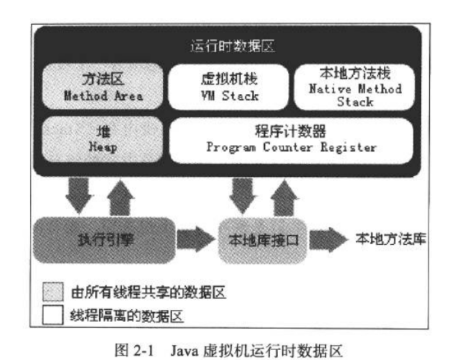
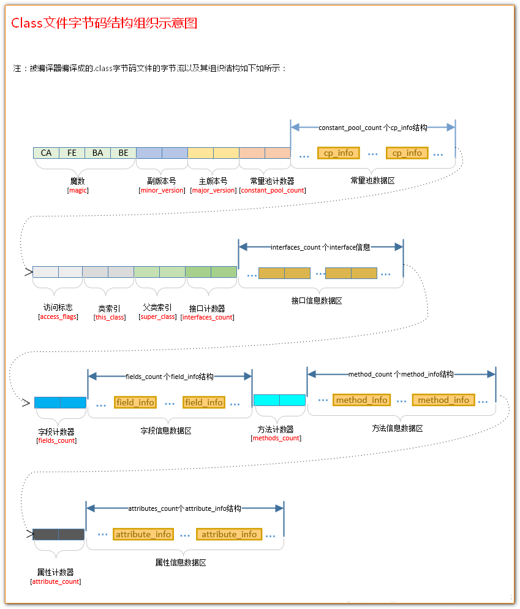
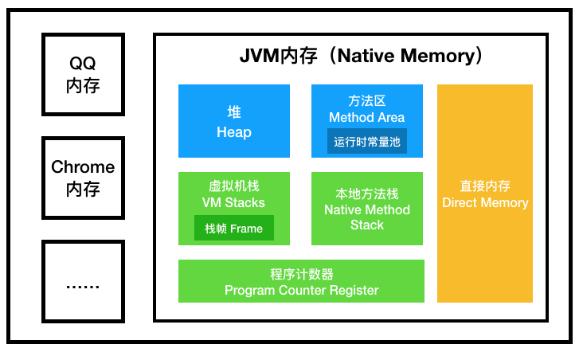

# 深入理解JVM笔记

java和C++之间区别

+ 动态内存技术
+ 垃圾收集技术


虚拟机管理内存

+ 	


# 总结

### 编译jdk

+ ant脚本不再使用，也不再支持 ALT_* 环境变量，注意看READM


### 字节码文件结构

#### 基本构成

 **无符号数属于最基本的数据类型。**它以 u1、u2、u4、u8 六七分别代表 1 个字节、2 个字节、4 个字节、8 个字节的无符号数 

 **表是由多个无符号数或者其他表作为数据项构成的复合数据类型** 

#### 组成 


又可以总结为以下的集合

- 魔数与Class文件版本
- 常量池
- 访问标志
- 类索引、父类索引、接口索引
- 字段表集合
- 方法表集合
- 属性表集合

**访问标记**

 这个标志用于识别一些类或者接口层次的访问信息 。字节码中的标记可能是多个值进行运算得出的结果

**类索引、父索引、接口索引**

+  **类索引。**类索引用于确定这个类的全限定名 
+  **父类索引。**父类索引用于确定这个类的父类的全限定名 
+  **接口索引。**接口索引集合就用来描述哪个类实现了哪些接口，这些被实现的接口将按 `implements `语句（如果这个类本身就是一个接口，则应当是`extends`语句）后的接口顺序从左到右排列在接口索引集合中。对于接口索引集合，入口第一项是 u2 类型的数据为接口计数器（interfaces_count），表示索引表的容量，而在接口计数器后则紧跟着所有的接口信息 

**字段表集合**

+  包括类级变量和实例级变量，但不包括在方法内部声明的局部变量 

  

### 运行时数据区域

​	  


### 栈堆配置

|          参数           |                   含义                    |
| :---------------------: | :---------------------------------------: |
|          -Xms           |                初始堆大小                 |
|          -Xmx           |                最大堆空间                 |
|          -Xmn           |              设置新生代大小               |
|    -XX:SurvivorRatio    | 设置新生代eden空间和from/to空间的比例关系 |
|      -XX:PermSize       |              方法区初始大小               |
|     -XX:MaxPermSize     |              方法区最大大小               |
|    -XX:MetaspaceSize    |          元空间GC阈值（JDK1.8）           |
|  -XX:MaxMetaspaceSize   |         最大元空间大小（JDK1.8）          |
|          -Xss           |                  栈大小                   |
| -XX:MaxDirectMemorySize |      直接内存大小，默认为最大堆空间       |

### 参数

跟踪参数

+ `-XX:+PrintGC`
+ `-XX:+Print GCDetails`
+ `-Xloggc:log/gc.log`
+ `-XX:+TraceClassLoading`

堆分配

+ `-Xmx `最大堆
+ `-Xms` 最小堆
+ `-Xmm`新生代
+ `-XX:NewRatio 4`新：老 （默认3/8）
+ `-XX:Survivor Ratio `默认1/10
+ `-XX:+HeapDumpOnOutOfMemoryError` 

栈分配

+ `-Xss` 反映调度深度


跟踪类信息

|           参数           |        含义        |
| :----------------------: | :----------------: |
|      -verbose:class      | 跟踪类的加载和卸载 |
|  -XX:+TraceClassLoading  |    跟踪类的加载    |
| -XX:+TraceClassUnloading |    跟踪类的卸载    |
| -XX:+PrintClassHistogram |  显示类信息柱状图  |


|                 参数                  |                       含义                       |
| :-----------------------------------: | :----------------------------------------------: |
|              -XX:PrintGC              |                    打印GC日志                    |
|          -XX:+PrintGCDetails          | 打印详细的GC日志。还会在退出前打印堆的详细信息。 |
|          -XX:+PrintHeapAtGC           |              每次GC前后打印堆信息。              |
|        -XX:+PrintGCTimeStamps         |                打印GC发生的时间。                |
| -XX:+PrintGCApplicationConcurrentTime |              打印应用程序的执行时间              |
|  -XX:+PrintGCApplicationStoppedTime   |          打印应用由于GC而产生的停顿时间          |
|         -XX:+PrintReferenceGC         |   跟踪软引用、弱引用、虚引用和Finallize队列。    |
|                -XLoggc                |             将GC日志以文件形式输出。             |


### 常见调优参数处理


## JVM问题排查命令

`jps`: 查看java进程，类似Linux 中的ps

`jstack`:查看线程状态

`jinfo`查看参数

```java
jinfo -flag MaxHeapSize xxxx(进程号)	//查看最大堆内存
jinfo -flag UseConcMarkSweepGC xxx(进程号)		//查看是否使用了这个GC
jinfo -flag UseG1GC xxx(进程号)	//是否使用了G1回收器
jinfo -flag UseParallelGC xxx(进程号)	//是否使用了并行回收器 
```

`jstat`: 查看统计信息

```java
//options:-class,-compiler,-gc,-printcompilation
jstat -class xxx(进程号)

//查看JIT编译信息
jstat -compiler PID
jstat -printcompilation PID
```

```java
jstat -gc xxx(进程号) 1000 10   //动态输出，没隔1s输出一次，一共输出10次
```

`jmap`


### CPU排查

1、`top`命令：Linux命令。可以查看实时的CPU使用情况。也可以查看最近一段时间的CPU使用情况。

2、`PS`命令：Linux命令。强大的进程状态监控命令。可以查看进程以及进程中线程的当前CPU使用情况。属于当前状态的采样数据。

3、`jstack`：Java提供的命令。可以查看某个进程的当前线程栈运行情况。根据这个命令的输出可以定位某个进程的所有线程的当前运行状态、运行代码，以及是否死锁等等。

4、`pstack`：Linux命令。可以查看某个进程的当前线程栈运行情况。

# ·书本笔记

### 运行时区域

#### 程序计数器

当前线程所执行的字节码行号指示器，分支,循环,跳转,异常处理,线程恢复等基础功能都需要这个计数器来完成。

执行java方法的时候指向虚拟机字节码所在地址；执行本地方法的时候计数器为空。

唯一一个没有规定OOM的区域

#### 虚拟机栈

虚拟机栈描述的是Java方法执行的内存模型：**每个方法被执行的时候都会创建一个栈帧用于存储局部变量表，操作栈，动态链接，方法出口等信息**。每一个方法被调用直至执行完成的过程，就对应着一个栈帧在虚拟机中从入栈到出栈的过程。

#### 本地方法栈

本地方法栈与 Java 虚拟机栈类似，它们之间的区别只不过1是本地方法栈为本地方法服务。

#### java堆

- `Java` 堆是整个虚拟机所管理的最大内存区域，所有的对象创建都是在这个区域进行内存分配。
- 这块区域也是垃圾回收器重点管理的区域，由于大多数垃圾回收器都采用`分代回收算法`，所有堆内存也分为 `新生代`、`老年代`，可以方便垃圾的准确回收。

##### 方法区

- 方法区主要用于存放已经被虚拟机加载的类信息，如`常量，静态变量`，即时编译器编译后的代码等。和Java堆一样不需要连续的内存，并且可以动态扩展。
- 对这块区域进行垃圾回收的主要目标是对常量池的回收和对类的卸载，但是一般比较难实现。

#### 运行时常量池

+ 运行时常量池是方法区的一部分。class文件除了有类的版本，字段，方法，接口等描述信息外，还有一项信息是常量池，用于存放编译期生成的各种字面量和符号引用，会在类加载后放入这个区域。

### 运行时常量池实例

**举个实例来说明一下:**

```
public class HelloWorld {
    public static void main(String []args) {
        String str1 = "abc"; 
        String str2 = new String("def"); 
        String str3 = "abc"; 
        String str4 = str2.intern(); 
        String str5 = "def"; 
        System.out.println(str1 == str3);//true 
        System.out.println(str2 == str4);//false 
        System.out.println(str4 == str5);//true
    }
}Copy to clipboardErrorCopied
```

- 回到上面的那个程序，现在就很容易解释整个程序的内存分配过程了，首先，在堆中会有一个”abc”实例，全局StringTable中存放着”abc”的一个引用值
- 然后在运行第二句的时候会生成两个实例，一个是”def”的实例对象，并且StringTable中存储一个”def”的引用值，还有一个是new出来的一个”def”的实例对象 与上面那个是不同的实例
- 当在解析str3的时候查找StringTable，里面有”abc”的全局驻留字符串引用，所以str3的引用地址与之前的那个已存在的相同
- str4是在运行的时候调用intern()函数，返回StringTable中”def”的引用值，如果没有就将str2的引用值添加进去，在这里，StringTable中已经有了”def”的引用值了，所以返回上面在new str2的时候添加到StringTable中的 “def”引用值
- 上面程序的首先经过编译之后，在该类的class常量池中存放一些符号引用，然后类加载之后，将class常量池中存放的符号引用转存到运行时常量池中，然后经过验证，准备阶段之后，在堆中生成驻留字符串的实例对象（也就是上例中str1所指向的”abc”实例对象），然后将这个对象的引用存到全局String Pool中，也就是StringTable中，最后在解析阶段，要把运行时常量池中的符号引用替换成直接引用，那么就直接查询StringTable，保证StringTable里的引用值与运行时常量池中的引用值一致，大概整个过程就是这样了。


### 对象的创建

1. 遇到一条new指令的时候，会检查指令的参数是否能在常量池中定位到对应的符号引用，并检查引用代表的类是否已被加载、解析和初始化过。
2. 如果没有，将会执行类加载过程
3. 类加载后分配内存，确定内存大小，保证分配动作的隔离性（同步）
4. 初始化内存空间
5. 设置对象头（至此虚拟机视角的对象产生）
6.  执行ini方法


### 引用

符号引用

+ 解析阶段将符号引用转换成直接引用
+ 符号引用是一组符号来描述所引用的目标，符号可以是任何形式的字面量，只要使用时能无歧义地定位到目标即可（它与直接引用区分一下，直接引用一般是指向方法区的本地指针，相对偏移量或是一个能间接定位到目标的句柄）。一般包括下面三类常量。类和接口的全限定名，字段的名称和描述符，方法的名称和描述符。


直接引用

+ new、读取或设置静态变量、调用静态方法
+ 通过反射执行上述行为
+ 初始化子类时触发父类初始化
+ main方法直接运行

主动引用

+ 

被动引用

+ 子类调用父类静态变量不会引发子类初始化
+ 数组定义的引用类不会引发此类初始化
+ 常量编译阶段存入调用类的常量池，不会引发初始化


### 数组类的初始化

```java
Object [] obj = new Object[10];//1
Object [] obj = {};  //2`
```


第1种：
在一个方法中定义一个数组，也就是局部变量，包含两块空间，一个是**变量名字**，存放到栈内存中，还有一个是**数组实例**，也就是`new Object[10]`,或者`{}`，或者`new Object[]{}`数组实例是存放在堆内存中。栈内存中的变量名字只是存放了指向堆内存中数组实例的地址。

第2种：
在一个类中定义一个数组，也就是成员变量（也叫全局变量），这种数组定义的时候并不会在内存中创建出来（加了static的成员变量除外），只有当产生了该类的实例，那么成员变量才会在堆内存中创建出来，也就是说**类中的数组变量名是存放在该对象的堆空间**中的，存放的也是地址，指向数组实例的堆空间地址。


### **对象类型数据和对象实例数据**

对象实例数据就是对象实例的数据（包括对象头，实例数据和对齐填充），存在java堆中。

对象类型数据是对象实例对应的类的相关信息，存在方法区。通过到对象类型数据的指针访问访问方法区中的对象类型数据。


### **编译原理**

**JIT**

在Java的编译体系中，一个Java的源代码文件变成计算机可执行的机器指令的过程中，需要经过两段编译，第一段是把.java文件转换成.class文件。第二段编译是把.class转换成机器指令的过程。

第一段编译就是javac命令。

在第二编译阶段，JVM 通过解释字节码将其翻译成对应的机器指令，逐条读入，逐条解释翻译。很显然，经过解释执行，其执行速度必然会比可执行的二进制字节码程序慢很多。这就是传统的JVM的解释器（Interpreter）的功能。为了解决这种效率问题，引入了 JIT（即时编译） 技术。

 引入了 JIT 技术后，Java程序还是通过解释器进行解释执行，当JVM发现某个方法或代码块运行特别频繁的时候，就会认为这是“热点代码”（Hot Spot Code)。然后JIT会把部分“热点代码”翻译成本地机器相关的机器码，并进行优化，然后再把翻译后的机器码缓存起来，以备下次使用。

**逃逸技术**

逃逸分析(Escape Analysis)是目前Java虚拟机中比较前沿的优化技术。这是一种可以有效减少Java 程序中同步负载和内存堆分配压力的跨函数全局数据流分析算法。通过逃逸分析，Java Hotspot编译器能够分析出一个新的对象的引用的使用范围从而决定是否要将这个对象分配到堆上。

逃逸分析的基本行为就是分析对象动态作用域：当一个对象在方法中被定义后，它可能被外部方法所引用，例如作为调用参数传递到其他地方中，称为方法逃逸。


### 使用非占有的垃圾回收器

为降低应用软件的垃圾回收时的停顿，首先考虑的是使用关注系统停顿的 CMS 回收器，其次，为了减少 Full GC 次数，应尽可能将对象预留在年轻代，因为年轻代 Minor GC 的成本远远小于年老代的 Full GC。


### 栈帧结构

**局部变量表**

一组变量值存储空间,存放方法参数和方法内部的局部变量

**操作数栈**

当一个方法刚刚开始执行的时候，这个方法的操作数找是空的，在方法的执行过程中，会有各种字节码指令往操作数找中写人和提取内容，也就是出找/人栈操作。例如，在做算术运算的时候是通过操作数栈来进行的.又或者在调用其他方法的时候是通过操作败栈来进行参数传递的。举个例子.整数加法的宇节码指令iadd在运行的时候操作数栈中最接近栈頂的两个元索已经存人了两个int型的数值，当执行这个指令时，会将这两个im值出栈并相加，然后将相加的结果人找。

**动态连接**

每个栈帧都包含**一个指向运行时常量池e中该栈帧所属方法的引用**，持有这个引用是为了支持方法调用过程中的动态连接（Dynamic Linking)。通过第6章的讲解，我们知道Class文件的常量池中存有大量的符号引用，字节码中的方法调用指令就以常量池中指向方法的符号引用作为参数。这些符号引用一部分会在类加载阶段或者第一次使用的时候就转化为直接引用，这种转化称为静态解析。另外一部分将在每一次运行期间转化为直接引用，这部分称为动态连接。

**方法返回地址**

- 一个方法执行后，只有通过正常完成出口和异常完成出口两种方式退出。
- 正常完成出口：当执行引擎遇到一个方法返回的字节码指令
- 异常完成出口：方法执行过程中遇到异常且方法中未处理此异常,就会导致方法退出。
- 方法正常退出时,调用者的程序计数器的值可以作为返回地址。
- 方法退出的过程等于就是把当前栈帧出栈。


### 调用java方法

当调用一个java方法时，JVM将push一个新的栈帧到当前的java栈中.

针对一个**实例方法**，VM 将pops调用方法栈帧中的对象引用和操作数栈中的参数.JVM创建一个新的栈帧，并且将新的栈帧中本地变量的0(this)替换为对象引用，其他的1、2替换为其他参数.

针对**类方法**，VM仅仅调用方法栈帧中的操作数栈中的参数，并用他们替换新的栈帧中的本地变量0,1,2....

一旦新的栈帧中的本地变量表替换完成，VM将新的栈帧作为当前栈帧并且设置程序计数器指向新方法的第一条指令.


1. **实例方法在调用前需要一个对象实例，而类方法不需要.**
2. **实例方法使用动态绑定，而类方法使用静态绑定.**

#### 静态分派

> 所有依赖静态类型来定位方法执行版本的分派动作称为静态分派

虚拟机（准确地说足编译器）在重载时是通过参数的静态类型而不是实际类型作为判定依据的.并且静态类®是编译期可知的，因此.在编译阶段，`Javac`编译器会根据参数的静态类型决定使用哪个重载版本


寻找重载方法流程

+ 匹配类型
+ 自动类型转换
+ 自动装箱
+ 自动转型（查找自动装箱实现类的接口）
+ 转型成父类

#### 动态分派

>我们把这种在运行期根据实际类型确定方法执行版本的分派过程称为动态分派。

由于`invokevirtual`指令执行的第一步就是在运行期确定接收者的实际类型，所以两次调用中的`invokevirtual`指令把常量池中的类方法符号引用解析到了不同的直接引用上，这个过程就是Java语言中方法重写的本质


#### 静态分派和动态分派的区别

在重载时时通过参数的静态类型而不是实际类型作为判定依据的。并且静态类型是编译可知的。 静态分派的典型应用就是方法重载

静态类型和 实际类型在程序中都可以发生一些变化、区别是**静态类型的变化仅仅在使用时发生，变量本 身的静态类型不会被改变，并且最终的静态类型是在编译財可知的**：而实际类型变化的结果在运行期才可确定，編译器在编译程序的时候并不知道一个对象的实际类型是什么

静态分派发生在编译阶段，因此确定静态分派的动作实际上不是由虚拟机 来执行的。另外，编译器虽然能确定出方法的重载版本，但在很多情况下这个重载版本并 不是“唯一的”，往往只能确定一个“更加合适的”版本。


## 泛型

[java 泛型详解](https://blog.csdn.net/s10461/article/details/53941091)

[[Java泛型](https://segmentfault.com/a/1190000019606768)](https://segmentfault.com/a/1190000019606768)

> 泛型本质说所操作的数据类型被指定为一个参数 这种参数类可以用在类、接口和方法
> 的创建屮，分別称为泛型类、泛型接口和泛型方法

Java语言中的泛型则不一样.它只在程序源码中存在，在编译后的宇节外文件中，就经替换为原来的原生类型（RawTVper也称为棵类型），并且在相应的地方插人了强制转型代码，因此对于运行期的Java语言来说，ArrayList_<int>与"Arrayfcist<String>就是同一个类，所泛型技术实除上是Java语言的一轎语法糖.Java语言中的泛型实现方法称为**类型 擦除**，基于这种方法实现的泛型称为**伪泛型**

>**Java中的泛型，只在编译阶段有效。在编译过程中，正确检验泛型结果后，会将泛型的相关信息擦出，并且在对象进入和离开方法的边界处添加类型检查和类型转换的方法。也就是说，泛型信息不会进入到运行时阶段。**

### 使用

+ 泛型类

```java
//此处T可以随便写为任意标识，常见的如T、E、K、V等形式的参数常用于表示泛型
//在实例化泛型类时，必须指定T的具体类型
public class Generic<T>{ 
    //key这个成员变量的类型为T,T的类型由外部指定  
    private T key;

    public Generic(T key) { //泛型构造方法形参key的类型也为T，T的类型由外部指定
        this.key = key;
    }

    public T getKey(){ //泛型方法getKey的返回值类型为T，T的类型由外部指定
        return key;
    }
}
```


+ 泛型接口

泛型接口与泛型类的定义及使用基本相同。泛型接口常被用在各种类的生产器中，可以看一个例子：

```java
//定义一个泛型接口
public interface Generator<T> {
    public T next();
}
```


+ 泛型方法

```java
/**
 * 泛型方法的基本介绍
 * @param tClass 传入的泛型实参
 * @return T 返回值为T类型
 * 说明：
 *     1）public 与 返回值中间<T>非常重要，可以理解为声明此方法为泛型方法。
 *     2）只有声明了<T>的方法才是泛型方法，泛型类中的使用了泛型的成员方法并不是泛型方法。
 *     3）<T>表明该方法将使用泛型类型T，此时才可以在方法中使用泛型类型T。
 *     4）与泛型类的定义一样，此处T可以随便写为任意标识，常见的如T、E、K、V等形式的参数常用于表示泛型。
 */
public <T> T genericMethod(Class<T> tClass)throws InstantiationException ,
  IllegalAccessException{
        T instance = tClass.newInstance();
        return instance;
}

```


### 泛型通配符

通过提示信息我们可以	看到`Generic<Integer>`不能被看作为`Generic<Number>`的子类。由此可以看出:同一种泛型可以对应多个版本（因为参数类型是不确定的），不同版本的泛型类实例是不兼容的。

回到上面的例子，如何解决上面的问题？总不能为了定义一个新的方法来处理`Generic<Integer>`类型的类，这显然与java中的多台理念相违背。因此我们需要一个在逻辑上可以表示同时是`Generic<Integer>`和`Generic<Number>`父类的引用类型。由此类型通配符应运而生。

类型通配符一般是使用`？`代替具体的类型实参，**注意了，此处’`？`’是类型实参，而不是类型形参** ！ 再直白点的意思就是，此处的`？`和Number、String、Integer一样都是一种实际的类型，可以把`？`看成所有类型的父类。是一种真实的类型。

可以解决当具体类型不确定的时候，这个通配符就是 `? ` ；当操作类型时，不需要使用类型的具体功能时，只使用Object类中的功能。那么可以用 `? `通配符来表未知类型。


### [*泛型中* *?* *super* *T和* *? extends* *T的区别* - 简书](https://www.baidu.com/link?url=Bjf4dw_ZSaOQc5Ko-kuRVXr73WkQSRUaLNJFNpBKG-YcTF5ev5ACOCYh4rEAfCXy&wd=&eqid=df9379820005790b000000045e992cf0)


### 类型擦除

#### 优势

+ 减小运行时内存负担
+ 提高类型安全
+ 消除强制转换，提高代码可读性
+ 向前兼容性好

#### 问题

+ 基本类型无法作为泛型实参，在使用过程中就意味着会有装箱和拆箱的开销：

  ```java
  List<int> intArray;          // compile error
  List<Integer> intArray;      // compile success
  List<double> intArray;       // compile error
  List<Double> intArray;       // compile success
  ```

+ 泛型类型无法用作方法重载

  ```java
  public void testMethod(List<Integer> array) {}
  public void testMethod(List<Double> array) {}    // compile error
  ```

  

+ 由于类型擦除后像`List`这样的类型是不存在的，所以也就无法直接当成真实类型使用：

  ```java
  public void testMethod(List<Integer> array) {}
  public void testMethod(List<Double> array) {}    // compile error
  ```

+ 类的泛型参数只有在类实例化的时候才知道，而静态方法的执行不需要有类的示例存在，所以静态方法无法引用类泛型参数：

  ```java
  class GenericClass<T> {
    public static T max(T a, T b) {}
  }
  ```

+ 泛型类型会带来类型强转的运行时开销

+ 数组不支持泛型

#### 类型擦除后怎么获取泛型参数

在Java中，泛型类型虽然被擦除了，但是被擦除的类型信息还是会以某种形式存储下来，并支持在运行时获取。这种形式就是指元素附加的签名信息（**Signatures**）

获取**Signatures**的方法如下：

```java
class GenericClass<T> {}
class ConcreteClass extends GenericClass<String> {
  public List<String> getArray() {}
}
```

```java
// 获取类元素泛型
ParameterizedType genericType = 
       (ParameterizedType)ConcreteClass.class.getGenericSuperClass();
// 获取方法元素泛型
ParameterizedType genericType = 
       (ParameterizedType)ConcreteClass.class.getMethod("getArray").getGenericReturnTypes();
```


## G1垃圾回收器

### G1堆内存的分布

G1垃圾收集器将堆内存分为一系列大小相等Region区，大小在1MB-32MB之间，**每一个分区不会确定的为某个代服务**，可以在老年代和年轻代之间切换。

### Remember Set


RSet用于记录从非收集部分指向收集部分的指针的集合（从其他Region指向一个Region的指针情况。**一个Region就会有一个RSet**，这样的好处是在回收一个Region的时候不需要执行全堆的扫描，只需要检查他的RSet就可以找到外部引用，这些引用就是gc root。

### Collection Set

就是每次**并发标记周期**的**标记需要回收**的区域。有两个，一个是**年轻代**的Set一个是**老年代**的Set。在任意一次收集暂停中，CSet所有分区**都会被释放**，内部存活的对象都会被转移到分配的空闲分区中。

### 年轻代收集

与CMS差不多，首先

1. 年轻代由几个不连续的区块组成
2. ygc是并行的，类似于parnew
3. 将活着的对象复制到sur区，活着晋升到old区
4. 调整eden区和sur区的大小

**与parnew的区别就是第四条，它会动态调整年轻代的大小**

### 并发标记周期

> （oldgc，最好理解成垃圾定位工作，因为只负责很小一块的收集）

1. 初始标记 stw，伴随着一次ygc的发生，所以oldgc直接重用了这个阶段。
2. 扫描根引用区（**并行的**），刚刚已经发生了一次ygc了，所以这个时候eden区是空的，年轻代存活的对象都在sur区，所以这个时候直接扫描sur区非常高效，扫描sur区到老年代的引用。**这个时候要注意，如果这个阶段eden区满了，是不会发生ygc的，必须等这个阶段结束才行**
3. 并发标记，寻找整个堆存活的对象，这个阶段可以被ygc打断
4. 重新标记（stw），完成最后的存活对象标记，使用了SATB（快照）算法。
5. 清理（stw）
   - 整理堆分区，为**混合收集周期识别回收收益高**(基于释放空间和暂停目标)的老年代分区集合；
   - **这个阶段会收集完全空闲的区块，也就是不包括任何存活对象的区块**


### fullGC

出现的情况跟CMS一样

ygc时担保失败

大对象进入老年代失败

### 与CMS的对比

1. 由于把三块内存变成了几百块内存，内存块的粒度变小了，从而可以垃圾回收工作更彻底的并行化。
2. G1的另一个显著特点他能够让用户设置应用的暂停时间，在mixgc的时候，是选择并发收集周期中标记的收益度高的模块进入CSet，所以这个时候可控。
3. 由于内存块比较小（这里主要是考虑老年代的内存碎片问题，因为CMS的老年代是一整大块，所以当标记整理完之后内存碎片的问题格外严重，如果启动内存压缩，那么就会影响性能，但是G1的分块化可以使这个内存碎片的问题降低到最小），进行内存压缩整理的代价都比较小。


## TLAB

> 线程本地分配缓存区，这是一个线程专用的内存分配区域。

TLAB的本质其实是三个指针管理的区域：`start`，`top` 和 `end`，每个线程都会从`Eden`分配一块空间，例如说100KB，作为自己的TLAB，其中 `start` 和 `end` 是占位用的，标识出 `eden` 里被这个 TLAB 所管理的区域，卡住`eden`里的一块空间不让其它线程来这里分配。

TLAB只是让每个线程有**私有的分配指针**，但底下存对象的内存空间还是给所有线程访问的，只是其它线程无法在这个区域分配而已。从这一点看，它被翻译为 线程私有分配区 更为合理一点
 当一个TLAB用满（分配指针top撞上分配极限end了），就新申请一个TLAB，而在老TLAB里的对象还留在原地什么都不用管——它们无法感知自己是否是曾经从TLAB分配出来的，而只关心自己是在eden里分配的。


**TLAB的缺点**

事务总不是完美的，TLAB也又自己的缺点。因为TLAB通常很小，所以放不下大对象。

1. TLAB空间大小是**固定**的，但是这时候一个大对象，我TLAB剩余的空间已经容不下它了。(比如100kb的TLAB，来了个110KB的对象)

2. TLAB空间还剩一点点没有用到，有点舍不得。(比如100kb的TLAB，装了80KB，又来了个30KB的对象)所以JVM开发人员做了以下处理，设置了**最大浪费空间**。

   当剩余的空间小于最大浪费空间，那该TLAB属于的线程在重新向Eden区申请一个TLAB空间。进行对象创建，还是空间不够，那你这个对象太大了，去Eden区直接创建吧

   当剩余的空间大于最大浪费空间，那这个大对象请你直接去Eden区创建，我TLAB放不下没有使用完的空间。当然，又回造成新的病垢。

3. Eden空间够的时候，你再次申请TLAB没问题，我不够了，Heap的Eden区要开始GC，

4. TLAB允许浪费空间，**导致Eden区空间不连续**，积少成多。以后还要人帮忙打理。

