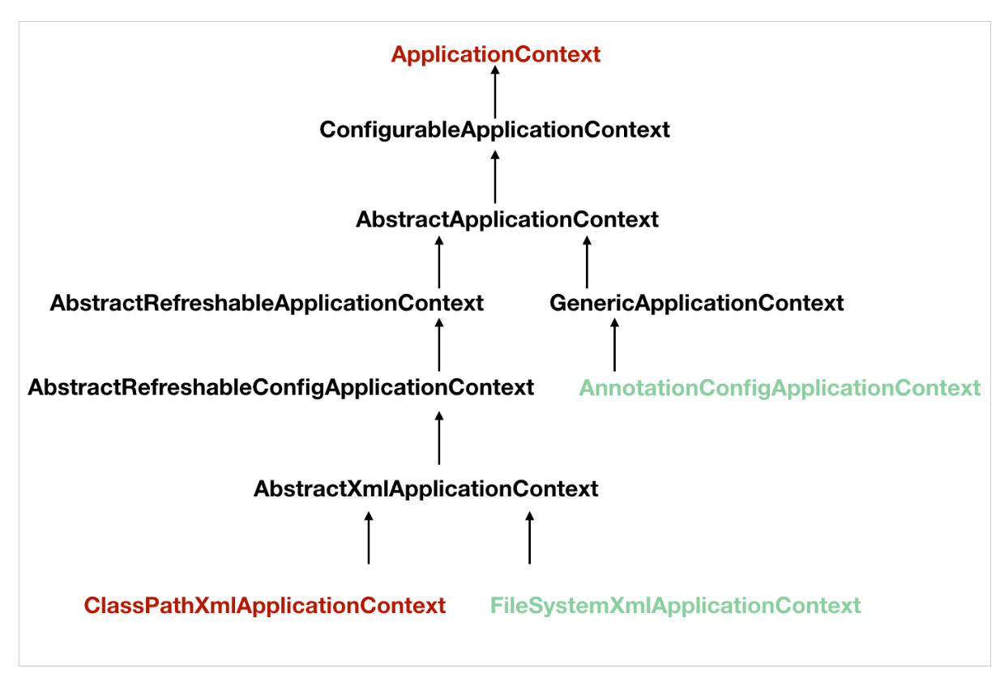
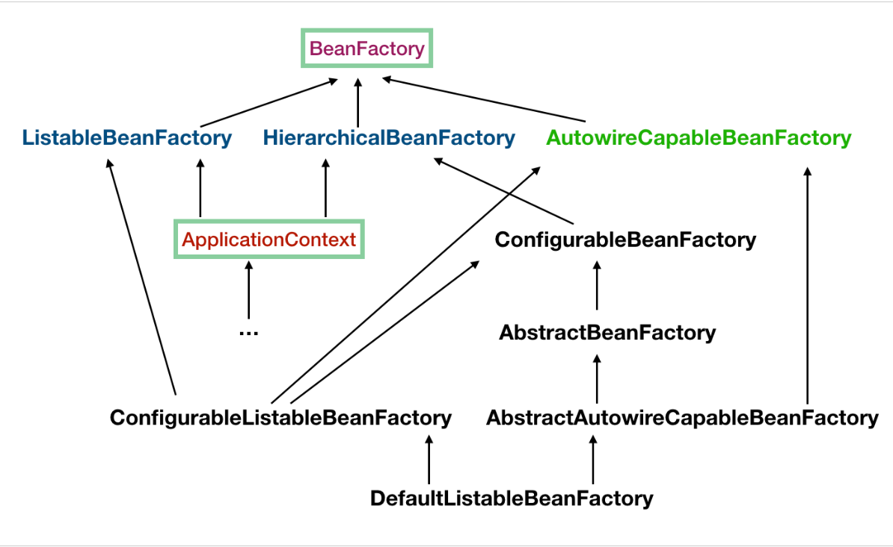
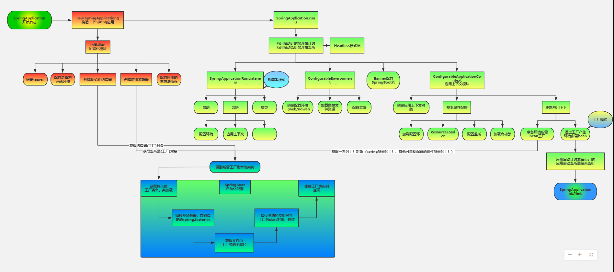

# 																												Spring笔记

>- **核心技术** ：`依赖注入(DI)`，`AOP`，事件(events)，资源，i18n，验证，数据绑定，类型转换，SpEL。
>- **测试** ：模拟对象，TestContext框架，Spring MVC 测试，WebTestClient。
>- **数据访问** ：`事务`，`DAO支持`，JDBC，`ORM`，编组XML。
>- **Web支持** : `Spring MVC`和Spring WebFlux Web框架。
>- **集成** ：远程处理，`JMS`，JCA，JMX，电子邮件，任务，调度，缓存。
>- **语言** ：Kotlin，Groovy，动态语言。

**Spring**的优点

1. 降低了组件之间的耦合性 ，实现了软件各层之间的解耦
2. 可以使用容易提供的众多服务，如事务管理，消息服务等
3. 容器提供单例模式支持
4. 容器提供了AOP技术，利用它很容易实现如权限拦截，运行期监控等功能
5. 容器提供了众多的辅助类，能加快应用的开发
6. spring对于主流的应用框架提供了集成支持，如hibernate，JPA，Struts等
7. spring属于低侵入式设计，代码的污染极低
8. 独立于各种应用服务器
9. spring的DI机制降低了业务对象替换的复杂性
10. Spring的高度开放性，并不强制应用完全依赖于Spring，开发者可以自由选择spring的部分或全部

## IOC

控制反转也叫依赖注入。**IOC利用java反射机制，AOP利用代理模式**。

> 当某个角色需要另外一个角色协助的时候，在传统的程序设计过程中，通常由调用者来创建被调用者的实例。但在spring中创建被调用者的工作不再由调用者来完成，因此称为控制反转。创建被调用者的工作由spring来完成，然后注入调用者因此也称为依赖注入。spring以动态灵活的方式来管理对象 ， 
>
> 注入常见的两种方式，设置注入和构造注入。
>
> **设置注入的优点：直观，自然**
> **构造注入的优点：可以在构造器中决定依赖关系的顺序。**


`IOC `概念看似很抽象，但是很容易理解。 说简单点就是将**对象交给容器管理**，你只需要在`spring`配置文件中配置对应的`bean`以及设置相关的属性，让`spring `容器来生成类的实例对象以及管理对象。在`spring`容器启动的时候，`spring`会把你在配置文件中配置的`bean`都初始化好，然后在你需要调用的时候，就把它已经初始化好的那些`bean`分配给你需要调用这些`bean`的类

> XML–—读取––-> resoure----解析------->BeanDefinition––—注入––––->BeanFactory

[Spring IOC 容器源码分析](https://javadoop.com/post/spring-ioc)

Spring 提供了以下两种不同类型的容器。

| 序号 | 容器 & 描述                                                  |
| :--- | :----------------------------------------------------------- |
| 1    | [Spring BeanFactory 容器](https://wiki.jikexueyuan.com/project/spring/ioc-container/spring-bean-fatory-container.html)它是最简单的容器，给 DI 提供了基本的支持，它用 *org.springframework.beans.factory.BeanFactory* 接口来定义。BeanFactory 或者相关的接口，如 BeanFactoryAware，InitializingBean，DisposableBean，在 Spring 中仍然存在具有大量的与 Spring 整合的第三方框架的反向兼容性的目的。 |
| 2    | [Spring ApplicationContext 容器](https://wiki.jikexueyuan.com/project/spring/ioc-container/spring-application-context-container.html)该容器添加了更多的企业特定的功能，例如从一个属性文件中解析文本信息的能力，发布应用程序事件给感兴趣的事件监听器的能力。该容器是由 *org.springframework.context.ApplicationContext* 接口定义。 |

### Bean

Bean 是一个被实例化，组装，并通过 Spring IoC 容器所管理的对象。这些 bean 是由用容器提供的配置元数据创建的.

bean 定义包含称为**配置元数据**的信息，下述容器也需要知道配置元数据：

- 如何创建一个 bean
- bean 的生命周期的详细信息
- bean 的依赖关系

| 属性                     | 描述                                                         |
| :----------------------- | :----------------------------------------------------------- |
| class                    | 这个属性是强制性的，并且指定用来创建 bean 的 bean 类。       |
| name                     | 这个属性指定唯一的 bean 标识符。在基于 XML 的配置元数据中，你可以使用 ID 和/或 name 属性来指定 bean 标识符。 |
| scope                    | 这个属性指定由特定的 bean 定义创建的对象的作用域，它将会在 bean 作用域的章节中进行讨论。 |
| constructor-arg          | 它是用来注入依赖关系的，并会在接下来的章节中进行讨论。       |
| properties               | 它是用来注入依赖关系的，并会在接下来的章节中进行讨论。       |
| autowiring mode          | 它是用来注入依赖关系的，并会在接下来的章节中进行讨论。       |
| lazy-initialization mode | 延迟初始化的 bean 告诉 IoC 容器在它第一次被请求时，而不是在启动时去创建一个 bean 实例。 |
| initialization 方法      | 在 bean 的所有必需的属性被容器设置之后，调用回调方法。它将会在 bean 的生命周期章节中进行讨论。 |
| destruction 方法         | 当包含该 bean 的容器被销毁时，使用回调方法。它将会在 bean 的生命周期章节中进行讨论。 |

### 实现原理



**1、FileSystemXmlApplicationContext** 的构造函数需要一个 xml 配置文件在系统中的路径，其他和 ClassPathXmlApplicationContext 基本上一样。

**2、AnnotationConfigApplicationContext** 是基于注解来使用的，它不需要配置文件，采用 java 配置类和各种注解来配置，是比较简单的方式，也是大势所趋吧。



1. `ApplicationContext `继承了 `ListableBeanFactory`，这个 `Listable `的意思就是，通过这个接口，我们可以获取多个 `Bean`，大家看源码会发现，最顶层 `BeanFactory `接口的方法都是获取单个 `Bean `的。
2. `ApplicationContext `继承了 `HierarchicalBeanFactory`，`Hierarchical `单词本身已经能说明问题了，也就是说我们可以在应用中起多个 `BeanFactory`，然后可以将各个 `BeanFactory `设置为父子关系。
3. `AutowireCapableBeanFactory `这个名字中的 `Autowire `大家都非常熟悉，它就是用来自动装配 Bean 用的，但是仔细看上图，`ApplicationContext `并没有继承它，不过不用担心，不使用继承，不代表不可以使用组合，如果你看到 `ApplicationContext `接口定义中的最后一个方法 `getAutowireCapableBeanFactory() `就知道了。
4. `ConfigurableListableBeanFactory `也是一个特殊的接口，看图，特殊之处在于它继承了第二层所有的三个接口，而 `ApplicationContext `没有。这点之后会用到。


> ApplicationContext 继承自 BeanFactory，但是它不应该被理解为 BeanFactory 的实现类，而是说其内部持有一个实例化的 BeanFactory（DefaultListableBeanFactory）。以后所有的 BeanFactory 相关的操作其实是委托给这个实例来处理的。


#### refresh()方法

```java
@Override
public void refresh() throws BeansException, IllegalStateException {
   // 来个锁，不然 refresh() 还没结束，你又来个启动或销毁容器的操作，那不就乱套了嘛
   synchronized (this.startupShutdownMonitor) {

      // 准备工作，记录下容器的启动时间、标记“已启动”状态、处理配置文件中的占位符
      prepareRefresh();

      // 这步比较关键，这步完成后，配置文件就会解析成一个个 Bean 定义，注册到 BeanFactory 中，
      // 当然，这里说的 Bean 还没有初始化，只是配置信息都提取出来了，
      // 注册也只是将这些信息都保存到了注册中心(说到底核心是一个 beanName-> beanDefinition 的 map)
      ConfigurableListableBeanFactory beanFactory = obtainFreshBeanFactory();

      // 设置 BeanFactory 的类加载器，添加几个 BeanPostProcessor，手动注册几个特殊的 bean
      // 这块待会会展开说
      prepareBeanFactory(beanFactory);

      try {
         // 【这里需要知道 BeanFactoryPostProcessor 这个知识点，Bean 如果实现了此接口，
         // 那么在容器初始化以后，Spring 会负责调用里面的 postProcessBeanFactory 方法。】

         // 这里是提供给子类的扩展点，到这里的时候，所有的 Bean 都加载、注册完成了，但是都还没有初始化
         // 具体的子类可以在这步的时候添加一些特殊的 BeanFactoryPostProcessor 的实现类或做点什么事
         postProcessBeanFactory(beanFactory);
         // 调用 BeanFactoryPostProcessor 各个实现类的 postProcessBeanFactory(factory) 方法
         invokeBeanFactoryPostProcessors(beanFactory);

         // 注册 BeanPostProcessor 的实现类，注意看和 BeanFactoryPostProcessor 的区别
         // 此接口两个方法: postProcessBeforeInitialization 和 postProcessAfterInitialization
         // 两个方法分别在 Bean 初始化之前和初始化之后得到执行。注意，到这里 Bean 还没初始化
         registerBeanPostProcessors(beanFactory);

         // 初始化当前 ApplicationContext 的 MessageSource，国际化这里就不展开说了，不然没完没了了
         initMessageSource();

         // 初始化当前 ApplicationContext 的事件广播器，这里也不展开了
         initApplicationEventMulticaster();

         // 从方法名就可以知道，典型的模板方法(钩子方法)，
         // 具体的子类可以在这里初始化一些特殊的 Bean（在初始化 singleton beans 之前）
         onRefresh();

         // 注册事件监听器，监听器需要实现 ApplicationListener 接口。这也不是我们的重点，过
         registerListeners();

         // 重点，重点，重点
         // 初始化所有的 singleton beans
         //（lazy-init 的除外）
         finishBeanFactoryInitialization(beanFactory);

         // 最后，广播事件，ApplicationContext 初始化完成
         finishRefresh();
      }

      catch (BeansException ex) {
         if (logger.isWarnEnabled()) {
            logger.warn("Exception encountered during context initialization - " +
                  "cancelling refresh attempt: " + ex);
         }

         // Destroy already created singletons to avoid dangling resources.
         // 销毁已经初始化的 singleton 的 Beans，以免有些 bean 会一直占用资源
         destroyBeans();

         // Reset 'active' flag.
         cancelRefresh(ex);

         // 把异常往外抛
         throw ex;
      }

      finally {
         // Reset common introspection caches in Spring's core, since we
         // might not ever need metadata for singleton beans anymore...
         resetCommonCaches();
      }
   }
}
```

+ 加锁防止并发
+ 准备工作
+ ·得到`BeanFactory`，注册`Bean`到`BeanFactory`
+ 设置 `BeanFactory` 的类加载器，添加几个 `BeanPostProcessor`
+ 调用`postProcessBeanFactory(beanFactory)`, 具体的子类可以在这步的时候添加一些特殊的 `BeanFactoryPostProcessor` 的实现类
+ `invokeBeanFactoryPostProcessors(beanFactory);`
+ 注册`BeanPostProcessor`的实现类，之后会在`bean`初始化之后执行其中的方法
+ 之后初始化一些`messsageSource` 、事件广播器、钩子方法、事件监听器等
+ 初始化单例`Bean`
+ 广播事件，`ApplicatrionContext`初始化完成
+ 销毁已初始化的`Bean`


#### 详细步骤

##### 创建Bean容器前的准备

+ 调用`prepareRefresh()`方法·

+ 设置启动时间，校验xml配置文件


##### 创建 Bean 容器，加载并注册 Bean

> **完成了初始化 BeanFactory**、**加载 Bean**、**注册 Bean**,但是**并没有完成初始化Bean实例**

+ 入口是调用`obtainFreshBeanFactory()`方法
+ 调用`customizeBeanFactory(beanFactory)`,配置是否允许`BeanDefinition `覆盖、是否允许循环引用
+ 调用`loadBeanDefinitions(beanFactory)`这个方法将根据配置，加载各个 Bean，然后放到 BeanFactory 中。
+ 在`loadBeanDefinitions(beanFactory)`里注册bean，调用`registerBeanDefinition`方法将bean'注册到`beanDefinitionMap`


##### 准备 Bean 容器: prepareBeanFactory(factory) 

+ 添加一个`BeanPostProcessor`,处理各种回调事件
+ 初始化一些实现了`BeanFactoryPostProcessor`的`bean`
+ 回调执行其中的` postProcessBeanFactory(factory) `方法
+ “手动”注册了一些特殊的 Bean，如 `environment`、`systemProperties` 等。

##### 初始化所有的 singleton beans

+ 入口是`finishBeanFactoryInitialization(beanFactory)`
+ `beanFactory.preInstantiateSingletons()`开始初始化（非抽象、非懒加载）
+ `getBean(beanName)`方法获取并初始化一个bean
  + `createBeanInstance`创建bean实例
  + `populateBean`依赖注入，执行Bean的构造器进行属性注入
  + `initializeBean`回调方法，`init-method`初始化方法在这里执行

[SpringBoot源码解析(一)--启动过程refresh()方法详解；（二）也值得一看](https://www.jianshu.com/p/5d75c9bdf0c6)


###### `populateBean`自动注入的过程


#### 模板方法

> **钩子方法**源于设计模式中**模板方法**（Template Method）模式，模板方法模式的概念为：在一个方法中定义一个算法的骨架，而将一些步骤延迟到子类中。模板方法使得子类可以在不改变算法结构的情况下，重新定义算法中的某些步骤。

其主要分为两大类：

+ 模版方法

  定义了一个方法，其中定义了整个逻辑的基本骨架

+ 基本方法

  + **抽象方法（Abstract Method）**

    由抽象类声明，由具体子类实现，并以abstract关键字进行标识。

  + **具体方法（Concrete Method）**

    由抽象类声明并且实现，子类并不实现或者做覆盖操作。其实质就是普遍适用的方法，不需要子类来实现。

  + **钩子方法（Hook Method）**

    由抽象类声明并且实现，子类也可以选择加以扩展。

    通常抽象类会给出一个空的钩子方法，也就是没有实现的扩展。它和具体方法在代码上没有区别，不过是一种意识的区别；而它和抽象方法有时候也是没有区别的，就是在子类都需要将其实现的时候。而不同的是抽象方法必须实现，而钩子方法可以不识闲。也就是说钩子方法为你在实现某一个抽象类的时候提供了可选项，相当于预先提供了一个默认配置

```java
   /**
     * 抽象类，定义模板方法和基本方法
     */
abstract class abstractClass{
        /**
         * 具体方法,声明并实现，继承此抽象类不需实现此方法
         */
        public void concreteMethod(){
            System.out.print("这是一个具体方法");
        }
        /**
         * 抽象方法，abstract关键字标识，只声明，并不实现，继承此抽象类必须实现此方法
         */
        protected abstract void abstractMethod();

        /**
         * 钩子方法，声明并实现（空实现或者定义相关内容皆可），继承此抽象类的子类可扩展实现或者不实现
         */
        public void hookMethod(){
            //可定义一个默认操作，或者为空
            //System.out.print("此钩子方法有个默认操作")
        };
        /**
         * 模板方法，整个算法的骨架
         */
        public void templateMethod(){
            abstractMethod();
            concreteMethod();
            hookMethod();
        }
    }
```

```java
public class childClass2 {
        public void bond(abstractClass abstractClass){
            abstractClass.templateMethod();
        }
    }
    public class Test{
        public static void main(String[] args) {
            childClass2 childClass2=new childClass2();
            childClass2.bond(new abstractClass(){//匿名内部类实现回调
                @Override
                protected void abstractMethod(){
                    System.out.print("子类实现父类抽象类中的抽象方法");
                }

                /**
                 * 重构钩子方法
                 */
             //public void hookMethod(){
                   System.out.print("子类可以在父类钩子方法实现的基础上进行扩展");
              }
       }
   }
```

### BeanFactory和BeanDefinition

> BeanFactory是Bean的容器
>
> BeanDefinition 就是我们所说的 Spring 的 Bean，我们自己定义的各个 Bean 其实会转换成一个个 BeanDefinition 存在于 Spring 的 BeanFactory 中。
>
> Bean 在代码层面上可以简单认为是 BeanDefinition 的实例


### BeanPostProcessor

```java
public interface BeanPostProcessor {

   Object postProcessBeforeInitialization(Object bean, String beanName) throws BeansException;

   Object postProcessAfterInitialization(Object bean, String beanName) throws BeansException;

}
```

**执行时机**

+ 首先会回调几个实现了 `Aware` 接口的 `bean`
+ 然后就开始回调 `BeanPostProcessor` 的 `postProcessBeforeInitialization` 方法
+ 之后是回调 `init-method`
+ 然后再回调 `BeanPostProcessor` 的 `postProcessAfterInitialization` 方法。


### *Aware的接口

些时候我们需要在 Bean 的初始化中使用 Spring 框架自身的一些对象来执行一些操作，比如获取 `ServletContext` 的一些参数，获取 `ApplicaitionContext` 中的 `BeanDefinition` 的名字，获取 `Bean` 在容器中的名字等等。为了让 `Bean` 可以获取到框架自身的一些对象，Spring 提供了一组名为`*Aware`的接口。

- **`ApplicationContextAware`**: 获得ApplicationContext对象,可以用来获取所有Bean definition的名字。
- **`BeanFactoryAware`**:获得BeanFactory对象，可以用来检测Bean的作用域。
- **`BeanNameAware`**:获得Bean在配置文件中定义的名字。
- **`ResourceLoaderAware`**:获得ResourceLoader对象，可以获得classpath中某个文件。
- **`ServletContextAware`**:在一个MVC应用中可以获取ServletContext对象，可以读取context中的参数。
- **`ServletConfigAware`**： 在一个MVC应用中可以获取ServletConfig对象，可以读取config中的参数。

### Bean

#### Bean标签可以定义的属性

| Property                     |                                                              |
| ---------------------------- | ------------------------------------------------------------ |
| **class**                    | 类的全限定名                                                 |
| **name**                     | 可指定 id、name(用逗号、分号、空格分隔)                      |
| **scope**                    | 作用域                                                       |
| **constructor arguments**    | 指定构造参数                                                 |
| **properties**               | 设置属性的值                                                 |
| **autowiring mode**          | no(默认值)、byName、byType、 constructor                     |
| **lazy-initialization mode** | 是否懒加载(如果被非懒加载的bean依赖了那么其实也就不能懒加载了) |
| **initialization method**    | bean 属性设置完成后，会调用这个方法                          |
| **destruction method**       | bean 销毁后的回调方法                                        |

此外还有factory-bean等标签，这里就不详细列出了


#### **Bean的生命周期**


可以简述为以下九步

1. 实例化`bean`对象(通过构造方法或者工厂方法)
2. 设置对象属性(`setter`等)（依赖注入）
3. 如果`Bean`实现了`BeanNameAware`接口，工厂调用`Bean`的`setBeanName`()方法传递`Bean`的`ID`。（和下面的一条均属于检查`Aware`接口）
4. 如果`Bean`实现了`BeanFactoryAware`接口，工厂调用`setBeanFactory`()方法传入工厂自身
5. 如果`Bean`实现了`ApplicationContextAware`接口的话，Spring将调用`Bean`的`setApplicationContext()`方法，将`bean`所在应用上下文引用传入进来。
6. 将`Bean`实例传递给`Bean`的前置处理器的`postProcessBeforeInitialization(Object bean, String beanname`)方法
7. 调用`Bean`的初始化方法
8. 将`Bean`实例传递给`Bean`的后置处理器的p`ostProcessAfterInitialization(Object bean, String beanname)`方法
9. 使用`Bean`容器关闭之前，调用Bean的销毁方法


#### Bean作用域

- `singleton `: 唯一 bean 实例，Spring 中的 bean **默认**都是单例的。
- `prototype `: 每次请求都会创建一个新的 bean 实例。
- `request `: 每一次HTTP请求都会产生一个新的bean，该bean仅在**当前HTTP request内有效**。
- `session `: 每一次HTTP请求都会产生一个新的 bean，该bean仅在**当前 HTTP session 内有效**。
- `global-session`： **全局session作用域**，仅仅在基于portlet的web应用中才有意义，Spring5已经没有了。Portlet是能够生成语义代码(例如：HTML)片段的小型Java Web插件。它们基于portlet容器，可以像servlet一样处理HTTP请求。但是，与 servlet 不同，每个 portlet 都有不同的会话


#### Bean的循环依赖

> 所谓循环依赖，就是两个或者两个以上的Bean互相持有对方，这样在程序运行调用中，会出现这种循环依赖的现象，假设是两个Bean，当程序调用Bean A时，Bean A中依赖Bean B，在Bean A中调用Bean B时，Bean B中又依赖了Bean A，这样就形成了循环依赖
>
> spring只解决单例bean的循环依赖问题

解决方法

+ 实例化bean

+ 提前缓存`ObjectFactory`以解决bean之间的循环依赖。该方法用于返回一个bean的实例，此时的bean已经完成初始化，但是尚未完成创建。

  如果当前的bean满足条件(是否单例，是否允许循环依赖)，则将当前正在创建的bean和其`ObjectFactory`对象提前曝光，加入到`正在创建bean池`中。

+ 首先解析`refBeanName`，然后通过`getBean`方法获取其实例，此时当前创建的bean是ClassA，引用bean是ClassB。

  获取到ClassB实例之后，又要填充ClassB的属性，此时又会出现对`RuntimeBeanReference`的解析，即ClassA，再去获取ClassA的实例，此时的ClassA的实例已经被提前曝光，会从缓存中获取ClassA的实例·

[循环依赖的解决](https://www.cnblogs.com/makai/p/11629196.html)

#### Bean的单例和多例模式的使用条件

**`spring`生成的对象默认都是单例(`singleton`)的.可以通过`scope`改成多例**. 对象在整个系统中只有一份，所有的请求都用一个对象来处理，*如service和dao层的对象一般是单例的。*

`prototype `多例模式：对象在整个系统中可以有多个实例，每个请求用一个新的对象来处理，如`action`。


**为什么使用单例**：因为没有必要每个请求都新建一个对象的时候，因为这样会浪费CPU和内存。如果要解决并发问题

1. Bean中避免定义可变成员变量
2. 类中定义一个Threadlocal成员变量

**为什么使用多例**：**防止并发问题**；即一个请求改变了对象的状态，此时对象又处理另一个请求，而之前请求对对象的状态改变导致了对象对另一个请求做了错误的处理；


#### @Component 和 @Bean 的区别是什么？

1. **作用对象**不同: `@Component` 注解作用于类，而`@Bean`注解作用于方法。
2. `@Component`通常是通过类路径扫描来自动侦测以及自动装配到Spring容器中（我们可以使用 `@ComponentScan` 注解定义要扫描的路径从中找出标识了需要装配的类自动装配到 Spring 的 bean 容器中）。`@Bean` 注解通常是我们在标有该注解的方法中定义产生这个 bean,`@Bean`告诉了Spring这是某个类的示例，当我需要用它的时候还给我。
3. `@Bean` 注解比 `Component` 注解的自定义性更强，而且很多地方我们只能通过 `@Bean` 注解来注册bean。比如当我们引用第三方库中的类需要装配到 `Spring`容器时，则只能通过 `@Bean`来实现。（也就是Bean是手动装配，而component是自动装配）


### @autowired和@Resource区别

@Resource和@Autowired都是做bean的注入时使用，其实@Resource并不是Spring的注解，它的包是`javax.annotation.Resource`，需要导入，但是Spring支持该注解的注入。

1、共同点

两者都可以写在`字段`和`setter`方法上。两者如果都写在字段上，那么就不需要再写setter方法。

2、不同点·

**（1）@Autowired**

`@Autowired`为Spring提供的注解，需要导入包`org.springframework.beans.factory.annotation.Autowired`;只按照byType注入。

```java
public class TestServiceImpl {
    // 下面两种@Autowired只要使用一种即可
    @Autowired
    private UserDao userDao; // 用于字段上

    @Autowired
    public void setUserDao(UserDao userDao) { // 用于属性的方法上
        this.userDao = userDao;
    }
}Click to copy
```

@Autowired注解是按照类型（`byType`）装配依赖对象，默认情况下它要求依赖对象必须存在，如果允许null值，可以设置它的required属性为false。如果我们想使用按照名称（`byName`）来装配，可以结合`@Qualifier`注解一起使用。如下：

```java
public class TestServiceImpl {
    @Autowired
    @Qualifier("userDao")
    private UserDao userDao; 
}Click to copy
```

**（2）@Resource**

`@Resource`默认按照`ByName`自动注入，由J2EE提供，需要导入包`javax.annotation.Resource`。@Resource有两个重要的属性：`name`和`type`，而Spring将@Resource注解的`name`属性解析为bean的名字，而`type`属性则解析为bean的类型。所以，如果使用name属性，则使用byName的自动注入策略，而使用type属性时则使用byType自动注入策略。如果既不制定name也不制定type属性，这时将通过反射机制使用byName自动注入策略。

```javascript
public class TestServiceImpl {
    // 下面两种@Resource只要使用一种即可
    @Resource(name="userDao")
    private UserDao userDao; // 用于字段上

    @Resource(name="userDao")
    public void setUserDao(UserDao userDao) { // 用于属性的setter方法上
        this.userDao = userDao;
    }
}Click to copy
```

注：最好是将`@Resource`放在`setter`方法上，因为这样更符合面向对象的思想，通过set、get去操作属性，而不是直接去操作属性。

`@Resource`装配顺序：

1. 如果同时指定了`name`和`type`，则从`Spring`上下文中找到唯一匹配的`bean`进行装配，找不到则抛出异常。
2. 如果指定了`name`，则从上下文中查找名称（`id`）匹配的`bean`进行装配，找不到则抛出异常。
3. 如果指定了`type`，则从上下文中找到类似匹配的唯一`bean`进行装配，找不到或是找到多个，都会抛出异常。
4. 如果既没有指定`name`，又没有指定`type`，则自动按照`byName`方式进行装配；如果没有匹配，则回退为一个原始类型进行匹配，如果匹配则自动装配。

> @Resource的作用相当于@Autowired，只不过@Autowired按照byType自动注入。


### 依赖注入的方式


+ 构造函数注入

```xml
<bean id="role1" class="com.ssm.chapter9.pojo.Role">
    <constructor-arg index="0" value="总经理"/>
    <constructor-arg index="1" value="公司管理者"/>
</bean>
```

+ Settter注入

```xml
<bean id="role2" class="com.ssm.chapter9.pojo.Role">
    <property name="roleName" value="高级工程师"/>
    <property name="note" value="重要人员"/>
</bean
```

+ 接口注入（不实用）


**静态工厂注入和实例工厂注入**

利用静态工厂方法可以把bean注入到IOC容器中。在XML文件中配置bean时，要指定`class`的属性为工厂的类；`factory-method`属性指定工厂类中工厂方法，用于创建bean；`constrctor-arg`用于给工厂方法传递参数。实例如下：

```xml
<!--class要写工厂的类；factory-method要写工厂类中用于创建bean的方法-->
<bean id="car1" class="com.lzj.spring.beans.factory.StaticFactory"
        factory-method="getCar">
        <constructor-arg value="baoma"></constructor-arg>
</bean>
```

实例化静态工厂注入bean，需要先实例化一个工厂类，然后通过由实例化工厂对象中的一个方法来创建bean，并注入到容器中。
在 bean 的 `factory-bean `属性里指定拥有该工厂方法的 Bean；在` factory-method` 属性里指定该工厂方法的名称；使用 `construtor-arg `元素为工厂方法传递方法参数。示例如下``

```xml
<!--首先创建一个工厂的bean-->
    <bean id="carFactory" class="com.lzj.spring.beans.factory.InstanceFactory"></bean>
    <!--factory-bean指定前面已经创建的bean; factory-method指定工厂实例中用于创建car的方法； constructor-arg指定创建car方法中传入的参数-->
    <bean id="car2" factory-bean="carFactory" factory-method="getCar">
        <constructor-arg value="baoma"></constructor-arg>
    </bean>

```


## AOP

> 面向切面编程。（Aspect-Oriented Programming） 。AOP可以说是对OOP的补充和完善。
>
> 面向对象编程将程序分解成各个层次的对象，面向切面编程将程序运行过程分解成各个切面。
>
> `AOP`从**程序运行**角度考虑程序的结构，提取业务处理过程的切面，**`oop`是静态的抽象，aop是动态的抽象， 是对应用执行过程中的步骤进行抽象，从而获得步骤之间的逻辑划分。**
>
> `OOP`引入**封装**、 **继承**和**多态**性等概念来建立一种对象层次结构，用以模拟公共行为的一个集合。


**实现`AOP`的技术，主要分为两大类：**

 一是采用**动态代理**技术，利用截取消息的方式，对该消息进行装饰，以取代原有对象行为的执行；(Spring AOP)

二是采用**静态织入** 的方式，引入特定的语法创建“方面”，从而使得编译器可以在编译期间织入有关“方面”的代码，属于静态代理。(AspectJ)

**`AOP`框架具有的两个特征：**

1. **各个步骤之间的良好隔离性**
2. **源代码无关性**


### 基本概念

#### 通知(Adivce)

通知有5种类型：

- `Before` 在方法被调用之前调用

- `After` 在方法完成后调用通知，无论方法是否执行成功

- `After-returning` 在方法成功执行之后调用通知

- `After-throwing` 在方法抛出异常后调用通知

- `Around` 通知了好、包含了被通知的方法，在被通知的方法调用之前后调用之后执行自定义的行为

  

#### 切点（Pointcut）

切点在Spring AOP中确实是对应系统中的方法。但是这个方法是定义在切面中的方法，一般和**通知**一起使用，一起组成了**切面**。

- **execution**：正则匹配方法签名

  >@Pointcut("execution(* transfer(..))")

- within：指定所在类或所在包下面的方法（Spring AOP 独有）

  > 如 @Pointcut("within(com.javadoop.springaoplearning.service..*)")

- @annotation：方法上具有特定的注解，如 @Subscribe 用于订阅特定的事件。

  > 如 @Pointcut("execution( .*(..)) && @annotation(com.javadoop.annotation.Subscribe)")

- bean(idOrNameOfBean)：匹配 bean 的名字（Spring AOP 独有）

  > 如 @Pointcut("bean(*Service)")

#### 连接点（Join point）

比如：方法调用、方法执行、字段设置/获取、异常处理执行、类初始化、甚至是 for 循环中的某个点

理论上, 程序执行过程中的任何时点都可以作为作为织入点, 而所有这些执行时点都是 Joint point

但 Spring AOP 目前仅支持方法执行 (method execution) 也可以这样理解，连接点就是你准备在系统中执行切点和切入通知的地方（一般是一个方法，一个字段）

#### 切面（Aspect）

切面是切点和通知的集合，一般单独作为一个类。通知和切点共同定义了关于切面的全部内容，它是什么时候，在何时和何处完成功能。

#### 引入（Introduction）

引用允许我们向现有的类添加新的方法或者属性

#### 织入（Weaving）

组装方面来创建一个被通知对象。这可以在编译时完成（例如使用AspectJ编译器），也可以在运行时完成。Spring和其他纯Java AOP框架一样，在**运行时完成织入**。


### SpringAOP和AspectJ比较

**Spring AOP：**

- 它基于动态代理来实现。默认地，如果使用接口的，用 JDK 提供的动态代理实现，如果没有接口，使用 CGLIB 实现。大家一定要明白背后的意思，包括什么时候会不用 JDK 提供的动态代理，而用 CGLIB 实现。
- Spring AOP 需要依赖于 IOC 容器来管理。
- Spring AOP 只能作用于 Spring 容器中的 Bean，它是使用纯粹的 Java 代码实现的，只能作用于 bean 的方法。
- 很多人会对比 Spring AOP 和 AspectJ 的性能，Spring AOP 是基于代理实现的，在容器启动的时候需要生成代理实例，在方法调用上也会增加栈的深度，使得 Spring AOP 的性能不如 AspectJ 那么好。

**AspectJ：**

- 属于静态织入，它是通过修改代码来实现的，它的织入时机可以是：
  - `Compile-time weaving`：**编译期织入**，如类 A 使用 AspectJ 添加了一个属性，类 B 引用了它，这个场景就需要编译期的时候就进行织入，否则没法编译类 B。
  - `Post-compile weaving`：也就是已经生成了 .class 文件，或已经打成 jar 包了，这种情况我们需要增强处理的话，就要用到**编译后织入**。
  - `Load-time weaving`：指的是在**加载类的时候进行织入**，要实现这个时期的织入，有几种常见的方法。
    + 1、自定义类加载器来干这个，这个应该是最容易想到的办法，在被织入类加载到 JVM 前去对它进行加载，这样就可以在加载的时候定义行为了。
    + 2、在 JVM 启动的时候指定 AspectJ 提供的 agent：`-javaagent:xxx/xxx/aspectjweaver.jar`。

- AspectJ 能干很多 Spring AOP 干不了的事情，它是 **AOP 编程的完全解决方案**。Spring AOP 致力于解决的是企业级开发中最普遍的 AOP 需求（方法织入），而不是力求成为一个像 AspectJ 一样的 AOP 编程完全解决方案。
- 因为 AspectJ 在实际代码运行前完成了织入，所以大家会说它生成的类是没有额外运行时开销的。


### **动态代理**

> 代理类在程序运行时创建的代理方式被称为动态代理。代理类并不是在Java代码中定义的，而是在运行时根据我们在Java代码中的“指示”动态生成的。方法实现前后加入对应的公共功能
>
> 代理对象是在程序运行时产生的，而不是编译期；

**基于接口**·

`jdk`的动态代理时基于`Java `的反射机制来实现的，是`Java `原生的一种代理方式。他的实现原理就是让**代理类和被代理类实现同一接口，代理类持有目标对象来达到方法拦截的作用**。

通过接口的方式有两个弊端:

1. 一个就是必须保证被代理类有接口
2. 另一个就是如果相对被代理类的方法进行代理拦截，那么就要保证这些方法都要在接口中声明。接口继承的是`java.lang.reflect.InvocationHandler`;


**必须实现接口的原因·**

1. 在需要继承`proxy`类获得有关方法和`InvocationHandler`构造方法传参的同时,java不能同时继承两个类，我们需要和想要代理的类建立联系，只能实现一个接口

2. 需要反射获得代理类的有关参数，**必须要通过某个类，反射获取有关方法**，如本次测试用的 :printSomeThing

3. 成功返回的是`object`类型，要获取原类，只能继承/实现，或者就是那个代理类

4. 对具体实现的方法内部并不关心，这个交给`InvocationHandler.invoke`那个方法里去处理就好了，我只想根据你给我的接口反射出对我有用的东西。

5. 考虑到设计模式，以及`proxy`编者编写代码的逻辑使然


**基于继承**

`cglib`动态代理使用的`ASM`这个非常强大的`Java`字节码生成框架来生成`class `，比`jdk`动态代理`ide`效率高。<mark>基于继承的实现动态代理</mark>，**可以直接通过`super`关键字来调用被代理类的方法.**

**CGLIB通过继承方式实现代理，在子类中采用方法拦截的技术拦截所有父类方法的调用并顺势织入横切逻辑**。


### **`springAOP `的具体加载步骤：**

　　1、当 spring 容器启动的时候，加载了 spring 的配置文件
　　2、为配置文件中的所有 `bean `创建对象
　　3、spring 容器会解析 `aop:config `的配置
　　　　解析切入点表达式，用**切入点表达式**和纳入 `spring `容器中的 `bean `做匹配
 　　　　如果匹配成功，则会为该 `bean `创建代理对象，**代理对象的方法=目标方法+通知**
 　　　　如果匹配不成功，不会创建代理对象
　　4、在客户端利用` context.getBean() `获取对象时，如果该对象有代理对象，则返回代理对象；如果没有，则返回目标对象
**说明：如果目标类没有实现接口，则 spring 容器会采用 cglib 的方式产生代理对象，如果实现了接口，则会采用 jdk 的方式**


### 具体实现

首先，先看下 `DefaultAdvisorAutoProxyCreator` 的继承结构：·


我们可以发现，`DefaultAdvisorAutoProxyCreator` 最后居然是一个 **`BeanPostProcessor`**，在 Spring IOC 源码分析的时候说过，`BeanPostProcessor` 的两个方法，分别在 init-method 的前后得到执行。

Spring AOP 会在 IOC 容器创建 bean 实例的最后对 bean 进行处理。其实就是在这一步进行代理增强

最后通过`createProxy`()方法创建了一个 ProxyFactory 的实例，然后 set 了一大堆内容，剩下的工作就都是这个 ProxyFactory 实例的了，通过这个实例来创建代理: `getProxy(classLoader)`。 

#### ProxyFactory 详解

如果被代理的目标类实现了一个或多个自定义的接口，那么就会使用 JDK 动态代理，如果没有实现任何接口，会使用 CGLIB 实现代理，如果设置了 proxy-target-class="true"，那么都会使用 CGLIB。

JDK 动态代理基于接口，所以只有接口中的方法会被增强，而 CGLIB 基于类继承，需要注意就是如果方法使用了 final 修饰，或者是 private 方法，是不能被增强的。


**jdk动态代理**

> 就是在执行每个方法的时候，判断下该方法是否需要被一次或多次增强（执行一个或多个 advice）。

代理类实现`InvocationHandler`类，然后就可以使用`invoke`方法在前后插入逻辑·

**Cglib代理**

> CGLIB 生成代理的核心类是 `Enhancer` 类

通过CGLIB的`Enhancer`来指定要代理的目标对象`(target.getClass()`)、实际处理代理逻辑的对象(`this`)，最终通过调用`create()`方法得到代理对象，对这个对象所有非`final`方法的调用都会转发给`MethodInterceptor.intercept()`方法，在`intercept()`方法里我们可以加入任何逻辑，比如修改方法参数，加入日志功能、安全检查功能等。CGLIG中`MethodInterceptor`的作用跟JDK代理中的`InvocationHandler`很类似，都是方法调用的中转站。

注意：对于从`Object`中继承的方法，`CGLIB`代理也会进行代理，如`hashCode()`、`equals()`、`toString()`等，但是`getClass()`、`wait()`等方法不会，因为它是`final`方法，`CGLIB`无法代理。

### 基于注解的SpringAop


和前面介绍的 DefaultAdvisorAutoProxyCreator 一样，它也是一个 BeanPostProcessor


### AOP失效问题

如果一开始调用的方法没有进行切面增强的话，其内部再调用有切面增强的方法，这时切面是不会生效的，因为此时调用有切面增强方法的类不是代理类，而是被代理类本身。


## SpringMVC

> MVC 是一种设计模式,Spring MVC 是一款很优秀的 MVC 框架。Spring MVC 可以帮助我们进行更简洁的Web层的开发，并且它天生与 Spring 框架集成

**流程**

1. 客户端（浏览器）发送请求，直接请求到 `DispatcherServlet`。
2. `DispatcherServlet` 根据请求信息调用 `HandlerMapping`，解析请求对应的 `Handler`。
3. 解析到对应的 `Handler`（也就是我们平常说的 `Controller` 控制器）后，开始由 `HandlerAdapter` 适配器处理。
4. `HandlerAdapter` 会根据 `Handler`来调用真正的处理器开处理请求，并处理相应的业务逻辑。
5. 处理器处理完业务后，会返回一个 `ModelAndView` 对象，`Model` 是返回的数据对象，`View` 是个逻辑上的 `View`。
6. `ViewResolver` 会根据逻辑 `View` 查找实际的 `View`。
7. `DispaterServlet` 把返回的 `Model` 传给 `View`（视图渲染）。
8. 把 `View` 返回给请求者（浏览器）


### SpringMVC拦截器实现

开始
查找Handle及拦截器
执行拦截器前置处理preHandle
执行Handle
执行拦截器后置处理postHandle
执行视图渲染
执行拦截器afterCompletion
结束


## 涉及的设计模式

- **工厂设计模式** : Spring使用工厂模式通过 `BeanFactory`、`ApplicationContext` 创建 bean 对象。

  **两者对比：**

  - `BeanFactory` ：延迟注入(使用到某个 bean 的时候才会注入),相比于`BeanFactory`来说会占用更少的内存，程序启动速度更快。
  - `ApplicationContext` ：容器启动的时候，不管你用没用到，一次性创建所有 bean 。`BeanFactory` 仅提供了最基本的依赖注入支持，`ApplicationContext` 扩展了 `BeanFactory` ,除了有`BeanFactory`的功能还有额外更多功能，所以一般开发人员使用`ApplicationContext`会更多。

  **ApplicationContext的三个实现类**：

  1. `ClassPathXmlApplication`：把上下文文件当成类路径资源。
  2. `FileSystemXmlApplication`：从文件系统中的 XML 文件载入上下文定义信息。
  3. `XmlWebApplicationContext`：从Web系统中的XML文件载入上下文定义信息。

- **代理设计模式** :  

- **单例设计模式** : Spring 中的 Bean 默认都是单例的。

  好处是

  - 对于频繁使用的对象，可以省略创建对象所花费的时间，这对于那些重量级对象而言，是非常可观的一笔系统开销；
  - 由于 new 操作的次数减少，因而对系统内存的使用频率也会降低，这将减轻 GC 压力，缩短 GC 停顿时间。

- **模板方法模式** : Spring 中 `jdbcTemplate`、`hibernateTemplate` 等以 Template 结尾的对数据库操作的类，它们就使用到了模板模式。

  一般情况下，我们都是使用继承的方式来实现模板模式，**但是 Spring 并没有使用这种方式，而是使用Callback 模式与模板方法模式配合，既达到了代码复用的效果，同时增加了灵活性。**

  

- **观察者模式:** Spring 事件驱动模型就是观察者模式很经典的一个应用。

  **事件角色**

  `ApplicationEvent` (`org.springframework.context`包下)充当事件的角色,这是一个抽象类，它继承了`java.util.EventObject`并实现了 `java.io.Serializable`接口。

  Spring 中默认存在以下事件，他们都是对 `ApplicationContextEvent` 的实现(继承自`ApplicationContextEvent`)：

  - `ContextStartedEvent`：`ApplicationContext` 启动后触发的事件;
  - `ContextStoppedEvent`：`ApplicationContext` 停止后触发的事件;
  - `ContextRefreshedEvent`：`ApplicationContext` 初始化或刷新完成后触发的事件;
  - `ContextClosedEvent`：`ApplicationContext` 关闭后触发的事件。

  **Spring 的事件流程总结**

  1. 定义一个事件: 实现一个继承自 `ApplicationEvent`，并且写相应的构造函数；
  2. 定义一个事件监听者：实现 `ApplicationListener` 接口，重写 `onApplicationEvent()` 方法；
  3. 使用事件发布者发布消息: 可以通过 `ApplicationEventPublisher` 的 `publishEvent()` 方法发布消息。

- **适配器模式** :Spring AOP 的增强或通知(Advice)使用到了适配器模式、spring MVC 中也是用到了适配器模式适配`Controller`。
- **装饰者模式**：Spring 中配置 DataSource 的时候，DataSource 可能是不同的数据库和数据源。我们能否根据客户的需求在少修改原有类的代码下动态切换不同的数据源？这个时候就要用到装饰者模式(这一点我自己还没太理解具体原理)。Spring 中用到的包装器模式在类名上含有 `Wrapper`或者 `Decorator`。这些类基本上都是动态地给一个对象添加一些额外的职责


## Spring事务

**Spring 管理事务的方式**

1. 编程式事务，在代码中硬编码。(不推荐使用)
2. 声明式事务，在配置文件中配置（推荐使用）

**声明式事务又分为两种：**

1. 基于XML的声明式事务
2. 基于注解的声明式事务

### 隔离级别

**TransactionDefinition 接口中定义了五个表示隔离级别的常量：**

- **TransactionDefinition.ISOLATION_DEFAULT:** 使用后端数据库默认的隔离级别，Mysql 默认采用的 REPEATABLE_READ隔离级别 Oracle 默认采用的 READ_COMMITTED隔离级别.
- **TransactionDefinition.ISOLATION_READ_UNCOMMITTED:** 最低的隔离级别，允许读取尚未提交的数据变更，**可能会导致脏读、幻读或不可重复读**
- **TransactionDefinition.ISOLATION_READ_COMMITTED:** 允许读取并发事务已经提交的数据，**可以阻止脏读，但是幻读或不可重复读仍有可能发生**
- **TransactionDefinition.ISOLATION_REPEATABLE_READ:** 对同一字段的多次读取结果都是一致的，除非数据是被本身事务自己所修改，**可以阻止脏读和不可重复读，但幻读仍有可能发生。**
- **TransactionDefinition.ISOLATION_SERIALIZABLE:** 最高的隔离级别，完全服从ACID的隔离级别。所有的事务依次逐个执行，这样事务之间就完全不可能产生干扰，也就是说，**该级别可以防止脏读、不可重复读以及幻读**。但是这将严重影响程序的性能。通常情况下也不会用到该级别

### 事务的传播行为

**支持当前事务的情况：**

- **TransactionDefinition.PROPAGATION_REQUIRED：** 如果当前存在事务，则加入该事务；如果当前没有事务，则创建一个新的事务。
- **TransactionDefinition.PROPAGATION_SUPPORTS：** 如果当前存在事务，则加入该事务；如果当前没有事务，则以非事务的方式继续运行。
- **TransactionDefinition.PROPAGATION_MANDATORY：** 如果当前存在事务，则加入该事务；如果当前没有事务，则抛出异常。（mandatory：强制性）

**不支持当前事务的情况：**

- **TransactionDefinition.PROPAGATION_REQUIRES_NEW：** 创建一个新的事务，如果当前存在事务，则把当前事务挂起。
- **TransactionDefinition.PROPAGATION_NOT_SUPPORTED：** 以非事务方式运行，如果当前存在事务，则把当前事务挂起。
- **TransactionDefinition.PROPAGATION_NEVER：** 以非事务方式运行，如果当前存在事务，则抛出异常。

**其他情况：**

- **TransactionDefinition.PROPAGATION_NESTED：** 如果当前存在事务，则创建一个事务作为当前事务的嵌套事务来运行；如果当前没有事务，则该取值等价于TransactionDefinition.PROPAGATION_REQUIRED。


### @Transactional

当`@Transactional`注解作用于类上时，该类的所有 public 方法将都具有该类型的事务属性

在`@Transactional`注解中如果不配置`rollbackFor`属性,那么事物只会在遇到`RuntimeException`的时候才会回滚,加上`rollbackFor=Exception.class`,可以让事物在遇到非运行时异常时也回滚。

**表 1. @Transactional 注解的属性信息**

| 属性名           | 说明                                                         |
| :--------------- | :----------------------------------------------------------- |
| name             | 当在配置文件中有多个 TransactionManager , 可以用该属性指定选择哪个事务管理器。 |
| propagation      | 事务的传播行为，默认值为 REQUIRED。                          |
| isolation        | 事务的隔离度，默认值采用 DEFAULT。                           |
| timeout          | 事务的超时时间，默认值为-1。如果超过该时间限制但事务还没有完成，则自动回滚事务。 |
| read-only        | 指定事务是否为只读事务，默认值为 false；为了忽略那些不需要事务的方法，比如读取数据，可以设置 read-only 为 true。 |
| rollback-for     | 用于指定能够触发事务回滚的异常类型，如果有多个异常类型需要指定，各类型之间可以通过逗号分隔。 |
| no-rollback- for | 抛出 no-rollback-for 指定的异常类型，不回滚事务。            |


### 事务的实现机制

在应用系统调用声明`@Transactional `的目标方法时，`Spring Framework `默认使用 AOP 代理，在代码运行时生成一个代理对象，根据`@Transactional `的属性配置信息，这个代理对象决定该声明`@Transactional `的目标方法是否由拦截器 `TransactionInterceptor `来使用拦截，在 `TransactionInterceptor `拦截时，会在在目标方法开始执行之前创建并加入事务，并执行目标方法的逻辑, 最后根据执行情况是否出现异常，利用抽象事务管理器`AbstractPlatformTransactionManager `操作数据源 `DataSource `提交或回滚事务


`Spring AOP` 代理有 `CglibAopProxy `和 `JdkDynamicAopProxy `两种，图 1 是以 `CglibAopProxy `为例，对于 `CglibAopProxy`，需要调用其内部类的 `DynamicAdvisedInterceptor `的 `intercept `方法。对于 `JdkDynamicAopProxy`，需要调用其 `invoke `方法。


**注意：@Transactional 只能应用到 public 方法才有效**

只有`@Transactional` 注解应用到 `public` 方法，才能进行事务管理。这是因为在使用` Spring AOP `代理时，`Spring `在调用在图 1 中的 `TransactionInterceptor `在目标方法执行前后进行拦截之前，`DynamicAdvisedInterceptor`（`CglibAopProxy `的内部类）的的 `intercept `方法或 `JdkDynamicAopProxy `的 `invoke `方法会间接调用 `AbstractFallbackTransactionAttributeSource`（Spring 通过这个类获取表 1. `@Transactional `注解的事务属性配置属性信息）的 `computeTransactionAttribute `方法。


#### **Spring事务管理接口**

- **PlatformTransactionManager：** （平台）事务管理器

  **Spring并不直接管理事务，而是提供了多种事务管理器** ，他们将事务管理的职责委托给Hibernate或者JTA等持久化机制所提供的相关平台框架的事务来实现

- **TransactionDefinition：** 事务定义信息(事务隔离级别、传播行为、超时、只读、回滚规则)
- **TransactionStatus：** 事务运行状态


# springboot

> Spring Boot 并不是一个框架，它是一种创建独立应用程序的更简单方法，只需要很少或没有配置（相比于 Spring 来说）。Spring Boot最好的特性之一是它利用现有的 Spring 项目和第三方项目来开发适合生产的应用程序。

**优点**

1. 开发基于 `Spring` 的应用程序很容易。
2. `Spring Boot` 项目所需的开发或工程时间明显减少，通常会提高整体生产力。
3. `Spring Boot`不需要编写大量样板代码、`XML`配置和注释。
4. `Spring`引导应用程序可以很容易地与`Spring`生态系统集成，如`Spring JDBC`、`Spring ORM`、`Spring Data`、`Spring Security`等。
5. `Spring Boot`遵循“固执己见的默认配置”，以减少开发工作（默认配置可以修改）。
6. `Spring Boot `应用程序提供嵌入式HTTP服务器，如`Tomcat`和`Jetty`，可以轻松地开发和测试`web`应用程序。（这点很赞！普通运行`Java`程序的方式就能运行基于`Spring Boot web `项目，省事很多）
7. `Spring Boot`提供命令行接口(CLI)工具，用于开发和测试`Spring Boot`应用程序，如`Java`或`Groovy`。
8. `Spring Boot`提供了多种插件，可以使用内置工具(如`Maven`和`Gradle`)开发和测试`Spring Boot`应用程序。


## spring boot启动过程



**构造函数**

`SpringApplication`的构造函数实例化了 ***初始化上下文的各种接口***--`ApplicationContextInitializer`以及***监听器***--`ApplicationListener`

要注意的是这里的实例化，并不像平时的Spring Components一样通过注解和扫包完成，而是通过一种不依赖Spring上下文的加载方法，这样才能在Spring完成启动前做各种配置。

Spring的解决方法是以**接口的全限定名**作为key，实现**类的全限定名**作为value记录在项目的`META-INF/spring.factories`文件中，然后通过`SpringFactoriesLoader`工具类提供静态方法进行类加载并缓存下来，`spring.factories`是Spring Boot的核心配置文件，后面会继续说明。

另外比较有意思的是两个deduce方法，Spring Boot项目主要的目标之一就是自动化配置，通过这两个deduce方法可以看出，Spring Boot的判断方法之一是检查系统中是否存在的核心类。

```java
public SpringApplication(ResourceLoader resourceLoader, Class<?>... primarySources) {
    this.resourceLoader = resourceLoader;
    Assert.notNull(primarySources, "PrimarySources must not be null");
    this.primarySources = new LinkedHashSet<>(Arrays.asList(primarySources));
    this.webApplicationType = WebApplicationType.deduceFromClasspath();//通过核心类判断是否开启、开启什么web容器
    //实例化初始器
    setInitializers((Collection) getSpringFactoriesInstances(ApplicationContextInitializer.class));
    //实例化监听器
    setListeners((Collection) getSpringFactoriesInstances(ApplicationListener.class));
    this.mainApplicationClass = deduceMainApplicationClass();
}
```

**Run**

初始化完成之后就进到了run方法，run方法完成了所有Spring的整个启动过程：

1. 准备Environment
2. 发布事件
3. 创建上下文、bean
4. 刷新上下文
5. 结束

其中穿插了很多监听器的动作，并且很多逻辑都是靠各种监听器的实现类执行的，所以在分析run方法之前，先看下各种核心监听器、接口的作用。


## @SpringApplication注解

```java
package org.springframework.boot.autoconfigure;
@Target(ElementType.TYPE)
@Retention(RetentionPolicy.RUNTIME)
@Documented
@Inherited
@SpringBootConfiguration
@EnableAutoConfiguration
@ComponentScan(excludeFilters = {
        @Filter(type = FilterType.CUSTOM, classes = TypeExcludeFilter.class),
        @Filter(type = FilterType.CUSTOM, classes = AutoConfigurationExcludeFilter.class) })
public @interface SpringBootApplication {
   ......
}
```

```java
package org.springframework.boot;
@Target(ElementType.TYPE)
@Retention(RetentionPolicy.RUNTIME)
@Documented
@Configuration
public @interface SpringBootConfiguration {

}
```

可以看出大概可以把 `@SpringBootApplication`看作是 `@Configuration`、`@EnableAutoConfiguration`、`@ComponentScan` 注解的集合。根据 SpringBoot官网，这三个注解的作用分别是：

- `@EnableAutoConfiguration`：启用 SpringBoot 的自动配置机制
- `@ComponentScan`： 扫描被`@Component` (`@Service`,`@Controller`)注解的bean，注解默认会扫描该类所在的包下所有的类。
- `@Configuration`：允许在上下文中注册额外的bean或导入其他配置类


## 自动配置实现

`@EnableAutoConfiguration`是启动自动配置的关键

```java
@Target({ElementType.TYPE})
@Retention(RetentionPolicy.RUNTIME)
@Documented
@Inherited
@AutoConfigurationPackage
@Import({AutoConfigurationImportSelector.class})
public @interface EnableAutoConfiguration {
    String ENABLED_OVERRIDE_PROPERTY = "spring.boot.enableautoconfiguration";

    Class<?>[] exclude() default {};

    String[] excludeName() default {};
}
```

`@EnableAutoConfiguration` 注解通过Spring 提供的 `@Import` 注解导入了`AutoConfigurationImportSelector`类（`@Import` 注解可以导入配置类或者Bean到当前类中）。

`AutoConfigurationImportSelector`类中`getCandidateConfigurations`方法会将所有自动配置类的信息以 List 的形式返回。这些配置信息会被 Spring 容器作 bean 来管理。

```java
protected List<String> getCandidateConfigurations(AnnotationMetadata metadata, AnnotationAttributes attributes) {
        List<String> configurations = SpringFactoriesLoader.loadFactoryNames(getSpringFactoriesLoaderFactoryClass(),
                getBeanClassLoader());
        Assert.notEmpty(configurations, "No auto configuration classes found in META-INF/spring.factories. If you "
                + "are using a custom packaging, make sure that file is correct.");
        return configurations;
    }
```

自动配置信息有了，那么自动配置还差什么呢？

`@Conditional` 注解。`@ConditionalOnClass`(指定的类必须存在于类路径下),`@ConditionalOnBean`(容器中是否有指定的Bean)等等都是对`@Conditional`注解的扩展。拿 Spring Security 的自动配置举个例子:

```java
@Configuration
@ConditionalOnBean(WebSecurityConfigurerAdapter.class)
@ConditionalOnMissingBean(name = BeanIds.SPRING_SECURITY_FILTER_CHAIN)
@ConditionalOnWebApplication(type = ConditionalOnWebApplication.Type.SERVLET)
@EnableWebSecurity
public class WebSecurityEnablerConfiguration {

}
```

`WebSecurityEnablerConfiguration`类中使用`@ConditionalOnBean`指定了容器中必须还有`WebSecurityConfigurerAdapter` 类或其实现类。所以，一般情况下 Spring Security 配置类都会去实现 `WebSecurityConfigurerAdapter`，这样自动将配置就完成了。


## **WebMvcConfigurerAdapter**

1. 首先是定义一个继承`WebMvcConfigurerAdapter`抽象类（WebMvcConfigurer类型）的拦截器，拦截器是一个WebMvcConfigurer类型的
   + 实现了`addInterceptor（registry）`方法添加拦截映射
   + 这个【WebMvcConfigurer】类型的拦截器丢到容器里，供别的组件从容器中获取（springboot大量用这种原理，实现什么功能的组件直接丢到容器中，就不用你操心了）。

2. 然后启动springboot应用，自动配置类加载
   + 加载`EnableWebMvcConfiguration.class`内部类
   + 这个内部类调用父类【DelegatingWebMvcConfiguration】方法
   + 父类`DelegatingWebMvcConfiguration`功能就是从容器中获取获取所有的WebMvcConfigurer类型的组件，运用一定的方式遍历所有的WebMvcConfigurer，并依次运行所有的方法（包括自定义的addInterceptor方法，以及自定义的其他方法都是在这里运行）
   + 等待你在浏览器url输入，判断是否满足拦截条件进行拦截

 

## Spring Boot Starter

> Spring Boot Starters 是一系列依赖关系的集合，因为它的存在，项目的依赖之间的关系对我们来说变的更加简单了

```xml
<dependency>
    <groupId>org.springframework.boot</groupId>
    <artifactId>spring-boot-starter-web</artifactId>
</dependency>
```


[适配器模式](https://blog.csdn.net/wwwdc1012/article/details/82780560)


