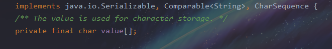

# StringBuilder源码学习


## StringBuilder类和string类的区别

**相同**：底层均采用字符数组`value`来保存字符串

**区别**：`String`类的`value`数组有`final `修饰，指向不可改，同时`private `未提供修改`value`数组的方法，==因此String类一旦赋值即不可变==。`StringBuilder`类的`value`数组没有`final`修饰，可以改变指向，==且可以扩容，扩容通过新建字符数组完成==。




## String类

### 构造函数

#### 1.默认的无参和含参构造函数

```java
public String() {
        this.value = "".value;
  }

public String(String original) {
        this.value = original.value;
        this.hash = original.hash;
  }
```

都是直接在现有常量上进行赋值（将常量的指针指向参数）

#### 2.参数是数组的构造函数

```java
public String(char value[]) {
        this.value = Arrays.copyOf(value, value.length);
    }
```

```java
/**
Array类
**/
public static char[] copyOf(char[] original, int newLength) {
        char[] copy = new char[newLength];
        System.arraycopy(original, 0, copy, 0,
                         Math.min(original.length, newLength));
        return copy;
    }
```

调用Arrays的copyOf方法，返回复制完的新数组。

### 常用函数

#### length()

返回的是字符数组value的长度

```java
    public int length() {
        return value.length;
    }
```

#### isEmpty() 

判断字符数组长度是否为0

```java
public boolean isEmpty() {
        return value.length == 0;
    }
```

#### charAt()

返回value对象的索引

```java
public char charAt(int index) {
    if ((index < 0) || (index >= value.length)) {
        throw new StringIndexOutOfBoundsException(index);
    }
    return value[index];
}
```

####  equals()

重写equals()方法,判断为真的情况是：两个对象相同，同时对应的value字符数组内容也相同

<mark>其中：可能是同一对象也可能是内容相同的不同String</mark>

```java
public boolean equals(Object anObject) {
    //判断是不是同一个对象
        if (this == anObject) {
            return true;
        }
    //判断是不是String对象，强转String类型
        if (anObject instanceof String) {
            String anotherString = (String)anObject;
            int n = value.length;
            if (n == anotherString.value.length) {
                char v1[] = value;
                char v2[] = anotherString.value;
                int i = 0;
                while (n-- != 0) {
                    if (v1[i] != v2[i])
                        return false;
                    i++;
                }
                return true;
            }
        }
        return false;
    }
```


#### compareTo()

返回：如果第一个不相同字符之差，如果一个字符串是另一个的子串（前lim个字符相同），返回两个字符串长度之差

```java
public int compareTo(String anotherString) {
    int len1 = value.length;
    int len2 = anotherString.value.length;
    int lim = Math.min(len1, len2);
    char v1[] = value;
    char v2[] = anotherString.value;

    int k = 0;
    while (k < lim) {
        char c1 = v1[k];
        char c2 = v2[k];
        if (c1 != c2) {
            return c1 - c2;
        }
        k++;
    }
    return len1 - len2;
}
```


#### substring()

1.substring(int)

该函数返回从给定参数位置起到字符串结束的新字符串。如果给定从0开始，<mark>则返回原本的String对象，否则返回一个新的String对象。</mark>

```java
public String substring(int beginIndex) {
        if (beginIndex < 0) {
            throw new StringIndexOutOfBoundsException(beginIndex);
        }
        int subLen = value.length - beginIndex;
        if (subLen < 0) {
            throw new StringIndexOutOfBoundsException(subLen);
        }
        return (beginIndex == 0) ? this : new String(value, beginIndex, subLen);
    }
```

2.substring(int, int)

如果要获取的子串是从0到最后，则返回原本的String对象，否则返回一个新的String对象。

```java
public String substring(int beginIndex, int endIndex) {
        if (beginIndex < 0) {
            throw new StringIndexOutOfBoundsException(beginIndex);
        }
        if (endIndex > value.length) {
            throw new StringIndexOutOfBoundsException(endIndex);
        }
        int subLen = endIndex - beginIndex;
        if (subLen < 0) {
            throw new StringIndexOutOfBoundsException(subLen);
        }
        return ((beginIndex == 0) && (endIndex == value.length)) ? this
                : new String(value, beginIndex, subLen);
    }
```

#### replace()

返回：如果是相同则返回原来的String对象，不同则先找到第一个不同的字符然后将字符复制到新的字符数组中

```java
public String replace(char oldChar, char newChar) {
        if (oldChar != newChar) {
            int len = value.length;
            int i = -1;
            char[] val = value; /* avoid getfield opcode */

            //找到第一个不同的索引下标
            while (++i < len) {
                if (val[i] == oldChar) {
                    break;
                }
            }
            if (i < len) {
                char buf[] = new char[len];
                for (int j = 0; j < i; j++) {
                    buf[j] = val[j];
                }
                while (i < len) {
                    char c = val[i];
                    buf[i] = (c == oldChar) ? newChar : c;
                    i++;
                }
                return new String(buf, true);
            }
        }
        return this;
    }
```


<mark>可见，**String是依赖字符常量表实现的**； 同时**所有对String发生修改的方法返回值都是一个新的String对象，没有修改原有对象**； 因此是线程安全的</mark>

## StringBuilder类源码

## 构造函数

1 .默认构造函数

`Stringbuilder`使用了父类`AbstractStringBuilder`构造，默认长度`16`.<mark>注意这里的value没有final修饰，权限为默认，因此内部数值可以改变·</mark>

```java
    public StringBuilder() {
        super(16);
    }
```

```java
/*父类*/    
AbstractStringBuilder(int capacity) {
        value = new char[capacity];
    }
```

2.传入字符串·

会设置初始容量为传入字符串长度加上`16`，再通过`append`函数将`str`写入，`append`函数见常用方法

```java
public StringBuilder(String str) {
        super(str.length() + 16);
        append(str);
    }
```


## 常用函数

### append()

append函数调用时会首先查看是否超出容量上限

```java
 @Override
    public StringBuilder append(Object obj) {
        return append(String.valueOf(obj));
    }

    @Override
    public StringBuilder append(String str) {
        //调用父类
        super.append(str);
        return this;
    }
```

```java
public AbstractStringBuilder append(String str) {
        if (str == null)
            return appendNull();
        int len = str.length();
        ensureCapacityInternal(count + len);
        str.getChars(0, len, value, count);
        count += len;
        return this;
    }
```

**容量检查函数**

参数是当前对象的value中字符长度与传入字符串长度之和，也即是value的容量最小值。

如果需要的容量最小值大于目前value容量，新申请一块内存复制进去

扩容的新容量为当前`value`的容量`2`倍加`2`，如果扩容后的容量还是比需要的最小容量小，则直接扩容为需要的最小容量，再将当前value内容复制给一个新的长度为`newCapacity`的字符数组，再将value`指向`这个扩容后的新数组。即扩容是通过开辟新数组完成的，返回的也是新创建的新数组。

```java
private void ensureCapacityInternal(int minimumCapacity) {
        // overflow-conscious code
        if (minimumCapacity - value.length > 0) {
            value = Arrays.copyOf(value,
                    newCapacity(minimumCapacity));
        }
    }

//-----------------中间省去很多函数...---------

private int newCapacity(int minCapacity) {
        // overflow-conscious code
        int newCapacity = (value.length << 1) + 2;
        if (newCapacity - minCapacity < 0) {
            newCapacity = minCapacity;
        }
        return (newCapacity <= 0 || MAX_ARRAY_SIZE - newCapacity < 0)
            ? hugeCapacity(minCapacity)
            : newCapacity;
    }
```

执行完`ensureCapacityInternal`函数后，`this`对象的`value`数组已经指向一个扩容后的新数组，并且之前的`value`数组里的值也复制到新的`value`数组中，接下来执行`getChars`函数

**复制字符函数**

该函数是将调用的`string`对象的`value`数组从`srcBegin`到`srcEnd`复制给目标数组`dst`，从`dst`数组的第`dstBegin`位置开始。

`append`函数中执行完`str.getChars`函数后就将参数`str`的内容追加到`StringBuilder`对象的`value`数组后面，再更新`count`值，返回调用对象。

```java
    public void getChars(int srcBegin, int srcEnd, char dst[], int dstBegin) {
        if (srcBegin < 0) {
            throw new StringIndexOutOfBoundsException(srcBegin);
        }
        if (srcEnd > value.length) {
            throw new StringIndexOutOfBoundsException(srcEnd);
        }
        if (srcBegin > srcEnd) {
            throw new StringIndexOutOfBoundsException(srcEnd - srcBegin);
        }
        System.arraycopy(value, srcBegin, dst, dstBegin, srcEnd - srcBegin);
    }
```

### 删除函数

```java
@Override
    public StringBuilder delete(int start, int end) {
        super.delete(start, end);
        return this;
    }

    @Override
    public StringBuilder deleteCharAt(int index) {
        super.deleteCharAt(index);
        return this;
    }
```

delete()函数通过覆盖原理，将删除的元素覆盖掉

deleteCharAt()删除索引为index处的字符。通过调用数组复制函数来完成，将索引后面的内容依次复制到从索引开始的位置上，即通过覆盖的原理完成，更新count。

```java
/*父类调用函数
*/

 public AbstractStringBuilder delete(int start, int end) {
        if (start < 0)
            throw new StringIndexOutOfBoundsException(start);
        if (end > count)
            end = count;
        if (start > end)
            throw new StringIndexOutOfBoundsException();
        int len = end - start;
        if (len > 0) {
            System.arraycopy(value, start+len, value, start, count-end);
            count -= len;
        }
        return this;
    }


public AbstractStringBuilder deleteCharAt(int index) {
        if ((index < 0) || (index >= count))
            throw new StringIndexOutOfBoundsException(index);
        System.arraycopy(value, index+1, value, index, count-index-1);
        count--;
        return this;
    }
```

### 插入函数


```java
 @Override
    public StringBuilder insert(int index, char[] str, int offset,
                                int len)
    {
        super.insert(index, str, offset, len);
        return this;
    }

/*简单拿这个举例子，后面char类型可以换成其他类型
*/
    @Override
    public StringBuilder insert(int offset, char c) {
        super.insert(offset, c);
        return this;
    }

```

首先确保value数组容量足够，然后通过数组复制，将索引位置开始全部向后移一位，再将索引位置赋值c，更新count。

```java
/*
父类调用函数
*/
public AbstractStringBuilder insert(int offset, char c) {
        ensureCapacityInternal(count + 1);
        System.arraycopy(value, offset, value, offset + 1, count - offset);
        value[offset] = c;
        count += 1;
        return this;
    }
```


## 对比

StringBuffer以后有机会在写吧。。。

[对比来源](https://www.cnblogs.com/snifferhu/p/5903958.html)

| 差别         | String                       | StringBuffer                                                 | StringBuilder                                                |
| ------------ | ---------------------------- | ------------------------------------------------------------ | ------------------------------------------------------------ |
| 常量 / 变量  | 常量                         | 变量                                                         | 变量                                                         |
| 线程是否安全 | 安全                         | 安全                                                         | 非安全                                                       |
| 所在内存区域 | Constant String Pool(常量池) | heap                                                         | heap                                                         |
| 是否能被继承 | 否                           | 否                                                           | 否                                                           |
| 代码行数     | 3157                         | 718                                                          | 448                                                          |
| 使用场景     | 在字符串不经常变化的场景     | 在频繁进行字符串运算（如拼接、替换、删除等）， 并且运行在多线程环境 | 在频繁进行字符串运算（如拼接、替换、和删除等）， 并且运行在单线程的环境 |
| 场景举例     | 常量的声明、少量的变量运算   | XML 解析、HTTP 参数解析和封装                                | SQL 语句的拼装、JSON 封装                                    |

`AbstractStringBuilder `：`StringBuffer`类与`StringBuilder`类都继承了`AbstractStringBuilder`，抽象父类里实现了除`toString`以外的所有方法。 
`StringBuilder`：自己重写了方法之后，全都在方法内`super.function()`，未做任何扩展。同时从类名语义上来说`String`构建者，所以没有`subString`方法看来也合情合理； 
`StringBuffer`：在重写方法的同时，几乎所有方法都添加了`synchronized`同步关键字；

