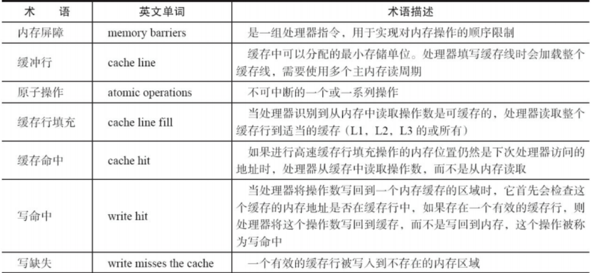

# JAVA并发编程艺术

## 第一章 并发编程的挑战

## 第2章 Java并发机制的底层实现原理

### volatile

>定义：Java编程语言允许线程访问共享变量，为了确保共享变量能被准确和一致地更新，线程应该确保通过排他锁单独获得这个变量。Java语言
>提供了volatile，在某些情况下比锁要更加方便。如果一个字段被声明成volatile，Java线程内存
>模型确保所有线程看到这个变量的值是一致的

