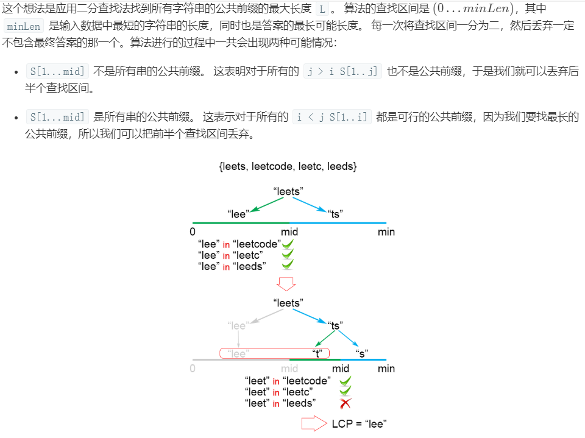
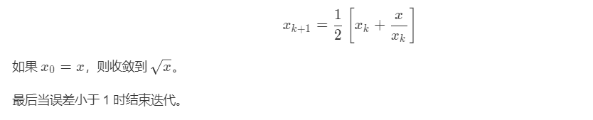

# LeetCode解题心得

### 1、两数之和


+ 把数值存在Hash表里，牺牲空间换取时间
+ 同时要注意数字相同的情况

> 时间复杂度：O(n)， 我们把包含有 n 个元素的列表遍历两次。由于哈希表将查找时间缩短到 O(1) ，所以时间复杂度为 O(n)。
>
> 空间复杂度：O(n)， 所需的额外空间取决于哈希表中存储的元素数量，该表中存储了 n 个元素。

注意：

+ 哈希碰撞：出现hash值相同的情况。  使用哈希的时候必须要考虑这种情况
+ 数字的hash值就是本身

---


### 2、两数相加

*题目：*

*给出两个 非空 的链表用来表示两个非负的整数。其中，它们各自的位数是按照 逆序 的方式存储的，并且它们的每个节点只能存储 一位 数字。*

*如果，我们将这两个数相加起来，则会返回一个新的链表来表示它们的和。*

*您可以假设除了数字 0 之外，这两个数都不会以 0 开头。*

*示例：*

```
输入：(2 -> 4 -> 3) + (5 -> 6 -> 4)
输出：7 -> 0 -> 8
原因：342 + 465 = 807
```

注意事项

+ 要考虑到两数相加存在进位，且进位只有1和0两种情况

+ 思路不一定是规整地每步相加，可以先求得总和，然后放入链表中

+ 注意链表的递进关系要保持一致，不要错位

  

答案

```java
public ListNode addTwoNumbers(ListNode l1, ListNode l2) {
    ListNode dummyHead = new ListNode(0);
    //设立哑节点 同时所有节点做了一次备份
    ListNode p = l1, q = l2, curr = dummyHead;     
    int carry = 0;
    while (p != null || q != null) {
        //因为后面需要对原来的p、q做比较，所以需要对原来节点做备份
        int x = (p != null) ? p.val : 0;             
        int y = (q != null) ? q.val : 0;
        int sum = carry + x + y;
        carry = sum / 10;
        curr.next = new ListNode(sum % 10);
        curr = curr.next;
        //注意链表递进关系的同步，三个链表都要同时递进
        if (p != null) p = p.next;
        if (q != null) q = q.next;
    }
    if (carry > 0) {
        curr.next = new ListNode(carry);
    }
    return dummyHead.next;
}

```

暴露的问题

+ 对题目的解读不够全面
+ 基础的代码不会编写（链表如何递进）


---


### 3、无重复的最长字符串

*题目*

*给定一个字符串，请你找出其中不含有重复字符的 最长子串 的长度。*

```
示例 1:
输入: "abcabcbb"
输出: 3 
解释: 因为无重复字符的最长子串是 "abc"，所以其长度为 3。
```

```
示例 2:
输入: "bbbbb"
输出: 1
解释: 因为无重复字符的最长子串是 "b"，所以其长度为 1。
```

```
示例 3:
输入: "pwwkew"
输出: 3
解释: 因为无重复字符的最长子串是 "wke"，所以其长度为 3。
     请注意，你的答案必须是 子串 的长度，"pwke" 是一个子序列，不是子串。
```

> 问题：如何快速检索重复的字符
>
> 解答： 使用首尾索引确定字串，发现重复只需修改索引位置


答案1:滑动窗口

```JAVA
public class Solution {
    public int lengthOfLongestSubstring(String s) {
        int n = s.length(), ans = 0;
        Map<Character, Integer> map = new HashMap<>(); // current index of character
        // try to extend the range [i, j]
        for (int j = 0, i = 0; j < n; j++) {
            if (map.containsKey(s.charAt(j))) {
                i = Math.max(map.get(s.charAt(j)), i);
            }
            ans = Math.max(ans, j - i + 1);
            map.put(s.charAt(j), j + 1);
        }
        return ans;
    }
}

//关键在于数值的选择，为什么索引要放j+1？
当if成立时，i直接跳到重复的字符中前一个的下一个（此时重复的字符还没有更新map）从而跳过被重复的那个字符
//为什么最后的ans= j-i+1？
拿完全不重复的字符串举例就行
```

答案2：ASCII码作为索引

```java
public class Solution {
    public int lengthOfLongestSubstring(String s) {
        int n = s.length(), ans = 0;
        int[] index = new int[128]; // current index of character
        // try to extend the range [i, j]
        for (int j = 0, i = 0; j < n; j++) {
            i = Math.max(index[s.charAt(j)], i);
            ans = Math.max(ans, j - i + 1);
            index[s.charAt(j)] = j + 1;     //直接将charAt（j）的ASCII码对应的值改变
        }
        return ans;
    }
}

//空间复杂度取决于ASCII字符集大小
//好处在已经存在数组，默认索引值为0，i就不需要判断，直接可以
```

**心得**

+ 构造函数设置起点、终点检索字符串
+ 使用首尾指针控制字符子串
+ 使用MAP做字符到索引的映射
+ 注意值+1-1

---


### 4.寻找两个有序数组的中位数*

给定两个大小为 m 和 n 的有序数组 nums1 和 nums2。

请你找出这两个有序数组的中位数，并且要求算法的时间复杂度为 O(log(m + n))。

你可以假设 nums1 和 nums2 不会同时为空。

```java
示例 1:
nums1 = [1, 3]
nums2 = [2]
则中位数是 2.0
```

```java
示例 2:
nums1 = [1, 2]
nums2 = [3, 4]
则中位数是 (2 + 3)/2 = 2.5

```

**解析**

主要是两种方法

+ 逐渐消除消除小于k的值，并二分k
+ 利用类似于堆排序的思想，维护左右两堆


**答案**

1.合并后排序（时间复杂度不符合）

```java
    public  double findMedianSortedArrays(int[] nums1,int[] nums2){
        if(nums1.length == 0 && nums2.length == 0){
            return 0;
        }
        double media = 0;
        int[] both = new int[nums1.length + nums2.length];
        System.arraycopy(nums1,0,both,0,nums1.length);
        System.arraycopy(nums2,0,both,nums1.length,nums2.length);
        Arrays.sort(both);
        if(both.length%2 == 0){
            media = (both[both.length/2-1]+both[both.length/2])/2.0;
        }else{
            media = both[both.length/2];
        }
        return media;
    }
```

2.只遍历len/2，得到中位数

+ 时间复杂度：遍历` len/2+1` 次，`len=m+n`，所以时间复杂度依旧是 `O(m+n)`。
+ 空间复杂度：我们申请了常数个变量，也就是 `m`，`n`，`len`，`left`，`right`，`aStart`，`bStart `以及 `i`。总共 8 个变量，所以空间复杂度是` O(1）`。

```java
public double findMedianSortedArrays(int[] A, int[] B) {
    int m = A.length;
    int n = B.length;
    int len = m + n;
    int left = -1, right = -1;
    int aStart = 0, bStart = 0;
    for (int i = 0; i <= len / 2; i++) {
        left = right;
        //这句判断，使得两个数组谁为空就走另外一个，写的很精简
        if (aStart < m && (bStart >= n || A[aStart] < B[bStart])) {
            right = A[aStart++];
        } else {
            right = B[bStart++];
        }
    }
    if ((len & 1) == 0)
        return (left + right) / 2.0;
    else
        return right;
}
```


3.求中位数，其实就是求第 `k` 小数的一种特殊情况


假设我们要找第 `7` 小的数字。


我们比较两个数组的第` k/2 `个数字，如果 `k` 是奇数，向下取整。也就是比较第 3 个数字，上边数组中的 4 和下边数组中的 3，如果哪个小，就表明该数组的前` k/2` 个数字都不是第 `k `小数字，所以可以排除。也就是 1，2，3 这三个数字不可能是第 7 小的数字，我们可以把它排除掉。将 1349 和 45678910 两个数组作为新的数组进行比较。

橙色的部分表示已经去掉的数字。


**最后当k等于1的时候返回两个数组中最小的数值就可以了**

**如果i其中一个数组为空，只要返回剩下数组的第k个数字就行了**

```java
public double findMedianSortedArrays(int[] nums1, int[] nums2) {
    int n = nums1.length;
    int m = nums2.length;
    //第k个数
    int left = (n + m + 1) / 2;
    int right = (n + m + 2) / 2;
    //将偶数和奇数的情况合并，如果是奇数，会求两次同样的 k 。
    return (getKth(nums1, 0, n - 1, nums2, 0, m - 1, left) + getKth(nums1, 0, n - 1, nums2, 0, m - 1, right)) * 0.5;  
}
    
    private int getKth(int[] nums1, int start1, int end1, int[] nums2, int start2, int end2, int k) {
        //两点相减得到距离要+1
        int len1 = end1 - start1 + 1;
        int len2 = end2 - start2 + 1;
        //让 len1 的长度小于 len2，这样就能保证如果有数组空了，一定是 len1 
        if (len1 > len2) return getKth(nums2, start2, end2, nums1, start1, end1, k);
        if (len1 == 0) return nums2[start2 + k - 1];

        if (k == 1) return Math.min(nums1[start1], nums2[start2]);

        //防止越界
        int i = start1 + Math.min(len1, k / 2) - 1;
        int j = start2 + Math.min(len2, k / 2) - 1;

        if (nums1[i] > nums2[j]) {
            return getKth(nums1, start1, end1, nums2, j + 1, end2, k - (j - start2 + 1));
        }
        else {
            return getKth(nums1, i + 1, end1, nums2, start2, end2, k - (i - start1 + 1));
        }
    }
```


4、类似归并的方法，对中位数进行切分

[leetcode题解](https://leetcode-cn.com/problems/median-of-two-sorted-arrays/solution/xiang-xi-tong-su-de-si-lu-fen-xi-duo-jie-fa-by-w-2/)


**关于j的定义**


**1.当 A 数组和 B 数组的总长度是偶数时，如果我们能够保证**

*左半部分的长度等于右半部分

```java
i + j = m - i  + n - j  , 也就是 j = ( m + n ) / 2 - i
```

*左半部分最大的值小于等于右半部分最小的值 max ( A [ i - 1 ] , B [ j - 1 ]）） <= min ( A [ i ] , B [ j ]））

```java
那么，中位数就可以表示如下

（左半部分最大值 + 右半部分最小值 ）/ 2。

（max ( A [ i - 1 ] , B [  j  - 1 ]）+ min ( A [ i ] , B [ j ]）） /  2
```


**2.当 A 数组和 B 数组的总长度是奇数时，如果我们能够保证**

*左半部分的长度比右半部分大 1

```java
  i + j = m - i  + n - j  + 1也就是 j = ( m + n + 1) / 2 - i
```

*左半部分最大的值小于等于右半部分最小的值 max ( A [ i - 1 ] , B [ j - 1 ]）） <= min ( A [ i ] , B [ j ]））

```java
那么，中位数就是

左半部分最大值，也就是左半部比右半部分多出的那一个数。

max ( A [ i - 1 ] , B [  j - 1 ]）
```

控制i，j将数组划分到左右两个堆中


```java
        public double findMedianSortedArrays3(int[] A, int[] B) {
            int m = A.length;
            int n = B.length;
            if (m > n) {
                return findMedianSortedArrays3(B,A); // 保证 m <= n
        }
            int iMin = 0, iMax = m;
            while (iMin <= iMax) {
                int i = (iMin + iMax) / 2;
                //这样可以保证i后移地时候j前移
                int j = (m + n + 1) / 2 - i;
                if (j != 0 && i != m && B[j-1] > A[i]){ // i 需要增大
                    iMin = i + 1;
                }
                else if (i != 0 && j != n && A[i-1] > B[j]) { // i 需要减小
                    iMax = i - 1;
                }
                else { // 达到要求，并且将边界条件列出来单独考虑
                    int maxLeft = 0;
                    if (i == 0) {
                        maxLeft = B[j-1];
                    }
                    else if (j == 0) {
                        maxLeft = A[i-1];
                    }
                    else {
                        maxLeft = Math.max(A[i-1], B[j-1]);
                    }

                    if ( (m + n) % 2 == 1 ) {
                        return maxLeft;
                    } // 奇数的话不需要考虑右半部分

                    int minRight = 0;
                    if (i == m) {        public double findMedianSortedArrays3(int[] A, int[] B) {
            int m = A.length;
            int n = B.length;
            if (m > n) {
                return findMedianSortedArrays3(B,A); // 保证 m <= n
        }
            int iMin = 0, iMax = m;
            while (iMin <= iMax) {
                int i = (iMin + iMax) / 2;
                //这样可以保证i后移地时候j前移
                int j = (m + n + 1) / 2 - i;
                if (j != 0 && i != m && B[j-1] > A[i]){ // i 需要增大
                    iMin = i + 1;
                }
                else if (i != 0 && j != n && A[i-1] > B[j]) { // i 需要减小
                    iMax = i - 1;
                }
                else { // 达到要求，并且将边界条件列出来单独考虑
                    int maxLeft = 0;
                    if (i == 0) { maxLeft = B[j-1]; }
                    else if (j == 0) { maxLeft = A[i-1]; }
                    else { maxLeft = Math.max(A[i-1], B[j-1]); }

                    if ( (m + n) % 2 == 1 ) { return maxLeft; } // 奇数的话不需要考虑右半部分

                    int minRight = 0;
                    if (i == m) { minRight = B[j]; }
                    else if (j == n) { minRight = A[i]; }
                    else { minRight = Math.min(B[j], A[i]); }

                    return (maxLeft + minRight) / 2.0; //如果是偶数的话返回结果
                }
            }
            return 0.0;
        } minRight = B[j]; }
                    else if (j == n) { minRight = A[i]; }
                    else { minRight = Math.min(B[j], A[i]); }

                    return (maxLeft + minRight) / 2.0; //如果是偶数的话返回结果
                }
            }
            return 0.0;
        }
```


---


### 5.最长回文数

给定一个字符串 s，找到 s 中最长的回文子串。你可以假设 s 的最大长度为 1000。

示例 1：

```
输入: "babad"
输出: "bab"
注意: "aba" 也是一个有效答案。
```

示例 2：

```
输入: "cbbd"
输出: "bb"
```

> 问题


**解析**

+ 注意中心扩展过程中下标的定位

  确定`center`后，左右节点分别为`center+len` 和`center-len`

  关于`center`中心对称的节点：`mirror = 2*center-i`

+ 


**答案**

1. 最长公共子串

   特点：当 String的其他部分中存在非回文子串的反向副本时，最长公共子串法就会失败。为了纠正这一点，每当我们找到最长的公共子串的候选项时，都需要检查子串的索引是否与反向子串的原始索引相同。如果相同，那么我们尝试更新目前为止找到的最长回文子串；如果不是，我们就跳过这个候选项并继续寻找下一个候选。

   

2. 中心扩展算法

   我们观察到回文中心的两侧互为镜像。因此，回文可以从它的中心展开，并且只有 2*n*−1 个这样的中心。

   

```java
public String longestPalindrome(String s) {
    if (s == null || s.length() < 1) return "";
    int start = 0, end = 0;
    //回文可以从它的中心展开，并且只有 2n−1 个这样的中心。（中心是奇一个字符时有n个中心，中心是2个字符时有n-1个）
    for (int i = 0; i < s.length(); i++) {
        //每次去判断两种情况
        int len1 = expandAroundCenter(s, i, i);
        int len2 = expandAroundCenter(s, i, i + 1);
        int len = Math.max(len1, len2);
        if (len > end - start) {
            start = i - (len - 1) / 2;
            end = i + len / 2;
        }
    }
    return s.substring(start, end + 1);
}

private int expandAroundCenter(String s, int left, int right) {
    int L = left, R = right;
    while (L >= 0 && R < c ssbv
           s.length() && s.charAt(L) == s.charAt(R)) {
        L--;
        R++;
    }
    return R - L - 1;
}
```

扩展： **Manacher's Algorithm 马拉车算法**

1. 通过`#`扩展原字符串，使得新字符串同时可以判断奇数和偶数的回文子串
2. 通过辅助数组`p[]`记录每个以该字符为中心到最长回文子串边界的长度，采用中心扩展法
3. 优化算法，将时间复杂度降低到O(N)，具体做法是：在遍历的过程中，除了循环变量 `i` 以外，我们还需要记录两个变量，它们是 `maxRight` 和 `center` 
4. 判断`maxRight`和`p[mirror]`的情况
   + p[mirror]小于maxRight的情况可以直接抄过来，不需要进一步分析
   + 大于maxRight的情况需要中心扩展法进行分析


```java
public class Solution {

    public String longestPalindrome(String s) {
        // 特判
        int len = s.length();
        if (len < 2) {
            return s;
        }

        // 得到预处理字符串
        String str = addBoundaries(s, '#');
        // 新字符串的长度
        int sLen = 2 * len + 1;

        // 数组 p 记录了扫描过的回文子串的信息
        int[] p = new int[sLen];

        // 双指针，它们是一一对应的，须同时更新
        int maxRight = 0;
        int center = 0;

        // 当前遍历的中心最大扩散步数，其值等于原始字符串的最长回文子串的长度
        int maxLen = 1;
        // 原始字符串的最长回文子串的起始位置，与 maxLen 必须同时更新        
        int start = 0;

        for (int i = 0; i < sLen; i++) {
            if (i < maxRight) {
                int mirror = 2 * center - i;
                // 这一行代码是 Manacher 算法的关键所在，要结合图形来理解
                p[i] = Math.min(maxRight - i, p[mirror]);
            }

            // 下一次尝试扩散的左右起点，能扩散的步数直接加到 p[i] 中
            int left = i - (1 + p[i]);
            int right = i + (1 + p[i]);

            // left >= 0 && right < sLen 保证不越界
            // str.charAt(left) == str.charAt(right) 表示可以扩散 1 次
            //中心扩展法
            while (left >= 0 && right < sLen && str.charAt(left) == str.charAt(right)) {
                p[i]++;
                left--;
                right++;

            }
            // 根据 maxRight 的定义，它是遍历过的 i 的 i + p[i] 的最大者
            // 如果 maxRight 的值越大，进入上面 i < maxRight 的判断的可能性就越大，这样就可以重复利用之前判断过的回文信息了
            if (i + p[i] > maxRight) {
                // maxRight 和 center 需要同时更新
                maxRight = i + p[i];
                center = i;
            }
            if (p[i] > maxLen) {
                // 记录最长回文子串的长度和相应它在原始字符串中的起点
                maxLen = p[i];
                start = (i - maxLen) / 2;
            }
        }
        return s.substring(start, start + maxLen);
    }


    /**
     * 创建预处理字符串
     *
     * @param s      原始字符串
     * @param divide 分隔字符
     * @return 使用分隔字符处理以后得到的字符串
     */
    private String addBoundaries(String s, char divide) {
        int len = s.length();
        if (len == 0) {
            return "";
        }
        if (s.indexOf(divide) != -1) {
            throw new IllegalArgumentException("参数错误，您传递的分割字符，在输入字符串中存在！");
        }
        StringBuilder stringBuilder = new StringBuilder();
        for (int i = 0; i < len; i++) {
            stringBuilder.append(divide);
            stringBuilder.append(s.charAt(i));
        }
        stringBuilder.append(divide);
        return stringBuilder.toString();
    }
}
```


3. 动态规划法

可以再[优化](https://leetcode-cn.com/problems/longest-palindromic-substring/solution/zhong-xin-kuo-san-dong-tai-gui-hua-by-liweiwei1419/)


```java
public String longestPalindrome(String s) {
        int len = s.length();
        if (len < 2) {
            return s;
        }
//dp[i][j]代表子串[i,j]是不是回文串
        boolean[][] dp = new boolean[len][len];

        // 初始化
        for (int i = 0; i < len; i++) {
            dp[i][i] = true;
        }

        int maxLen = 1;
        int start = 0;

        for (int j = 1; j < len; j++) {
            for (int i = 0; i < j; i++) {

                if (s.charAt(i) == s.charAt(j)) {
                    if (j - i < 3) {
                        dp[i][j] = true;
                    } else {
                        dp[i][j] = dp[i + 1][j - 1];
                    }
                } else {
                    dp[i][j] = false;
                }

                // 只要 dp[i][j] == true 成立，就表示子串 s[i, j] 是回文，此时记录回文长度和起始位置
                if (dp[i][j]) {
                    int curLen = j - i + 1;
                    if (curLen > maxLen) {
                        maxLen = curLen;
                        start = i;
                    }
                }
            }
        }
        return s.substring(start, start + maxLen);
    }
```


### 6.字形变换

将一个给定字符串根据给定的行数，以从上往下、从左到右进行 Z 字形排列。

比如输入字符串为 "LEETCODEISHIRING" 行数为 3 时，排列如下：

L   C   I   R
E T O E S I I G
E   D   H   N
之后，你的输出需要从左往右逐行读取，产生出一个新的字符串，比如："LCIRETOESIIGEDHN"。

请你实现这个将字符串进行指定行数变换的函数：

```
示例 1:
输入: s = "LEETCODEISHIRING", numRows = 3
输出: "LCIRETOESIIGEDHN"
```


**答案**

按列排序

将字符放到每一行的StringBuilder中去，利用指针控制前进和后退

```java
class Solution {
    public String convert(String s, int numRows) {
        if (numRows == 1) return s;

        List<StringBuilder> rows = new ArrayList<>();
        for (int i = 0; i < Math.min(numRows, s.length()); i++)
            rows.add(new StringBuilder());

        int curRow = 0;
        boolean goingDown = false;

        for (char c : s.toCharArray()) {
            rows.get(curRow).append(c);
            if (curRow == 0 || curRow == numRows - 1) goingDown = !goingDown;
            curRow += goingDown ? 1 : -1;
        }

        StringBuilder ret = new StringBuilder();
        for (StringBuilder row : rows) ret.append(row);
        return ret.toString();
    }
}
```

**按行访问**

+ 行`0`中的字符位于索引`k*(2*numRows-2)`处
+ 行`numRows-1`的字符位于索引`k*(2*numRows-2)+numRows-1`处
+ 内部行`i`中的字符位于索引`k*(2*numRows-2+i)`以及 `(k+1)(2*numRows-2)-i`处
  + 第 1 个字符和第 0 行的规律是一样的。
  + 第 2 个字符其实就是下一个周期的第 0 行的下标减去当前行

```java
class Solution {
    public String convert(String s, int numRows) {

        if (numRows == 1) return s;
        StringBuilder ret = new StringBuilder();
        int n = s.length();
        int cycleLen = 2 * numRows - 2;

        for (int i = 0; i < numRows; i++) {
            for (int j = 0; j + i < n; j += cycleLen) {
                ret.append(s.charAt(j + i));
                if (i != 0 && i != numRows - 1 && j + cycleLen - i < n)
                    ret.append(s.charAt(j + cycleLen - i));
            }
        }
        return ret.toString();
    }
}
```


## 队列

### 队列实现栈


## 数组

### 300.最长上升子序列

给定一个无序的整数数组，找到其中最长上升子序列的长度。

**示例:**

```
输入: [10,9,2,5,3,7,101,18]
输出: 4 
解释: 最长的上升子序列是 [2,3,7,101]，它的长度是 4。
```

**说明:**

- 可能会有多种最长上升子序列的组合，你只需要输出对应的长度即可。
- 你算法的时间复杂度应该为 O(*n2*) 。

**进阶:** 你能将算法的时间复杂度降低到 O(*n* log *n*) 吗?


**答案**

**动态规划**

使用一个最大值数组保存每次遍历的最大值，

动态规划每次使用上一次的最大值和现在进行比较，如果满足条件，那就在原来基础上递增

步骤

1. **定义状态**  `dp[i]` 表示**以 `nums[i]` 结尾**的「上升子序列」的长度

2. **考虑状态转移方程**   

   

3. **考虑初始化**  `dp[i] = 1`，11 个字符显然是长度为 11 的上升子序列。

4. **考虑输出**  最后一个状态值只是以 `nums[len - 1]` 结尾的「上升子序列」的长度，`dp`的最大值才是最后的输出值

5. **考虑状态压缩**

```java
public class Solution {
    public int lengthOfLIS(int[] nums) {
        if (nums.length == 0) {
            return 0;
        }
        int[] dp = new int[nums.length];
        dp[0] = 1;
        int maxans = 1;
        //注意i从1开始
        for (int i = 1; i < dp.length; i++) {
            int maxval = 0;
            for (int j = 0; j < i; j++) {
                if (nums[i] > nums[j]) {
                    maxval = Math.max(maxval, dp[j]);
                }
            }
            dp[i] = maxval + 1;
            maxans = Math.max(maxans, dp[i]);
        }
        return maxans;
    }
}
```


**贪心+二分**

> 考虑一个简单的贪心，如果我们要使上升子序列尽可能的长，则我们需要让序列上升得尽可能慢，因此我们希望每次在上升子序列最后加上的那个数尽可能的小。

+ 二分主要是为了找到第一个大于nums[i]的数，前提是tail数组是一个递增的数组
+ 贪心是

**状态定义**：

+ `tails[k]` 的值代表 长度为 `k+1` 子序列 的尾部元素值。

**转移方程**： 设 `res `为 `tails` 当前长度，代表直到当前的最长上升子序列长度。设 j∈[0,res)，考虑每轮遍历 `nums[k]` 时，通过二分法遍历` [0,res)` 列表区间，找出 `nums[k]` 的大小分界点，会出现两种情况：

+ 区间中存在 `tails[i] > nums[k]`： 将第一个满足 `tails[i] > nums[k]`执行` tails[i] = nums[k]`；因为更小的 nums[k]后更可能接一个比它大的数字（前面分析过）。
+ 区间中不存在 `tails[i] > nums[k]` ： 意味着 `nums[k] `可以接在前面所有长度的子序列之后，因此肯定是接到最长的后面（长度为 `res `），新子序列长度为` res + 1`。

**初始状态**：

+ 令 `tails `列表所有值 `=0`。·

**返回值**：

+ 返回 res ，即最长上升子子序列长度。


> 自我解读
>
> 只要比尾部大说明可以继续成为连续数组，二分的作用就是遍历数组看是不是这个数比尾部都大
>
> 

```java
class Solution {
    public int lengthOfLIS(int[] nums) {
        int[] tails = new int[nums.length];
        int res = 0;
        for(int num : nums) {
            int i = 0, j = res;
            while(i < j) {
                int m = (i + j) / 2;
                if(tails[m] < num) i = m + 1;
                else j = m;
            }
            //尾部数组插入值，可能是新值也可能更新
            tails[i] = num;
            //如果res==j说明长度变长了
            if(res == j) res++;
        }
        return res;
    }
}
```


### 35、插入元素的位置


**答案**

#### 二分查找法的应用

### 200、岛屿数量

**示例 1:**

```
输入:
11110
11010
11000
00000

输出: 1
```


**答案**

**深度优先遍历**

有点暴力

```java
public void dfs(char[][] grid, int r, int c) {
    int nr = grid.length;
    int nc = grid[0].length;

    if (r < 0 || c < 0 || r >= nr || c >= nc || grid[r][c] == '0') {
      return;
    }
//访问过的全部清0，防止被重复访问
    grid[r][c] = '0';
    dfs(grid, r - 1, c);
    dfs(grid, r + 1, c);
    dfs(grid, r, c - 1);
    dfs(grid, r, c + 1);
  }

  public int numIslands(char[][] grid) {
    if (grid == null || grid.length == 0) {
      return 0;
    }

    int nr = grid.length;
    int nc = grid[0].length;
    int num_islands = 0;
    for (int r = 0; r < nr; ++r) {
      for (int c = 0; c < nc; ++c) {
        if (grid[r][c] == '1') {
          ++num_islands;
          dfs(grid, r, c);
        }
      }
    }

    return num_islands;
  }
```


**广度优先遍历**

保存队列的值比较巧妙

`id  = r *nc +c;`

`row = id / nc; `

`col = id %nc; `

```java
class Solution {
    public int numIslands(char[][] grid) {
        if (grid == null || grid.length == 0) {
            return 0;
        }

        int nr = grid.length;
        int nc = grid[0].length;
        int num_islands = 0;

        for (int r = 0; r < nr; ++r) {
            for (int c = 0; c < nc; ++c) {
                if (grid[r][c] == '1') {
                    ++num_islands;
                    grid[r][c] = '0';
                    Queue<Integer> neighbors = new LinkedList<>();
                    //这一步非常妙，用一个数字保存了横纵坐标
                    neighbors.add(r * nc + c);
                    while (!neighbors.isEmpty()) {
                        int id = neighbors.remove();
                        //还原横纵坐标
                        int row = id / nc;
                        int col = id % nc;
                        
                        if (row - 1 >= 0 && grid[row-1][col] == '1') {
                            neighbors.add((row-1) * nc + col);
                            grid[row-1][col] = '0';
                        }
                        if (row + 1 < nr && grid[row+1][col] == '1') {
                            neighbors.add((row+1) * nc + col);
                            grid[row+1][col] = '0';
                        }
                        if (col - 1 >= 0 && grid[row][col-1] == '1') {
                            neighbors.add(row * nc + col-1);
                            grid[row][col-1] = '0';
                        }
                        if (col + 1 < nc && grid[row][col+1] == '1') {
                            neighbors.add(row * nc + col+1);
                            grid[row][col+1] = '0';
                        }
                    }
                }
            }
        }

        return num_islands;
    }
}
```


### 695、岛屿的最大面积

给定一个包含了一些 0 和 1 的非空二维数组 grid 。

一个 岛屿 是由一些相邻的 1 (代表土地) 构成的组合，这里的「相邻」要求两个 1 必须在水平或者竖直方向上相邻。你可以假设 grid 的四个边缘都被 0（代表水）包围着。

找到给定的二维数组中最大的岛屿面积。(如果没有岛屿，则返回面积为 0 。)

```
[[0,0,1,0,0,0,0,1,0,0,0,0,0],
 [0,0,0,0,0,0,0,1,1,1,0,0,0],
 [0,1,1,0,1,0,0,0,0,0,0,0,0],
 [0,1,0,0,1,1,0,0,1,0,1,0,0],
 [0,1,0,0,1,1,0,0,1,1,1,0,0],
 [0,0,0,0,0,0,0,0,0,0,1,0,0],
 [0,0,0,0,0,0,0,1,1,1,0,0,0],
 [0,0,0,0,0,0,0,1,1,0,0,0,0]]
 
 返回6
```


**答案**

注意面积一定要这样返回，不然int类型无法传递到上层

```java
class Solution {
    public int maxAreaOfIsland(int[][] grid) {
        int res = 0; 
        for (int i = 0; i < grid.length; i++) {
            for (int j = 0; j < grid[i].length; j++) {
                if (grid[i][j] == 1) {
                    res = Math.max(res, dfs(i, j, grid));
                }
            }
        } 
        return res;
    }
    // 每次调用的时候默认num为1，进入后判断如果不是岛屿，则直接返回0，就可以避免预防错误的情况。
    // 每次找到岛屿，则直接把找到的岛屿改成0，这是传说中的沉岛思想，就是遇到岛屿就把他和周围的全部沉默。
    // ps：如果能用沉岛思想，那么自然可以用朋友圈思想。有兴趣的朋友可以去尝试。
    private int dfs(int i, int j, int[][] grid) {
        if (i < 0 || j < 0 || i >= grid.length || j >= grid[i].length || grid[i][j] == 0) { 
            return 0;
        } 
        grid[i][j] = 0;
        int num = 1;
        num += dfs(i + 1, j, grid);
        num += dfs(i - 1, j, grid);
        num += dfs(i, j + 1, grid);
        num += dfs(i, j - 1, grid);
        return num;
        
    }
}

```


**广度优先遍历**

```java
class Solution {
    public int maxAreaOfIsland(int[][] grid) {
        Deque<int[]> queue = new LinkedList<>();

        int[][] moveIndexArray = {{-1, 0}, {1, 0}, {0, -1}, {0, 1}};
        int maxArea = 0;
        for (int i = 0; i < grid.length; i++) {
            for (int j = 0; j < grid[i].length; j++) {
                queue.offer(new int[]{i, j});
                //计算最大面积
                int currMaxArea = 0;
                while (!queue.isEmpty()) {
                    int size = queue.size();
                    for (int k = 0; k < size; k++) {
                        int[] poll = queue.poll();
                        int currI = poll[0];
                        int currJ = poll[1];
                        if (currI < 0 || currI >= grid.length || currJ < 0 || currJ >= grid[0].length || grid[currI][currJ] == 0) {
                            continue;
                        }
                        currMaxArea++;
                        grid[currI][currJ] = 0;
                        for (int[] moveIndex : moveIndexArray) {
                            queue.offer(new int[]{currI + moveIndex[0], currJ + moveIndex[1]});
                        }
                    }
                }
                maxArea = Math.max(currMaxArea, maxArea);
            }
        }

        return maxArea;
    }

}
```


### 215、数组中第k个最大的元素（最大的k个数）

在未排序的数组中找到第 k 个最大的元素。请注意，你需要找的是数组排序后的第 k 个最大的元素，而不是第 k 个不同的元素。

```
示例 1:

输入: [3,2,1,5,6,4] 和 k = 2
输出: 5
示例 2:

输入: [3,2,3,1,2,4,5,5,6] 和 k = 4
输出: 4
```


**答案**

利用快排的思想，当排序到 `k` 后，停止排序，输出结果

//时间复杂度较高

```java
public static int findKthLargest(int[] nums, int k) {
    fastSort(nums, 0, nums.length - 1);
    return nums[nums.length - k];
}

public static void fastSort(int[] nums, int start, int end) {
    if (nums.length <= 1) {
        return;
    }

    if (start > end) {
        return;
    }

    if (end < 0 || start < 0 || end > nums.length - 1 || start > nums.length - 1) {
        return;
    }

    int left = start, right = end;
    int keyIndex = (left + right) / 2;

    while (left < right) {
        while (right > keyIndex && nums[right] > nums[keyIndex]) {
            right--;
        }

        if (right > keyIndex) {
            swap(nums, keyIndex, right);
            keyIndex = right;
        }

        while (left < keyIndex && nums[left] < nums[keyIndex]) {
            left++;
        }

        if (left < keyIndex) {
            swap(nums, left, keyIndex);
            keyIndex = left;
        }
        left++;
    }

    fastSort(nums, keyIndex + 1, end);
    fastSort(nums, start, keyIndex - 1);

}
```


```java
// 说人话的版本
    public int findKthLargest(int[] nums, int k){
        // k是要求的第几大(从1开始计数),k-1即是数组中的序号(0开始计数)
        return findKthLargest(nums,0,nums.length-1,k-1);
    }
    public int findKthLargest(int[] nums,int low,int high,int k){
        int index = partition(nums,low,high,k);
        if (index == k)
            return nums[index];
        else if (index>k)
            return findKthLargest(nums,low,index-1,k);
        else
            return findKthLargest(nums,index+1,high,k);
    }

    // 同快排的partation,每次确定一个枢轴的位置,并返回其index
    // 找第k 大 的数就把数组按大->小排列
    private int partition(int[] nums,int low,int high,int k){
        int pivot = nums[low];

        while (low<high){
            while (low<high && nums[high]<=pivot) // nums[high]<=pivot 体现出把数组按大->小排列
                high--;
            nums[low] = nums[high];

            while (low< high && nums[low]>=pivot)
                low++;
            nums[high] = nums[low];
        }

        nums[low] = pivot;
        return low;
    } 
```


### 11、盛多水的容器

给你 n 个非负整数 a1，a2，...，an，每个数代表坐标中的一个点 (i, ai) 。在坐标内画 n 条垂直线，垂直线 i 的两个端点分别为 (i, ai) 和 (i, 0)。找出其中的两条线，使得它们与 x 轴共同构成的容器可以容纳最多的水。

说明：你不能倾斜容器，且 n 的值至少为 2。


**解析**

实际是一种贪心算法（大概？），每次尽可能得到最大值

**答案**

实质就是在移动的过程中不断消去不可能成为最大值的状态

```java
public int maxArea(int[] height){
        int maxArea =0;
        int i =0;
        int j = height.length-1;
         while(j> i){
             maxArea = height[i] < height[j] ?
                     Math.max(maxArea, (j - i) * height[i++]):
                     Math.max(maxArea, (j - i) * height[j--]);
         }
         return maxArea;
    }
```


## 字符串

### 14、最长公共前缀

编写一个函数来查找字符串数组中的最长公共前缀。

如果不存在公共前缀，返回空字符串 “"。

```
示例 1:
输入: ["flower","flow","flight"]
输出: "fl"
```

**解析**


1. 找到最短字符串
2. 构建二维数组
3. 多个字符串逐个字符比较

```java
public String longestCommonPrefix(String[] strs) {
    if (strs.length == 0) {
        return "";
    }

    //得到最小长度
    int minLen = strs[0].length();
    for (String str : strs) {
        minLen = Math.min(minLen, str.length());
    }

    //构建字符数组
    char[][] data = new char[strs.length][minLen];
    for (int i = 0; i < strs.length; i++) {
        char[] chars = strs[i].toCharArray();
        System.arraycopy(chars, 0, data[i], 0, minLen);
    }
	//构建公共前缀
    StringBuilder res = new StringBuilder();
    for (int i = 0; i < minLen; i++) {
        for (int j = 1; j < data.length; j++) {
            if (data[j - 1][i] != data[j][i]) {
                return res.toString();
            }
        }
        res.append(data[0][i]);
    }
    return res.toString();
}
```

**优化解法**

**水平扫描法**

选取其中一个字符串，然后利用indexOf依次判断是不是其他字符串的子串

如果是则返回，如果不是，则字符串缩短再次匹配


+ 时间复杂度：O(S)，S 是所有字符串中字符数量的总和。
+ 最坏的情况下，n 个字符串都是相同的。算法会将 S1 与其他字符串 [S 2 …S n ] 都做一次比较。这样就会进行 S 次字符比较，其中 S 是输入数据中所有字符数量。
+ 空间复杂度：O(1)，我们只需要使用常数级别的额外空间。

```java
public String longestCommonPrefix(String[] strs) {
   if (strs.length == 0) return "";
   String prefix = strs[0];
   for (int i = 1; i < strs.length; i++)
       //进入循环说明index不存在 -1
       while (strs[i].indexOf(prefix) != 0) {
           //
           prefix = prefix.substring(0, prefix.length() - 1);
           if (prefix.isEmpty()) return "";
       }        
   return prefix;
```

**垂直扫描**

最容易想到的方法

+ 时间复杂度：O(S)，S 是所有字符串中字符数量的总和。
+ 最坏情况下，输入数据为 n 个长度为 m 的相同字符串，算法会进行 S=m∗n 次比较。可以看到最坏情况下，本算法的效率与算法一相同，但是最好的情况下，算法只需要进行 n∗minLen 次比较，其中 minLen 是数组中最短字符串的长度。
+ 空间复杂度：O(1)，我们只需要使用常数级别的额外空间。

```java
public String longestCommonPrefix(String[] strs) {
    if (strs == null || strs.length == 0) return "";
    for (int i = 0; i < strs[0].length() ; i++){
        char c = strs[0].charAt(i);
        for (int j = 1; j < strs.length; j ++) {
            if (i == strs[j].length() || strs[j].charAt(i) != c)
                return strs[0].substring(0, i);             
        }
    }
    return strs[0];
}

```

#### **二分查找**

+ **判断二分前面部分是不是前缀，如果是，就查后面部分，如果不是就查前面部分**



```java
public String longestCommonPrefix(String[] strs) {
    if (strs == null || strs.length == 0)
        return "";
    int minLen = Integer.MAX_VALUE;
    for (String str : strs)
        minLen = Math.min(minLen, str.length());
    int low = 1;
    int high = minLen;
    while (low <= high) {
        int middle = (low + high) / 2;
        if (isCommonPrefix(strs, middle))
            low = middle + 1;
        else
            high = middle - 1;
    }
    return strs[0].substring(0, (low + high) / 2);
}

private boolean isCommonPrefix(String[] strs, int len){
    String str1 = strs[0].substring(0,len);
    for (int i = 1; i < strs.length; i++)
        if (!strs[i].startsWith(str1))
            return false;
    return true;
}
```


### 576、字符串的排列

给定两个字符串 s1 和 s2，写一个函数来判断 s2 是否包含 s1 的排列。

换句话说，第一个字符串的排列之一是第二个字符串的子串。

```java
示例1:

输入: s1 = "ab" s2 = "eidbaooo"
输出: True
解释: s2 包含 s1 的排列之一 ("ba").
```

**解析**

```java
public boolean checkInclusion(String s1, String s2) {
    int len1 = s1.length();
    int len2 = s2.length();
    int[] c1 = new int[26];
    int[] c2 = new int[26];

    for (char c : s1.toCharArray()) {
        c1[c - 'a']++;
    }

    for (int i = 0; i < len2; i++) {
        //因为只维护一段连续子序列，因此超过子序列长度的字符要减掉
        if (i >= len1)
            --c2[s2.charAt(i - len1) - 'a'];//先把坐标查过的减掉
        c2[s2.charAt(i) - 'a']++;
        if (Arrays.equals(c1, c2))
            return true;
    }

    return false;
}
```


### 43、字符串相乘

给定两个以字符串形式表示的非负整数 num1 和 num2，返回 num1 和 num2 的乘积，它们的乘积也表示为字符串形式。

- num1 和 num2 的长度小于110。
- num1 和 num2 只包含数字 0-9。
- num1 和 num2 均不以零开头，除非是数字 0 本身。
- 不能使用任何标准库的大数类型（比如 BigInteger）或直接将输入转换为整数来处理。

```
示例 1:
输入: num1 = "2", num2 = "3"
```


**解析**

1. 对于字符串 `num2` 中的每一位数与字符串 `num1` 相乘所得的结果，不再分开计算最后相加，而是先全部累加，最后再考虑进位的影响。
2. 对于最终结果的第`i + j`位数，可以由 `num1` 数组的第 `i` 位数和 `num2` 数组的第 `j` 位数组成。


**答案**

```java
public String multiply(String num1,String num2){

        if(num1 == null || num2 == null){
            return null;
        }
        int[] res = new int[num1.length()+num2.length()-1];

        Arrays.fill(res,0);
        for(int i =0;i<num1.length();i++){
            for(int j =0;j<num2.length();j++){
                res[i+j] += (num1.charAt(i)-'0') * (num2.charAt(j) - '0');
            }
        }

        StringBuilder resStr = new StringBuilder();
        int addIn = 0;
        for(int i = res.length-1;i>= 0;i--){
            int t = res[i]+addIn;
            addIn = t/10;
            //这里是从个位开始添加到字符串的
            resStr.append(t%10);
        }

        if (addIn > 0) {
            resStr.append(addIn);
        }
        System.out.println(resStr);
        return resStr.reverse().toString();
    }

    public static void main(String[] args) {
        Solution solution = new Solution();
        String res = solution.multiply("12" ,"1");
        System.out.println(res);
    }
```


### 53、最大子序和

给定一个整数数组 `nums` ，找到一个具有最大和的连续子数组（子数组最少包含一个元素），返回其最大和。

```
输入: [-2,1,-3,4,-1,2,1,-5,4],
输出: 6
解释: 连续子数组 [4,-1,2,1] 的和最大，为 6。
```

**答案**

1. 动态规划：  \(f(i)=\begin{cases}num[i]&f(i-1)+num[i]num[i]\end{cases}\)
2. 用`result[i]`保存以数字`nums[i]`结尾的最大子序和，然后不断更新`result`数组的最大值即可。总的时间复杂度O(n)

```java
public int maxSubArray(int[] nums) {
    if (nums.length == 0) {
        return 0;
    }

    if (nums.length == 1) {
        return nums[0];
    }

    int[] res = new int[nums.length];
    res[0] = nums[0];

    int max = res[0];
    for (int i = 1; i < nums.length; i++) {
        int curMax = nums[i] + res[i - 1];
        if (curMax > nums[i]) {
            res[i] = curMax;
        } else {
            res[i] = nums[i];
        }
        max = Math.max(max, res[i]);
    }


    return max;
}
```

**分治法**

当最大子数组有 `n` 个数字时：

+ 若  `n==1`，返回此元素。·

+ `left_sum` 为最大子数组前 `n/2` 个元素，在索引为` (left + right) / 2 `的元素属于左子数组。
+ `right_sum` 为最大子数组的右子数组，为最后 `n/2` 的元素。
+ `cross_sum` 是包含左右子数组且含索引 `(left + right) / 2` 的最大值。


```java
class Solution {
  public int crossSum(int[] nums, int left, int right, int p) {
    if (left == right) return nums[left];

    int leftSubsum = Integer.MIN_VALUE;
    int currSum = 0;
    for(int i = p; i > left - 1; --i) {
      currSum += nums[i];
      leftSubsum = Math.max(leftSubsum, currSum);
    }

    int rightSubsum = Integer.MIN_VALUE;
    currSum = 0;
    for(int i = p + 1; i < right + 1; ++i) {
      currSum += nums[i];
      rightSubsum = Math.max(rightSubsum, currSum);
    }

    return leftSubsum + rightSubsum;
  }

  public int helper(int[] nums, int left, int right) {
    if (left == right) return nums[left];

    int p = (left + right) / 2;

    int leftSum = helper(nums, left, p);
    int rightSum = helper(nums, p + 1, right);
    int crossSum = crossSum(nums, left, right, p);

    return Math.max(Math.max(leftSum, rightSum), crossSum);
  }

  public int maxSubArray(int[] nums) {
    return helper(nums, 0, nums.length - 1);
  }
}
```


### 8、字符串转换成整数

规则

+ 如果第一个非空字符为正或者负号时，则将该符号与之后面尽可能多的连续数字字符组合起来，形成一个有符号整数。
+ 假如第一个非空字符是数字，则直接将其与之后连续的数字字符组合起来，形成一个整数。
  该字符串在有效的整数部分之后也可能会存在多余的字符，那么这些字符可以被忽略，它们对函数不应该造成影响。

```
输入: "4193 with words"
输出: 4193
解释: 转换截止于数字 '3' ，因为它的下一个字符不为数字。
```

```
输入: "-91283472332"
输出: -2147483648
解释: 数字 "-91283472332" 超过 32 位有符号整数范围。 
     因此返回 INT_MIN (−231) 。
```


**解析**

考验的是边界条件的周全程度


**答案**

```java
public int myAtoi(String str) {
            char[] chars = str.toCharArray();
            int n = chars.length;
            int idx = 0;
            while (idx < n && chars[idx] == ' ') {
                // 去掉前导空格
                idx++;
            }
            if (idx == n) {
                //去掉前导空格以后到了末尾了
                return 0;
            }
            boolean negative = false;
            if (chars[idx] == '-') {
                //遇到负号
                negative = true;
                idx++;
            } else if (chars[idx] == '+') {
                // 遇到正号
                idx++;
            } else if (!Character.isDigit(chars[idx])) {
                // 其他符号
                return 0;
            }
            int ans = 0;
            while
            (idx < n && Character.isDigit(chars[idx])) {
                int digit = chars[idx] - '0';
                if (ans > (Integer.MAX_VALUE - digit) / 10) {

                    // 本来应该是 ans * 10 + digit > Integer.MAX_VALUE
                    // 但是 *10 和 + digit 都有可能越界，所有都移动到右边去就可以了。
                    return negative? Integer.MIN_VALUE : Integer.MAX_VALUE;
                }
                ans = ans * 10 + digit;
                idx++;
            }
            return negative? -ans : ans;
        }
```


### 10、正则表达式匹配

给你一个字符串 `s` 和一个字符规律 `p`，请你来实现一个支持 `'.'` 和 `'*'` 的正则表达式匹配。

```java
'.' 匹配任意单个字符
'*' 匹配零个或多个前面的那一个元素
```

所谓匹配，是要涵盖 整个 字符串 s的，而不是部分字符串。

说明:

+ s 可能为空，且只包含从 a-z 的小写字母。
+ p 可能为空，且只包含从 a-z 的小写字母，以及字符 . 和 *。

```java
输入:
s = "aab"
p = "c*a*b"
输出: true
解释: 因为 '*' 表示零个或多个，这里 'c' 为 0 个, 'a' 被重复一次。因此可以匹配字符串 "aab"。
```


**解析**

遇到的坑

+ 先判断是否`*`号再判断是否`.`号,因为`.`号等于匹配的一种变式
+ 注意停止递归的边界条件，判断`index+1`小于字符串长度

**答案**

**常规解法**

```java
public boolean isMatch(String s,String p){
        if((p == "" && s != "" )||(p != "" && s == "")){
            return false;
        }

        if(p.equals(".") && s.length() == 1){
            return true;
        }

        boolean flag = match(s,0,p,0);
        return flag;
    }

    private boolean match(String s, int i, String p, int y) {
            if(i == s.length() && y == p.length()){
                return true;
            }
        //注意这里递归停止条件
            if(y +1 >    p.length()){
                return false;
            }
        if(y+1 < p.length() && p.charAt(y+1) == '*'){
            if(i < s.length() && (p.charAt(y) == '.' || p.charAt(y) == s.charAt(i))) {
                    return match(s,i+1,p,y) || match(s,i,p,y+2);
            }else{
                    return match(s,i,p,y+2);
            }
        }else{
            if(i<s.length() && (p.charAt(y) == '.' || s.charAt(i) == p.charAt(y))){
                return match(s,i+1,p,y+1);
            }
        }
            return false;
    }
```

**简约写法**

```java
class Solution {
    public boolean isMatch(String text, String pattern) {
        if (pattern.isEmpty()) return text.isEmpty();
        boolean first_match = (!text.isEmpty() &&
                               (pattern.charAt(0) == text.charAt(0) || pattern.charAt(0) == '.'));

        if (pattern.length() >= 2 && pattern.charAt(1) == '*'){
            return (isMatch(text, pattern.substring(2)) ||
                    (first_match && isMatch(text.substring(1), pattern)));
        } else {
            return first_match && isMatch(text.substring(1), pattern.substring(1));
        }
    }
}
```


动态规划

我们通过用 `dp(i,j)`表示 `text[i:] `和 `pattern[j:] `是否能匹配。我们可以用更短的字符串匹配问题来表示原本的问题

+ 注意：`&&`优先级比`||`高!

```java
//自底向上的方法
class Solution {
    public boolean isMatch(String text, String pattern) {
        boolean[][] dp = new boolean[text.length() + 1][pattern.length() + 1];
        dp[text.length()][pattern.length()] = true;

        for (int i = text.length(); i >= 0; i--){
            for (int j = pattern.length() - 1; j >= 0; j--){
                boolean first_match = (i < text.length() &&
                                       (pattern.charAt(j) == text.charAt(i) ||
                                        pattern.charAt(j) == '.'));
                if (j + 1 < pattern.length() && pattern.charAt(j+1) == '*'){
                    //第一个条件是假设*不匹配任何字符 第二个条件是*匹配上一个字符
                    dp[i][j] = dp[i][j+2] || first_match && dp[i+1][j];
                } else {
                    //等于之后的状态
                    dp[i][j] = first_match && dp[i+1][j+1];
                }
            }
        }
        return dp[0][0];
    }
}
```


## 链表

### 142.环形链表

给定一个链表，返回链表开始入环的第一个节点。 如果链表无环，则返回 null。

为了表示给定链表中的环，我们使用整数 pos 来表示链表尾连接到链表中的位置（索引从 0 开始）。 如果 pos 是 -1，则在该链表中没有环。

```java
输入：head = [3,2,0,-4], pos = 1
输出：tail connects to node index 1
解释：链表中有一个环，其尾部连接到第二个节点。
```


**答案**

1. 首先通过快慢指针确定链表是否有环
2. 再使用一个指针从头节点与快慢指针相遇节点同步长前进，最终找到环的入口

```java
public ListNode detectCycle(ListNode head) {
    ListNode fast = head, slow = head;

    ListNode meetNode = null;
    while (fast != null && fast.next != null) {
        fast = fast.next.next;
        slow = slow.next;

        if (fast == slow) {
            meetNode = fast;
            break;
        }
    }

    if (meetNode == null) {
        return meetNode;
    }

    while (head != meetNode) {
        head = head.next;
        if (head == meetNode) {
            break;
        }

        meetNode = meetNode.next;
    }

    return meetNode;
}
```


### 160、相交链表

编写一个程序，找到两个单链表相交的起始节点。

如下面的两个链表**：**

[](https://assets.leetcode-cn.com/aliyun-lc-upload/uploads/2018/12/14/160_statement.png)

在节点 c1 开始相交。


**解析**

1. 先将两个链表中长的一个向前遍历，直到两个链表长度一致
2. 两个链表同时向前遍历，便可找到交点

**答案**

```java
public ListNode getIntersectionNode(ListNode headA, ListNode headB) {
    if (headA == null || headB == null) {
        return null;
    }

    if (headA == headB) {
        return headA;
    }

    int lenA = 1;
    int lenB = 1;
    ListNode temp = headA;
    while (temp.next != null) {
        temp = temp.next;
        lenA++;
    }

    ListNode tailA = temp;

    temp = headB;
    while (temp.next != null) {
        temp = temp.next;
        lenB++;
    }

    ListNode tailB = temp;
    if (tailB != tailA) {
        return null;
    }

    if (lenA > lenB) {
        for (int i = 0; i < lenA - lenB && headA != null; i++) {
            headA = headA.next;
        }

    } else if (lenA < lenB) {
        for (int i = 0; i < lenB - lenA && headB != null; i++) {
            headB = headB.next;
        }
    }

    while (!headA.equals(headB)) {
        headA = headA.next;
        headB = headB.next;
    }

    return headA;
}
```

拼接链表，消除长度差

```java
public class Solution {
    public ListNode getIntersectionNode(ListNode headA, ListNode headB) {
        ListNode ha = headA, hb = headB;
        while (ha != hb) {
            ha = ha != null ? ha.next : headB;
            hb = hb != null ? hb.next : headA;
        }
        return ha;
    }
}
```


### 24、两两交换链表中的节点

给定一个链表，两两交换其中相邻的节点，并返回交换后的链表。

**你不能只是单纯的改变节点内部的值**，而是需要实际的进行节点交换


**解析**


**答案**

通解，反转k个节点


```java
public ListNode swapPairs(ListNode head){
    //1.创建哨兵节点，因为头节点也要参与反转，尾节点初始化为头节点
        ListNode newHead = new ListNode(-1);
        newHead.next = head;

        ListNode tail =head;
        head = newHead;
        int i =1;
    //尾节点控制循环条件
        while(tail != null){
            if(i%2 ==0){
                //首先要保存头节点的next节点，因为后面反转后next节点会改变
                newTail = newHead.next;
                reverse(newHead,tail);
                //重新开始循环
                newHead =newTail;
                tail =newTail;
            }
            i++;
            tail = tail.next;
        }
        return head.next;
    }


//反转函数头节点不参与反转，尾节点参与反转
    ListNode newTail = null;
    public void reverse(ListNode head,ListNode tail){
        ListNode cur =head.next.next;
        ListNode curNext = cur.next;
        //
        while(cur!= null){
            //先头插入节点
            cur.next =head.next;
            head.next =cur;
            //如果是尾节点，curNext就是下一组的头节点，赋值到新的尾节点
            if(cur ==tail){
                newTail.next =curNext;
                break;
            }
            cur =curNext;
            curNext = cur.next;
        }
    }
```

递归方法

+ 从链表的头节点 `head `开始递归。
+ 每次递归都负责交换一对节点。由 `firstNode `和 `secondNode `表示要交换的两个节点。
+ 下一次递归则是传递的是下一对需要交换的节点。若链表中还有节点，则继续递归。
+ 交换了两个节点以后，返回 `secondNode`，因为它是交换后的新头。
+ 在所有节点交换完成以后，我们返回交换后的头，实际上是原始链表的第二个节点。


```java
class Solution {
    public ListNode swapPairs(ListNode head) {

        // If the list has no node or has only one node left.
        if ((head == null) || (head.next == null)) {
            return head;
        }

        // Nodes to be swapped
        ListNode firstNode = head;
        ListNode secondNode = head.next;

        //递归都是每两个节点递归一层
        //firstNode反转后变成尾节点
        firstNode.next  = swapPairs(secondNode.next);
        secondNode.next = firstNode;

        // Now the head is the second node
        return secondNode;
    }
}

/**
*对比反转链表的递归
*/

   public Node reverseList(Node head) {
        if (head == null || head.next == null) return head;
        Node p = reverseList(head.next);
        head.next.next = head;
        //删除原来的指向，中间的节点的话这个会被上一级函数覆盖，直到最上面一层即根节点的时候
        head.next = null;
        return p;
    }
```

常规迭代

```java
public ListNode swapPairs(ListNode head) {

        ListNode dummy = new ListNode(-1);
        dummy.next = head;

        ListNode prevNode = dummy;

        while ((head != null) && (head.next != null)) {

            // Nodes to be swapped
            ListNode firstNode = head;
            ListNode secondNode = head.next;

            // Swapping
            prevNode.next = secondNode;
            firstNode.next = secondNode.next;
            secondNode.next = firstNode;

            // Reinitializing the head and prevNode for next swap
            prevNode = firstNode;
            head = firstNode.next; // jump
        }

        // Return the new head node.
        return dummy.next;
    }
```


## 数字

### 7、整数反转

给出一个 32 位的有符号整数，你需要将这个整数中每位上的数字进行反转。

```
输入: 123
输出: 321
```


**解析**

注意正负数和整型溢出

`2^31-1=2147483647,-2^31=-2147483648`

**答案**

+ 从`ans * 10 + pop > MAX_VALUE`这个溢出条件来看
  + 当出现 `ans > MAX_VALUE / 10` 且 还有`pop`需要添加 时，则一定溢出
  + 当出现` ans == MAX_VALUE / 10 `且` pop > 7` 时，则一定溢出，`7`是`2^31 - 1`的个位数
+ 从`ans * 10 + pop < MIN_VALUE`这个溢出条件来看
  + 当出现 `ans < MIN_VALUE / 10 `且 还有`pop`需要添加 时，则一定溢出
  + 当出现` ans == MIN_VALUE / 10 `且 `pop < -8` 时，则一定溢出，`8`是`-2^31`的个位数

·

推荐这种写法

```java
class Solution {
    public int reverse(int x) {
        //最后的结果
        int ans = 0;
        while (x != 0) {
            //每次获取最后一个值
            int pop = x % 10;
            //注意这里
            if (ans > Integer.MAX_VALUE / 10 || (ans == Integer.MAX_VALUE / 10 && pop > 7)) 
                return 0;
            if (ans < Integer.MIN_VALUE / 10 || (ans == Integer.MIN_VALUE / 10 && pop < -8)) 
                return 0;
            ans = ans * 10 + pop;
            x /= 10;
        }
        return ans;
    }
}
```


### 9、回文数

判断一个整数是否是回文数。回文数是指正序（从左向右）和倒序（从右向左）读都是一样的整数。

```
输入: -121
输出: false
解释: 从左向右读, 为 -121 。 从右向左读, 为 121- 。因此它不是一个回文数。
```


**解析**

关键在于数字的取余和整除要弄清楚

+ `x/div`得到最左边的值,`div`为`10*位数`
+ `x%10`得到最右边的值
+ `x%div`删除最左边的值
+ `x/10`删除最右边的

**答案**

数学解法

```java
class Solution {
    public boolean isPalindrome(int x) {
        //边界判断
        if (x < 0) return false;
        int div = 1;
        //
        while (x / div >= 10) div *= 10;
        while (x > 0) {
            int left = x / div;
            int right = x % 10;
            if (left != right) return false;
            //删除第一个数和最后一个数
            x = (x % div) / 10;
            div /= 100;
        }
        return true;
    }
}
```


翻转操作

+ 每次进行取余操作 （ `%10`），取出最低的数字：`y = x % 10·`
+ 将最低的数字加到取出数的末尾：`revertNum = revertNum * 10 + y`
+ 每取一个最低位数字，`x` 都要自除以` 10`
+ 判断 x 是不是小于 `revertNum` ，当它小于的时候，说明数字已经对半或者过半了
+ 最后，判断奇偶数情况：如果是偶数的话，`revertNum` 和 `x` 相等；如果是奇数的话，最中间的数字就在`revertNum` 的最低位上，将它除以 `10` 以后应该和 `x` 相等。


```java
class Solution {
    public boolean isPalindrome(int x) {
        //思考：这里大家可以思考一下，为什么末尾为 0 就可以直接返回 false
        if (x < 0 || (x % 10 == 0 && x != 0)) return false;
        int revertedNumber = 0;
        //两种情况：位数为奇数和位数为偶数
        while (x > revertedNumber) {
            revertedNumber = revertedNumber * 10 + x % 10;
            x /= 10;
        }
        return x == revertedNumber || x == revertedNumber / 10;
    }
}
```


### 12、整数转罗马数字

```java
字符          数值
I             1
V             5
X             10
L             50
C             100
D             500
M             1000
```


**解析**

贪心算法,

在这道题上恰好可以使用，但是不具备普适性（对数据敏感）

**答案**

```java
public class Solution {

    public String intToRoman(int num) {
        // 把阿拉伯数字与罗马数字可能出现的所有情况和对应关系，放在两个数组中
        // 并且按照阿拉伯数字的大小降序排列，这是贪心选择思想
        int[] nums = {1000, 900, 500, 400, 100, 90, 50, 40, 10, 9, 5, 4, 1};
        String[] romans = {"M", "CM", "D", "CD", "C", "XC", "L", "XL", "X", "IX", "V", "IV", "I"};

        StringBuilder stringBuilder = new StringBuilder();
        int index = 0;
        while (index < 13) {
            // 特别注意：这里是等号
            while (num >= nums[index]) {
                // 注意：这里是等于号，表示尽量使用大的"面值"
                stringBuilder.append(romans[index]);
                num -= nums[index];
            }
            index++;
        }
        return stringBuilder.toString();
    }
}
```


### 13、罗马数字转整数

**解析**

字符一个个匹配，关键是看出**把一个小值放在大值的左边，就是做减法，否则为加法**

如果要排除罗马数字错误的情况只要增加特殊情况判断就行了

**答案**

```java
public static int romanToInt(String s){
        int[] nums = {1000, 900, 500, 400, 100, 90, 50, 40, 10, 9, 5, 4, 1};
        Map<Character,Integer> map  = new HashMap<>();
        map.put('I', 1);
        map.put('V', 5);
        map.put('X', 10);
        map.put('L', 50);
        map.put('C', 100);
        map.put('D', 500);
        map.put('M', 1000);

        int res = 0;
        for(int i =0;i<s.length();i++){
            if(!map.containsKey(s.charAt(i))){
                return 0;
            }

            if(i+1 <s.length() && map.get(s.charAt(i)) < map.get(s.charAt(i+1))){
                res-=map.get(s.charAt(i));
            }else{
                res+=map.get(s.charAt(i));
            }

        }
        return res;
    }
```


### 16、最接近的三数之和

给定一个包括 n 个整数的数组 nums 和 一个目标值 target。找出 nums 中的三个整数，使得它们的和与 target 最接近。返回这三个数的和。假定每组输入只存在唯一答案。

```java
例如，给定数组 nums = [-1，2，1，-4], 和 target = 1.

与 target 最接近的三个数的和为 2. (-1 + 2 + 1 = 2).
```

**解析**

第一次做出错的问题在于二分的条件，应该是target和三数之和的判断结果，

二分的作用是减少不必要的判断，是一种剪枝

**答案**


```java
class Solution {
    public int threeSumClosest(int[] nums, int target) {
        Arrays.sort(nums);
        //注意初始条件不能赋值Integer.MIN_VALUE
        int ans = nums[0] + nums[1] + nums[2];
        for(int i=0;i<nums.length;i++) {
            int start = i+1, end = nums.length - 1;
            while(start < end) {
                int sum = nums[start] + nums[end] + nums[i];
                //分治的条件和得到最小解的条件是不一样的
                if(Math.abs(target - sum) < Math.abs(target - ans))
                    ans = sum;
                if(sum > target)
                    end--;
                else if(sum < target)
                    start++;
                else
                    return ans;
            }
        }
        return ans;
    }
}
```


### 18、四数之和


**解析**

关键在于怎么处理重复数字

**答案**

其实就是三数之和的基础上再嵌套一层循环，只不过加了对特殊值的考虑使得减少一些情况

注意其中去重判断，从i+1开始判断去重，防止[0,0,0,0]情况被排除

注意各种continue和break

```java
public List<List<Integer>> fourSum(int[] nums,int target){
        /*定义一个返回值*/
        List<List<Integer>> result=new ArrayList<>();
        /*当数组为null或元素小于4个时，直接返回*/
        if(nums==null||nums.length<4){
            return result;
        }
        /*对数组进行从小到大排序*/
        Arrays.sort(nums);
  
            int length=nums.length;
            /*定义4个指针k，i，j，h  k从0开始遍历，i从k+1开始遍历，留下j和h，j指向i+1，h指向数组最大值*/
        for(int k=0;k<length-3;k++){
            /*当k的值与前面的值相等时忽略*/
            if(k>0&&nums[k]==nums[k-1]){
                continue;
            }
            /*获取当前最小值，如果最小值比目标值大，说明后面越来越大的值根本没戏*/
            //因为这里获取的所有结果中的最小值，所以可以放心break
            int min1=nums[k]+nums[k+1]+nums[k+2]+nums[k+3];
            if(min1>target){
                break;
            }
            /*获取当前最大值，如果最大值比目标值小，说明后面越来越小的值根本没戏，忽略*/
            int max1=nums[k]+nums[length-1]+nums[length-2]+nums[length-3];
            if(max1<target){
                continue;
            }
            /*第二层循环i，初始值指向k+1*/
            for(int i=k+1;i<length-2;i++){
             
               //注意这里，防止第一个相同元素被清理
                if(i>k+1&&nums[i]==nums[i-1]){
                    continue;
                }
                /*定义指针j指向i+1*/
                int j=i+1;
                /*定义指针h指向数组末尾*/
                int h=length-1;
                /*获取当前最小值，如果最小值比目标值大，说明后面越来越大的值根本没戏，忽略*/
                int min=nums[k]+nums[i]+nums[j]+nums[j+1];
                if(min>target){
                    continue;
                }
                /*获取当前最大值，如果最大值比目标值小，说明后面越来越小的值根本没戏，忽略*/
                int max=nums[k]+nums[i]+nums[h]+nums[h-1];
                if(max<target){
                    continue;
                }
                /*开始j指针和h指针的表演，计算当前和，如果等于目标值，j++并去重，h--并去重，当当前和大于目标值时h--，当当前和小于目标值时j++*/
                while (j<h){
                    int curr=nums[k]+nums[i]+nums[j]+nums[h];
                    if(curr==target){
                        //内层去重注意不是continue了
                        result.add(Arrays.asList(nums[k],nums[i],nums[j],nums[h]));
                        j++;
                        //注意是while去重
                        while(j<h&&nums[j]==nums[j-1]){
                            j++;
                        }
                        h--;
                        //注意h+1而不是h-1
                        while(j<h&&i<h&&nums[h]==nums[h+1]){
                            h--;
                        }
                    }else if(curr>target){
                        h--;
                    }else {
                       j++;
                    }
                }
            }
        }
        return result;
    }
```


## 动态规划专题


通用思路

+ 思考状态

+ 思考状态转移方程，**技巧是分类讨论。对状态空间进行分类，思考最优子结构到底是什么。即大问题的最优解如何由小问题的最优解得到。**

+ 思考初始化

  角度 1：直接从状态的语义出发；

  角度 2：如果状态的语义不好思考，就考虑“状态转移方程”的边界需要什么样初始化的条件；

  角度 3：从“状态转移方程”方程的下标看是否需要多设置一行、一列表示“哨兵”，这样可以避免一些边界的讨论，使得代码变得比较短。

+ 思考输出

+ 思考状态压缩

## 回溯专题


[回溯大法](https://leetcode-cn.com/problems/permutations/solution/hui-su-suan-fa-python-dai-ma-java-dai-ma-by-liweiw/)

### 47、全排列Ⅱ

给定一个可包含重复数字的序列，返回所有不重复的全排列。

```
示例:
输入: [1,1,2]
输出:
[
  [1,1,2],
  [1,2,1],
  [2,1,1]
]
```

回溯法

剪纸条件

+ 重复数字相邻的情况，会得出相同的结果
+ 连续两个使用同一个相同的数字的时候（反映在used数组上面）


```java
class Solution {
    public List<List<Integer>> permuteUnique(int[] nums) {
            List<Integer> path = new ArrayList<Integer>();
            List<List<Integer>> res = new ArrayList<>();

            boolean[] used=  new boolean[nums.length];
            Arrays.fill(used,false);
            if(nums.length == 0){
                return res;
            }

            dfs(res,path,used,nums,0,nums.length);

        return res;
    }

 public void dfs(List<List<Integer>> res,List<Integer> path,boolean[] used,int[] nums,int depth,int len){
            if(depth == len){
               // List<Integer> newPath = new ArrayList<Integer>(path);
                res.add(path);
                return;
            }

            for(int i =0;i<len;i++){
                if(!used[i]){
                    //添加新的列表，每一层遍历都是新的列表，就不需要回溯
                   		List<Integer> newPath = new ArrayList<>(path);
                        newPath.add(nums[i]);

                        boolean[] newUsed = new boolean[len];
                        System.arraycopy(used, 0, newUsed, 0, len);
                        newUsed[i] = true;

    //关键在这里，剪除相同的重复的数字
                 if (i > 0 && nums[i] == nums[i - 1] && !used[i - 1]) {
                        continue;
                    }

                dfs(res,newPath,newUsed,nums,depth+1,len);
            }
        }

    }
}
```

交换法另外再说

### 17、电话号码的字母组合

给定一个仅包含数字 2-9 的字符串，返回所有它能表示的字母组合。

给出数字到字母的映射如下（与电话按键相同）。注意 1 不对应任何字母。


```
示例:

输入："23"
输出：["ad", "ae", "af", "bd", "be", "bf", "cd", "ce", "cf"].
```


**答案**

因为不是全排列，所以用不上used数组

```java
class Solution {

   private String letterMap[] = {
            " ",    //0
            "",     //1
            "abc",  //2
            "def",  //3
            "ghi",  //4
            "jkl",  //5
            "mno",  //6
            "pqrs", //7
            "tuv",  //8
            "wxyz"  //9
    };
     List<String> res = new ArrayList<String>();
    public List<String> letterCombinations(String digits) {
       
         StringBuilder path = new StringBuilder();
        //没有使用，因为字母不会重复（不是全排列）
      //  boolean[] used = new boolean[digits.length()];  

        if(digits.equals(""))
            return res;


       findCombination(digits,0,path);
        return res;
    }

    private void findCombination(String digits, int index, StringBuilder sb) {

        if (index == digits.length()) {
            res.add(sb.toString());
            return;
        }

        char c = digits.charAt(index);
        String letters = letterMap[c - '0'];
        for (int i = 0; i < letters.length(); i++) {
            StringBuilder newSb = new StringBuilder(sb);
            findCombination(digits, index + 1, newSb.append(letters.charAt(i)));
            //sb.deleteCharAt(sb.length()-1);
        }

    }
}
```


### 22、括号生成

给出 n 代表生成括号的对数，请你写出一个函数，使其能够生成所有可能的并且有效的括号组合。

例如，给出 n = 3，生成结果为：

```
[
  "((()))",
  "(()())",
  "(())()",
  "()(())",
  "()()()"
]
```

**答案**

回溯法

+ 关键在于开>闭;开<max

```java
class Solution {
    public List<String> generateParenthesis(int n) {
        List<String> ans = new ArrayList();
        backtrack(ans, "", 0, 0, n);
        return ans;
    }

    public void backtrack(List<String> ans, String cur, int open, int close, int max){
        if (cur.length() == max * 2) {
            ans.add(cur);
            return;
        }

        if (open < max)
            backtrack(ans, cur+"(", open+1, close, max);
        if (close < open)
            backtrack(ans, cur+")", open, close+1, max);
    }
}

```

闭合数

```java
class Solution {
    public List<String> generateParenthesis(int n) {
        List<String> ans = new ArrayList();
        if (n == 0) {
            ans.add("");
        } else {
            for (int c = 0; c < n; ++c)
                for (String left: generateParenthesis(c))
                    for (String right: generateParenthesis(n-1-c))
                        ans.add("(" + left + ")" + right);
        }
        return ans;
    }
}

```


### 39、组合总和

定一个无重复元素的数组 candidates 和一个目标数 target ，找出 candidates 中所有可以使数字和为 target 的组合。

candidates 中的数字可以无限制重复被选取。

说明：

所有数字（包括 target）都是正整数。
解集不能包含重复的组合。 

```
示例 1:
输入: candidates = [2,3,6,7], target = 7,
所求解集为:
[
  [7],
  [2,2,3]
]

```

```
示例 2:
输入: candidates = [2,3,5], target = 8,
所求解集为:
[
  [2,2,2,2],
  [2,3,3],
  [3,5]
]
```


**答案**

```java
public class Solution {

    public List<List<Integer>> combinationSum(int[] candidates, int target) {
        List<List<Integer>> res = new ArrayList<>();
        int len = candidates.length;

        // 排序是为了提前终止搜索
        Arrays.sort(candidates);

        dfs(candidates, len, target, 0, new ArrayDeque<>(), res);
        return res;
    }

    /**
     * @param candidates 数组输入
     * @param len        输入数组的长度，冗余变量
     * @param residue    剩余数值
     * @param begin      本轮搜索的起点下标
     * @param path       从根结点到任意结点的路径
     * @param res        结果集变量
     */
    private void dfs(int[] candidates,
                     int len,
                     int residue,
                     int begin,
                     Deque<Integer> path,
                     List<List<Integer>> res) {
        if (residue == 0) {
            // 由于 path 全局只使用一份，到叶子结点的时候需要做一个拷贝
            res.add(new ArrayList<>(path));
            return;
        }

        for (int i = begin; i < len; i++) {

            // 在数组有序的前提下，剪枝
            if (residue - candidates[i] < 0) {
                break;
            }

            path.addLast(candidates[i]);
            dfs(candidates, len, residue - candidates[i], i, path, res);
            path.removeLast();

        }
    }
}
```


### 40、组合总和Ⅱ

给定一个数组 candidates 和一个目标数 target ，找出 candidates 中所有可以使数字和为 target 的组合。

candidates 中的每个数字在每个组合中只能使用一次。

说明：

所有数字（包括目标数）都是正整数。
解集不能包含重复的组合。 

```
示例 1:

输入: candidates = [10,1,2,7,6,1,5], target = 8,
所求解集为:
[
  [1, 7],
  [1, 2, 5],
  [2, 6],
  [1, 1, 6]
]
```

**解析**

这道题其实比上一问更简单，思路是：

以 target 为根结点，依次减去数组中的数字，直到小于 00 或者等于 00，把等于 00 的结果记录到结果集中。

当然你也可以以 00 为根结点，依次加上数组中的数字，直到大于 target 或者等于 target，把等于 target 的结果记录到结果集中。

“解集不能包含重复的组合”，就提示我们得对数组先排个序（“升序”或者“降序”均可，下面示例中均使用“升序”）。
“candidates 中的每个数字在每个组合中只能使用一次”，那就按照顺序依次减去数组中的元素，递归求解即可：遇到 00 就结算且回溯，遇到负数也回溯。
candidates 中的数字可以重复，可以借助「力扣」第 47 题：“全排列 II” 的思想，在搜索的过程中，找到可能发生重复结果的分支，把它剪去。


**答案**

```java
public class Solution {

    /**
     * @param candidates 候选数组
     * @param len
     * @param begin      从候选数组的 begin 位置开始搜索
     * @param residue    表示剩余，这个值一开始等于 target，基于题目中说明的"所有数字（包括目标数）都是正整数"这个条件
     * @param path       从根结点到叶子结点的路径
     * @param res
     */
    private void dfs(int[] candidates, int len, int begin, int residue, Deque<Integer> path, List<List<Integer>> res) {
        if (residue == 0) {
            res.add(new ArrayList<>(path));
            return;
        }
        for (int i = begin; i < len; i++) {
            // 大剪枝
            if (residue - candidates[i] < 0) {
                break;
            }

            // 小剪枝，主要是防止重复元素出现重复结果
            // 1、i > begin 表明剪枝的分支一定不是当前层的第 1 个分支
            // 2、candidates[i - 1] == candidates[i] 表明当前选出来的数等于当前层前一个分支选出来的数
            // 因为前一个分支的候选集合一定大于后一个分支的候选集合
            // 故后面出现的分支中一定包含了前面分支出现的结果，因此剪枝
            // “剪枝”的前提是排序，升序或者降序均可
            if (i > begin && candidates[i] == candidates[i - 1]) {
                continue;
            }

            path.addLast(candidates[i]);

            // 因为元素不可以重复使用，这里递归传递下去的是 i + 1 而不是 i
            dfs(candidates, len, i + 1, residue - candidates[i], path, res);

            path.removeLast();
        }
    }

    public List<List<Integer>> combinationSum2(int[] candidates, int target) {
        int len = candidates.length;
        List<List<Integer>> res = new ArrayList<>();
        if (len == 0) {
            return res;
        }

        // 先将数组排序，这一步很关键
        Arrays.sort(candidates);

        Deque<Integer> path = new ArrayDeque<>(len);
        dfs(candidates, len, 0, target, path, res);
        return res;
    }
}
```

### 51、N皇后实现

示例:

```
输入: 4
输出: [
 [".Q..",  // 解法 1
  "...Q",
  "Q...",
  "..Q."],

 ["..Q.",  // 解法 2
  "Q...",
  "...Q",
  ".Q.."]
]
解释: 4 皇后问题存在两个不同的解法。

```


**答案**

```java
class Solution {
    public static List<List<String>> output;
    public List<List<String>> solveNQueens(int n) {
        output = new ArrayList<>();
        // 声明一个长度为n的数组用来代表 第n行棋子是在第result[n]列
        int[] result = new int [n];
        calnQueens(0, n, result);
        return output;
    }
    
    // n 皇后问题 row代表计算到了到第row行
    private static void calnQueens(int row, int n, int[] result){
        if (row == n){
            // 到达第n行代表已经得到一个将解决方案 直接返回即可
            // 根据result数组将结果加入到output列表中
            getPrint(result);
            return;
        }
        // 若不是第n行 则说明需要继续判断该行棋子应该在那一列
        for (int column = 0; column < n; column++){
            // 判断第row行 放置在column列的棋子是否满足要求
            if (isOK(row, column, result)){
                result[row] = column;
                // 递归判断下一行的情况
                calnQueens(row + 1, n, result);
            }
            // 不满足要求 回溯下一列 对应操作column++
        }
    }
    
    // row代表行数 column代表列数 result代表满足规则的棋子在第n行中的位置
    private static boolean isOK(int row, int column, int[] result){
        // 判断棋子的位置是否正确 不正确返回false
        for (int i = 0; i < row; i++){
            // 第一个条件排除的是相同列的问题
            // 第二个条件排除的是对角线列的左下角
            // 第三个条件排除的是对角线列的右下角
            if (column == result[i] || column == result[i] - row + i || column == result[i] + row - i){
                return false;
            }
        }
        return true;
    }
    
    private static void getPrint(int[] result){
        List<String> one = new ArrayList<>();
        for (int row = 0; row < result.length; row++){
            // 一行一个StringBuilder
            StringBuilder str = new StringBuilder();
            for (int column = 0; column < result.length; column++){
                if (column == result[row]){
                    str.append("Q");
                }else{
                    str.append(".");
                }
            }
            one.add(str.toString()); 
        }
        output.add(one);
    }
}
```


### 60、第K个排列

给出集合 [1,2,3,…,n]，其所有元素共有 n! 种排列。

按大小顺序列出所有排列情况，并一一标记，当 n = 3 时, 所有排列如下：

"123"
"132"
"213"
"231"
"312"
"321"
给定 n 和 k，返回第 k 个排列。

说明：

给定 n 的范围是 [1, 9]。
给定 k 的范围是[1,  n!]。

```
输入: n = 3, k = 3
输出: "213"
```

**解析**

事实上，我们不必求出所有的全排列。基于以下几点考虑：

1、我们知道所求排列一定在叶子结点处得到。事实上，进入每一个分支的时候，我们都可以通过递归的层数，直接计算这一分支可以得到的叶子结点的个数；

这是因为：进入一个分支的时候，我们可以根据已经选定的数的个数，进而确定还未选定的数的个数，然后计算阶乘，就知道这一个分支的叶子结点有多少个。

2、如果 k 大于这一个分支将要产生的叶子结点数，直接跳过这个分支，这个操作叫“剪枝”；

3、如果 k 小于等于这一个分支将要产生的叶子结点数，那说明所求的全排列一定在这一个分支将要产生的叶子结点里，需要递归求解；

4、计算阶乘的时候，你可以使用循环计算，特别注意：0!=10!=1，它表示了没有数可选的时候，即表示到达叶子结点了，排列数只剩下 11 个；


**答案**

```java
public class Solution {

    /**
     * 记录数字是否使用过
     */
    private boolean[] used;

    /**
     * 阶乘数组
     */
    private int[] factorial;

    private int n;
    private int k;
    /**
     * 从根结点到叶子结点的路径
     */
    private List<Integer> path;

    public String getPermutation(int n, int k) {
        this.n = n;
        this.k = k;
        used = new boolean[n + 1];
        Arrays.fill(used, false);

        // 计算阶乘数组
        factorial = new int[n + 1];
        factorial[0] = 1;
        for (int i = 1; i <= n; i++) {
            factorial[i] = factorial[i - 1] * i;
        }

        path = new ArrayList<>(n);
        dfs(0);

        StringBuilder stringBuilder = new StringBuilder();
        for (Integer c : path) {
            stringBuilder.append(c);
        }
        return stringBuilder.toString();
    }

    /**
     * @param index 在这一步之前已经选择了几个数字，其值恰好等于这一步需要确定的索引位置
     * @return
     */
    private void dfs(int index) {
        if (index == n) {
            return;
        }

        // 还未确定的数字的全排列的个数，第 1 次进入的时候是 n - 1
        int cnt = factorial[n - 1 - index];
        for (int i = 1; i <= n; i++) {
            if (used[i]) {
                continue;
            }
            if (cnt < k) {
                k -= cnt;
                continue;
            }
            path.add(i);
            used[i] = true;
            dfs(index + 1);
        }
    }
}
```


### 77、组合

示例:

```java
输入: n = 4, k = 2
输出:
[
  [2,4],
  [3,4],
  [2,3],
  [1,2],
  [1,3],
  [1,4],
]
```


**答案**


```		java
public class Solution {

    private List<List<Integer>> res = new ArrayList<>();

    private void findCombinations(int n, int k, int begin, Stack<Integer> pre) {
        if (pre.size() == k) {
            // 够数了，就添加到结果集中
            res.add(new ArrayList<>(pre));
            return;
        }
        // 关键在于分析出 i 的上界
        //关键在于这个begin限制了顺序
        //n-(k-pre.size())进行了剪枝，
        for (int i = begin; i <= n - (k - pre.size()) + 1; i++) {
            pre.add(i);
            findCombinations(n, k, i + 1, pre);
            pre.pop();
        }
    }

    public List<List<Integer>> combine(int n, int k) {
        // 特判
        if (n <= 0 || k <= 0 || n < k) {
            return res;
        }
        // 从 1 开始是题目的设定
        findCombinations(n, k, 1, new Stack<>());
        return res;
    }
}
```


### 78、子集

给定一组**不含重复元素**的整数数组 *nums*，返回该数组所有可能的子集（幂集）。

**说明：**解集不能包含重复的子集。

```java
输入: nums = [1,2,3]
输出:
[
  [3],
  [1],
  [2],
  [1,2,3],
  [1,3],
  [2,3],
  [1,2],
  []
]
```


**答案**

[丰富题解](https://leetcode-cn.com/problems/subsets/solution/hui-su-python-dai-ma-by-liweiwei1419/)

在回溯的过程中记录结点。

```java
public class Solution {

    private List<List<Integer>> res;

    private void find(int[] nums, int begin, List<Integer> pre) {
        // 没有显式的递归终止
        res.add(new ArrayList<>(pre));// 注意：Java 的引用传递机制，这里要 new 一下
        for (int i = begin; i < nums.length; i++) {
            pre.add(nums[i]);
            find(nums, i + 1, pre);
            pre.remove(pre.size() - 1);// 组合问题，状态在递归完成后要重置
        }
    }

    public List<List<Integer>> subsets(int[] nums) {
        int len = nums.length;
        res = new ArrayList<>();
        if (len == 0) {
            return res;
        }
        List<Integer> pre = new ArrayList<>();
        find(nums, 0, pre);
        return res;
    }
}
```


在回溯中记录深度

```java
public class Solution {

    public List<List<Integer>> subsets(int[] nums) {
        int size = nums.length;
        List<List<Integer>> res = new ArrayList<>();
        if (size == 0) {
            return res;
        }
        Stack<Integer> stack = new Stack<>();
        for (int i = 0; i < size + 1; i++) {
            dfs(nums, 0, i, stack, res);
        }
        return res;
    }

    private void dfs(int[] nums, int start, int depth, Stack<Integer> path, List<List<Integer>> res) {
        if (depth == path.size()) {
            res.add(new ArrayList<>(path));
            return;
        }
        for (int i = start; i < nums.length; i++) {
            path.add(nums[i]);
            dfs(nums, i + 1, depth, path, res);
            path.pop();
        }
    }

    public static void main(String[] args) {
        int[] nums = {1, 2, 3};
        Solution solution = new Solution();
        List<List<Integer>> subsets = solution.subsets(nums);
        System.out.println(subsets);
    }
}
```


### 79、子集Ⅱ

给定一个可能包含重复元素的整数数组 ***nums***，返回该数组所有可能的子集（幂集）。

**说明：**解集不能包含重复的子集。

```java
输入: [1,2,2]
输出:
[
  [2],
  [1],
  [1,2,2],
  [2,2],
  [1,2],
  []
]
```


**答案**

关键在于剪枝

```java
public class Solution {
    public List<List<Integer>> subsetsWithDup(int[] nums){
        List<List<Integer>> ans = new ArrayList<>();
        getAns(nums,0,new ArrayList<Integer>(),ans);
        return ans;
    }

    private void getAns(int[] nums, int start, ArrayList<Integer> path, List<List<Integer>> ans) {
        //回溯  引用所以需要new一下
        ans.add(new ArrayList<>(path));
        for(int i =start;i<nums.length;i++){
            //这里是关键
            if(i > start && nums[i] == nums[i-1]){
                continue;
            }
            path.add(nums[i]);
            getAns(nums,start,new ArrayList<>(path),ans);
        }
    }
}

```


### 93、复制IP地址

给定一个只包含数字的字符串，复原它并返回所有可能的 IP 地址格式。

```java
输入: "25525511135"
输出: ["255.255.11.135", "255.255.111.35"]
```


**解析**

分析剪枝条件（下面只写出一些我想到的要点，有些点能想到，但是编码很复杂，我就没有写了）：

1、一开始，字符串的长度小于 4 或者大于 12 ，一定不能拼凑出合法的 ip 地址（这一点可以一般化到中间结点的判断中，以产生剪枝行为）；

2、每一个结点可以选择截取的方法只有 3 种：截 1 位、截 2 位、截 3 位，因此每一个结点可以生长出的分支最多只有 3 条分支；

根据截取出来的字符串判断是否是合理的 ip 段，这里写法比较多，可以先截取，再转换成 int ，再判断。我采用的做法是先转成 int，是合法的 ip 段数值以后，再截取。

3、由于 ip 段最多就 4 个段，因此这棵三叉树最多 4 层，这个条件作为递归终止条件之一；

4、每一个结点表示了求解这个问题的不同阶段，需要的状态变量有：

+ splitTimes：已经分割出多少个 ip 段；
+ begin：截取 ip 段的起始位置；
+ path：记录从根结点到叶子结点的一个路径（回溯算法常规变量，是一个栈）；
+ res：记录结果集的变量，常规变量。
  总结：这个问题思想不难，但是细节比较繁琐，什么时候递归终止，如何手动截取字符串，再转换成 int 类型，还有如何在中间结点发现可以剪枝，这些细节需要在编码的时候考虑清楚。


**答案**

1. 回溯+剪枝

```java
public class Solution {

    public List<String> restoreIpAddresses(String s) {
        int len = s.length();
        List<String> res = new ArrayList<>();
        if (len > 12 || len < 4) {
            return res;
        }

        Deque<String> path = new ArrayDeque<>(4);
        dfs(s, len, 0, 4, path, res);
        return res;
    }

    // 需要一个变量记录剩余多少段还没被分割

    private void dfs(String s, int len, int begin, int residue, Deque<String> path, List<String> res) {
        if (begin == len) {
            if (residue == 0) {
                res.add(String.join(".", path));
            }
            return;
        }

        for (int i = begin; i < begin + 3; i++) {
            if (i >= len) {
                break;
            }

            if (residue * 3 < len - i) {
                continue;
            }

            if (judgeIpSegment(s, begin, i)) {
                String currentIpSegment = s.substring(begin, i + 1);
                path.addLast(currentIpSegment);

                dfs(s, len, i + 1, residue - 1, path, res);
                path.removeLast();
            }
        }
    }

    private boolean judgeIpSegment(String s, int left, int right) {
        int len = right - left + 1;
        if (len > 1 && s.charAt(left) == '0') {
            return false;
        }

        int res = 0;
        while (left <= right) {
            res = res * 10 + s.charAt(left) - '0';
            left++;
        }

        return res >= 0 && res <= 255;
    }
}
```


### 784、字母大小全排列

给定一个字符串`S`，通过将字符串`S`中的每个字母转变大小写，我们可以获得一个新的字符串。返回所有可能得到的字符串集合。

```JAVA
示例:
输入: S = "a1b2"
输出: ["a1b2", "a1B2", "A1b2", "A1B2"]

输入: S = "3z4"
输出: ["3z4", "3Z4"]

输入: S = "12345"
输出: ["12345"]
```


**答案**

#### 技巧：使用异或运算转换字母大小写

我们发现大写字符与其对应的小写字符的 ASCII 的差为 32，32 这个值如果敏感的话，它是 `2^52 
5` ，在编程语言中，可以表示为 1 << 5。而

变换大小写这件事等价于：

1、如果字符是小写字符，减去 32 得到大写字符；
2、如果字符是大写字符，加上 32 得到小写字符。

而这两者合并起来，就是给这个字符做一次不进位的加法，即异或上 `1 << 5`


**为什么不需要回溯删除?**

因为字符串每次拼接都会产生新的字符串

```java
public class Solution {

    public List<String> letterCasePermutation(String S) {
        int len = S.length();
        List<String> res = new ArrayList<>();
        if (len == 0) {
            return res;
        }
        char[] charArray = new char[len];
        dfs(S, 0, len, charArray, res);
        return res;
    }

    private void dfs(String S, int start, int len, char[] charArray, List<String> res) {
        if (start == len) {
            //关键在这里，保证了charArray在添加入list之后不会被修改
            res.add(new String(charArray));
            return;
        }
        charArray[start] = S.charAt(start);
        dfs(S, start + 1, len, charArray, res);

        // 如果是字符，就可以派生出一个新分支
        if (Character.isLetter(S.charAt(start))) {
            // 这一步直接修改，相当于回溯
            charArray[start] = (char) (S.charAt(start) ^ (1 << 5));
            dfs(S, start + 1, len, charArray, res);
        }
    }
}
```


## 时间效率

### 432、全O(1)的数据结构

实现一个数据结构支持以下操作：

+ Inc(key) - 插入一个新的值为 1 的 key。或者使一个存在的 key 增加一，保证 key 不为空字符串。
+ Dec(key) - 如果这个 key 的值是 1，那么把他从数据结构中移除掉。否者使一个存在的 key 值减一。如果这个 key 不存在，这个函数不做任何事情。key 保证不为空字符串。
+ GetMaxKey() - 返回 key 中值最大的任意一个。如果没有元素存在，返回一个空字符串""。
+ GetMinKey() - 返回 key 中值最小的任意一个。如果没有元素存在，返回一个空字符串""。
+ 挑战：以 O(1) 的时间复杂度实现所有操作。


**答案**

```java
class AllOne {

    /** Initialize your data structure here. */
    public AllOne() {

    }
    
    /** Inserts a new key <Key> with value 1. Or increments an existing key by 1. */
    public void inc(String key) {

    }
    
    /** Decrements an existing key by 1. If Key's value is 1, remove it from the data structure. */
    public void dec(String key) {

    }
    
    /** Returns one of the keys with maximal value. */
    public String getMaxKey() {

    }
    
    /** Returns one of the keys with Minimal value. */
    public String getMinKey() {

    }
}

/**
 * Your AllOne object will be instantiated and called as such:
 * AllOne obj = new AllOne();
 * obj.inc(key);
 * obj.dec(key);
 * String param_3 = obj.getMaxKey();
 * String param_4 = obj.getMinKey();
 */
```


## 头条

### 71、简化路径

以 Unix 风格给出一个文件的绝对路径，你需要简化它。或者换句话说，将其转换为规范路径。

在 Unix 风格的文件系统中，一个点（.）表示当前目录本身；此外，两个点 （..） 表示将目录切换到上一级（指向父目录）；两者都可以是复杂相对路径的组成部分。

请注意，返回的规范路径必须始终以斜杠 / 开头，并且两个目录名之间必须只有一个斜杠 /。最后一个目录名（如果存在）不能以 / 结尾。此外，规范路径必须是表示绝对路径的最短字符串。

```java
\示例 1：

输入："/home/"
输出："/home"
解释：注意，最后一个目录名后面没有斜杠。

示例 2：

输入："/../"
输出："/"
解释：从根目录向上一级是不可行的，因为根是你可以到达的最高级。
示例 3：

输入："/home//foo/"
输出："/home/foo"
解释：在规范路径中，多个连续斜杠需要用一个斜杠替换。
```


**答案**

1. 利用栈的特性，将有效路径名压入
2. 当遇到 `..` 时 `pop` 栈
3. 最后按顺序 `pop` 组成最终路径

```java
 public static String simplifyPath(String path){
            Stack<String> stack = new Stack<>();
            String[] spilt = path.split("/");
            for(String s : spilt){
                if(s.isEmpty()){
                    continue;
                }
                switch (s){
                    case ".." :
                        stack.pop();
                        break;
                    case ".":
                        break;
                    default:
                        stack.add(s);
                }
            }
            StringBuilder builder = new StringBuilder("/");
            for(String s:stack){
                builder.append(s);
                builder.append("/");
            }
            if(builder.length() > 1){
                builder.deleteCharAt(builder.length()-1);
            }
            return builder.reverse().toString();
        }
```


### 15、三数之和

给你一个包含 n 个整数的数组 nums，判断 nums 中是否存在三个元素 a，b，c ，使得 a + b + c = 0 ？请你找出所有满足条件且不重复的三元组。

注意：答案中不可以包含重复的三元组。

```
给定数组 nums = [-1, 0, 1, 2, -1, -4]，

满足要求的三元组集合为：
[
  [-1, 0, 1],
  [-1, -1, 2]
]
```


**解析**


**答案**

双指针法，先排序（排完序后就可以去重了），然后从两边往中间推进

这是一种全遍历的暴力破解法

```java
public List<List<Integer>> threeSum(int[] nums){
        if (nums.length < 3) {
            return Collections.emptyList();
        }
        Arrays.sort(nums);
        Set<List<Integer>> res = new HashSet<>();

        int sum = 0;
        if(nums[0]>0){
            return new ArrayList<>(res);
        }
        for(int i =0;i<nums.length ;i++){
           //优化：可以去重
            //if(i > 0 && nums[i] == nums[i-1]) continue;
            int first = nums[i];
            int j = i+1;
            int k = nums.length - 1;
            while(j<k){
                int temp = nums[j] + nums[k] + first;
                if(temp == 0){
                    List<Integer> list = new ArrayList<Integer>();
                    list.add(first);
                    list.add(nums[j]);
                    list.add(nums[k]);
                    res.add(list);
                    j++;
                    k--;
                }else if(temp >0){
                    k--;
                }else{
                    j++;
                }
            }
        }
        return new ArrayList<>(res);
    }
```


### 33、旋转排序数组

假设按照升序排序的数组在预先未知的某个点上进行了旋转。

( 例如，数组 [0,1,2,4,5,6,7] 可能变为 [4,5,6,7,0,1,2] )。

搜索一个给定的目标值，如果数组中存在这个目标值，则返回它的索引，否则返回 -1 。

你可以假设数组中不存在重复的元素。

你的算法时间复杂度必须是 O(log n) 级别。

```java
输入: nums = [4,5,6,7,0,1,2], target = 0
输出: 4
```


**答案**

```java
public static int search(int[] nums, int target) {
    int start = 0, end = nums.length - 1;

    while (start <= end) {
        int mid = (start + end) / 2;
        if (nums[mid]==target) return mid;

        if (nums[mid] >= nums[start]) {
            if (target < nums[mid] && target >= nums[start]) {
                end = mid - 1;
            } else {
                start = mid + 1;
            }

        }

        if (nums[mid] <= nums[end]) {
            if (target > nums[mid] && target <= nums[end]) {
                start = mid + 1;
            } else {
                end = mid - 1;
            }
        }
    }

    return -1;
}
```


### 34、旋转排序数组Ⅱ

假设按照升序排序的数组在预先未知的某个点上进行了旋转。

( 例如，数组 [0,0,1,2,2,5,6] 可能变为 [2,5,6,0,0,1,2] )。

编写一个函数来判断给定的目标值是否存在于数组中。若存在返回 true，否则返回 false。

注意：**存在重复数字**

示例 1:

```java
输入: nums = [2,5,6,0,0,1,2], target = 0
输出: true
```

**答案**

```java
public boolean search(int[] nums, int target) {
        if (nums == null || nums.length == 0) {
            return false;
        }
        int start = 0;
        int end = nums.length - 1;
        int mid;
        while (start <= end) {
            mid = start + (end - start) / 2;
            if (nums[mid] == target) {
                return true;
            }
            //重复出现干扰项
            if (nums[start] == nums[mid]) {
                start++;
                continue;
            }
            //前半部分有序
            if (nums[start] < nums[mid]) {
                //target在前半部分
                if (nums[mid] > target && nums[start] <= target) {
                    end = mid - 1;
                } else {  //否则，去后半部分找
                    start = mid + 1;
                }
            } else {
                //后半部分有序
                //target在后半部分
                if (nums[mid] < target && nums[end] >= target) {
                    start = mid + 1;
                } else {  //否则，去后半部分找
                    end = mid - 1;
                }
            }
        }
        //一直没找到，返回false
        return false;
    }
```


### 42、接雨水

给定 *n* 个非负整数表示每个宽度为 1 的柱子的高度图，计算按此排列的柱子，下雨之后能接多少雨水。


```
输入: [0,1,0,2,1,0,1,3,2,1,2,1]
输出: 6
```


**答案**

```java
public int trap(int[] height) {
    if (height.length <= 2) {
        return 0;
    }
    int max = 0, maxIndex = 0;
    for (int i = 0; i < height.length; i++) {
        if (height[i] > max) {
            max = height[i];
            maxIndex = i;
        }
    }

    int total = 0;
    int topIndex = 0;//局部最高点
    for (int i = 0; i < maxIndex; i++) {
        if (height[topIndex] < height[i]) {
            topIndex = i;
        } else {
            total += height[topIndex] - height[i];
        }
    }

    topIndex = height.length - 1;
    for (int i = height.length - 1; i > maxIndex; i--) {
        if (height[topIndex] < height[i]) {
            topIndex = i;
        } else {
            total += height[topIndex] - height[i];
        }
    }
    return total;
}
```


### 148、链表排序

在 O(n log n) 时间复杂度和常数级空间复杂度下，对链表进行排序。

```
输入: 4->2->1->3
输出: 1->2->3->4
```

**解析**

1. 通过快慢指针将链表拆分
2. 递归进行拆分，再通过合并两个排序链表的方式进行合并
3. 类似于归并排序

**答案**

```java
public ListNode sortList(ListNode head) {
    if (head == null || head.next == null) {
        return head;
    }

    ListNode slow = head, fast = head;
    while (fast.next != null && fast.next.next != null) {
        fast = fast.next.next;
        
        slow = slow.next;
    }

        ListNode mid = slow.next;
        slow.next = null;

    ListNode l1 = sortList(head);
    ListNode l2 = sortList(mid);

    return merge(l1, l2);
}

private ListNode merge(ListNode l1, ListNode l2) {
    if (l1 == null) {
        return l2;
    }

    if (l2 == null) {
        return l1;
    }

    ListNode head,res;
    if (l1.val > l2.val) {
        head = l2;
        l2 = l2.next;
    } else {
        head = l1;
        l1 = l1.next;
    }
    res = head;
//        head.next = null;

    while (l1 != null || l2 != null) {
        if (l1 == null) {
            head.next = l2;
            l2 = l2.next;
        } else if (l2 == null) {
            head.next = l1;
            l1 = l1.next;
        } else {
            if (l1.val > l2.val) {
                head.next = l2;
                l2 = l2.next;
            } else {
                head.next = l1;
                l1 = l1.next;
            }
        }
        head = head.next;
    }

    return res;
}
```


### 69、x的平方根


**答案**


**牛顿迭代法**



```java
public int mySqrt(int x) {
    double a = 1, diff = 0;

    do {
        a = (x / a + a) / 2.0;
        diff = Math.abs(a * a - x);
    } while (diff > 0.1);

    return (int) a;
}
```

**二分查找法**

```java
class Solution {
  public int mySqrt(int x) {
    if (x < 2) return x;

    long num;
    int pivot, left = 2, right = x / 2;
    while (left <= right) {
      pivot = left + (right - left) / 2;
      num = (long)pivot * pivot;
      if (num > x) right = pivot - 1;
      else if (num < x) left = pivot + 1;
      else return pivot;
    }

    return right;
  }
}
```


### 23、合并k个有序链表

合并 *k* 个排序链表，返回合并后的排序链表。请分析和描述算法的复杂度。

**示例:**

```
输入:
[
  1->4->5,
  1->3->4,
  2->6
]
输出: 1->1->2->3->4->4->5->6
```

**解析**

1. 通过小根堆，将所有元素放入小根堆
2. 从小根堆依次取出数据

```java
public ListNode mergeKLists(ListNode[] lists) {
    if (lists == null) {
        return null;
    }

    Queue<ListNode> set = new PriorityQueue<>(Comparator.comparingInt(o -> o.val));
    /*
    PriorityQueue<ListNode> queue = new PriorityQueue<>(lists.length, new Comparator<ListNode>() {
            @Override
            public int compare(ListNode o1, ListNode o2) {
                if (o1.val < o2.val) return -1;
                else if (o1.val == o2.val) return 0;
                else return 1;
            }
        });
   */

    for (ListNode node : lists) {
        while (node != null) {
            set.add(node);
            node = node.next;
        }
    }

    ListNode head = new ListNode(-1);
    ListNode res = head;
    ListNode cur;
    //注意这里的跳出循环条件，不能是队列等于0
    while ((cur = set.poll()) != null) {
        head.next = cur;
        head = head.next;
    }
		//注意这句，防止循环链表发生
    head.next = null;
    return res.next;
}
```


**分治思想**

待思考

```java
class Solution {
   public ListNode mergeKLists(ListNode[] lists) {
        if (lists == null || lists.length == 0) return null;
        PriorityQueue<ListNode> queue = new PriorityQueue<>(lists.length, new Comparator<ListNode>() {
            @Override
            public int compare(ListNode o1, ListNode o2) {
                if (o1.val < o2.val) return -1;
                else if (o1.val == o2.val) return 0;
                else return 1;
            }
        });
        ListNode dummy = new ListNode(0);
        ListNode p = dummy;
        for (ListNode node : lists) {
            if (node != null) queue.add(node);
        }
        while (!queue.isEmpty()) {
            p.next = queue.poll();
            p = p.next;
            if (p.next != null) queue.add(p.next);
        }
        return dummy.next;
    }
}class Solution {
   public ListNode mergeKLists(ListNode[] lists) {
        if (lists == null || lists.length == 0) return null;
        return merge(lists, 0, lists.length - 1);
    }

    private ListNode merge(ListNode[] lists, int left, int right) {
        if (left == right) return lists[left];
        int mid = left + (right - left) / 2;
        ListNode l1 = merge(lists, left, mid);
        ListNode l2 = merge(lists, mid + 1, right);
        return mergeTwoLists(l1, l2);
    }

    private ListNode mergeTwoLists(ListNode l1, ListNode l2) {
        if (l1 == null) return l2;
        if (l2 == null) return l1;
        if (l1.val < l2.val) {
            l1.next = mergeTwoLists(l1.next, l2);
            return l1;
        } else {
            l2.next = mergeTwoLists(l1,l2.next);
            return l2;
        }
    }
}
```


### 236、二叉树的最近公共祖先

给定一个二叉树, 找到该树中两个指定节点的最近公共祖先。

百度百科中最近公共祖先的定义为：“对于有根树 T 的两个结点 p、q，最近公共祖先表示为一个结点 x，满足 x 是 p、q 的祖先且 x 的深度尽可能大（一个节点也可以是它自己的祖先）。”

```
示例 1:

输入: root = [3,5,1,6,2,0,8,null,null,7,4], p = 5, q = 1
输出: 3
解释: 节点 5 和节点 1 的最近公共祖先是节点 3。
```

1. 通过 DFS 找到节点的路径
2. 从头开始遍历两个节点的路径，找到最后一个相等的节点

**解析**


**答案**

**回溯法**

+ 注意这里new list不合适，因为如果是new list每次新建list，值无法传递到最老的list中去
+ 如果remove的话，始终在改变原有list，这样就可以实现了。

```java
public TreeNode lowestCommonAncestor(TreeNode root, TreeNode p, TreeNode q) {
    LinkedList<TreeNode> pathP = new LinkedList<>();
    LinkedList<TreeNode> pathQ = new LinkedList<>();

    findNodePath(pathP, root, p);
    findNodePath(pathQ, root, q);

    TreeNode last = null;
    while (!pathP.isEmpty() && !pathQ.isEmpty()) {
        TreeNode pi = pathP.pollFirst();
        TreeNode qi = pathQ.pollFirst();

        if (qi==pi) {
            last = pi;
        }else break;

    }

    return last;
}

private void findNodePath(LinkedList<TreeNode> path, TreeNode root, TreeNode target) {
    if (root == null) {
        return;
    }

    if (!path.isEmpty() && path.getLast().val == target.val) {
        return;
    }

    path.addLast(root);

    findNodePath(path, root.left, target);
    if (!path.isEmpty() && path.getLast().val == target.val) {
        return;
    }

    findNodePath(path, root.right, target);
	//注意这里，每一层遍历结束需要回溯list
    if (!path.isEmpty() && path.getLast().val != target.val) {
        path.removeLast();
    }
}
```

**回溯的简约写法**，欣赏一下就好，暂时没能完全理解

```java
class Solution {
    public TreeNode lowestCommonAncestor(TreeNode root, TreeNode p, TreeNode q) {
        /*
        该函数是要找p和q的位置，因此返回值可能是null，p，q，普通TreeNode

        */
        //如果root为null或者为p或q，都直接返回root，其实root为p和q返回root的含义第一层是要返回root来通知root的父节点
        //还有一层是如果另一个节点在root的子树中也不需要判断了,它们的最近公共祖先肯定就在root。
        if (root==null||root==p||root == q)
            return root;
        TreeNode left = lowestCommonAncestor(root.left, p, q);
        //这里如果left直接返回另一个普通TreeNode就是找到了最近公共祖先
        if (left!=null&&left!=q&&left!=p)
            return left;
        //这里要注意不可以剪枝，因为即使left为p或者q，也不能直接返回root，因为另一个节点不一定在right中，
        //所以要继续递归right,根据right的值决定返回值。
        TreeNode right = lowestCommonAncestor(root.right, p, q);
        //与left那个同理
        if(right!=null&&right!=q&&right!=p)
            return right;
            
        //一个为p一个为q，肯定要返回root，因为root就是最近公共节点
        if(left!=null&&right!=null)
            return root;
        
        return left==null?right:left;
    }
}
```

**父指针迭代法**

如果每个节点都有父指针，那么我们可以从 p 和 q 返回以获取它们的祖先。在这个遍历过程中，我们得到的第一个公共节点是 LCA 节点。我们可以在遍历树时将父指针保存在字典中。

**算法**：

1. 从根节点开始遍历树。
2. 在找到 p 和 q 之前，将父指针存储在字典中。
3. 一旦我们找到了 p 和 q，我们就可以使用父亲字典获得 p 的所有祖先，并添加到一个称为祖先的集合中。
4. 同样，我们遍历节点 q 的祖先。如果祖先存在于为 p 设置的祖先中，这意味着这是 p 和 q 之间的第一个共同祖先（同时向上遍历），因此这是 LCA 节点。

```java
class Solution {

    public TreeNode lowestCommonAncestor(TreeNode root, TreeNode p, TreeNode q) {

        // 支持广度遍历
        Deque<TreeNode> stack = new ArrayDeque<>();

        // 存放节点和父节点的映射关系
        Map<TreeNode, TreeNode> parent = new HashMap<>();

        parent.put(root, null);
        stack.push(root);

        // Iterate until we find both the nodes p and q
        while (!parent.containsKey(p) || !parent.containsKey(q)) {

            TreeNode node = stack.pop();

            // While traversing the tree, keep saving the parent pointers.
            if (node.left != null) {
                parent.put(node.left, node);
                stack.push(node.left);
            }
            if (node.right != null) {
                parent.put(node.right, node);
                stack.push(node.right);
            }
        }

        // Ancestors set() for node p.
        Set<TreeNode> ancestors = new HashSet<>();

        // 不断得到父节点，同时将经过的父节点存放到祖先容器中
        while (p != null) {
            ancestors.add(p);
            p = parent.get(p);
        }

        //不断获取q的父节点，知道找到和p共同的父节点
        while (!ancestors.contains(q))
            q = parent.get(q);
        return q;
    }

}
```


**无父节点的迭代**

+ 从根节点开始。
+ 将` (root, root_state) `放在堆栈上。`root_state `定义要遍历该节点的一个子节点还是两个子节点。
  当堆栈不为空时，查看堆栈的顶部元素，该元素表示为` (parent_node, parent_state)`。
+ 在遍历` parent_node` 的任何子节点之前，我们检查 `parent_node `本身是否是` p` 或` q` 中的一个。
+ 当我们第一次找到 `p `或 `q` 的时候，设置一个布尔标记，名为 `one_node_found `为 `true `。还可以通过在变量 `LCA_index `中记录堆栈的顶部索引来跟踪最近的公共祖先。**因为堆栈的所有当前元素都是我们刚刚发现的节点的祖先。**
+ 第二次 `parent_node == p or parent_node == q` 意味着我们找到了两个节点，我们可以返回 `LCA node`。
+ 每当我们访问 `parent_node `的子节点时，我们将` (parent_node, updated_parent_state)` 推到堆栈上。我们更新父级的状态为子级/分支已被访问/处理，并且相应地更改状态。
+ 当状态变为 `BOTH_DONE `时，最终会从堆栈中弹出一个节点，这意味着左、右子树都被推到堆栈上并进行处理。如果 `one_node_found `是 `true `的，那么我们需要检查被弹出的顶部节点是否可能是找到的节点的祖先之一。在这种情况下，我们需要将`LCA_index`减少一个。因为其中一位祖先被弹出了。
+ 当同时找到 `p` 和 `q `时，`LCA_index `将指向堆栈中包含 `p` 和` q `之间所有公共祖先的索引。并且 `LCA_index `元素具有`p`和`q`之间的最近公共祖先。

```java
import javafx.util.*;

class Solution {
    // Three static flags to keep track of post-order traversal.

    // Both left and right traversal pending for a node.
    // Indicates the nodes children are yet to be traversed.
    private static int BOTH_PENDING = 2;

    // Left traversal done.
    private static int LEFT_DONE = 1;

    // Both left and right traversal done for a node.
    // Indicates the node can be popped off the stack.
    private static int BOTH_DONE = 0;

    public TreeNode lowestCommonAncestor(TreeNode root, TreeNode p, TreeNode q) {

        Stack<Pair<TreeNode, Integer>> stack = new Stack<Pair<TreeNode, Integer>>();

        // Initialize the stack with the root node.
        stack.push(new Pair<TreeNode, Integer>(root, Solution.BOTH_PENDING));

        // This flag is set when either one of p or q is found.
        boolean one_node_found = false;

        // This is used to keep track of the LCA.
        TreeNode LCA = null;

        // Child node
        TreeNode child_node = null;

        // We do a post order traversal of the binary tree using stack
        while (!stack.isEmpty()) {

            Pair<TreeNode, Integer> top = stack.peek();
            TreeNode parent_node = top.getKey();
            int parent_state = top.getValue();

            // If the parent_state is not equal to BOTH_DONE,
            // this means the parent_node can't be popped off yet.
            if (parent_state != Solution.BOTH_DONE) {

                // If both child traversals are pending
                if (parent_state == Solution.BOTH_PENDING) {

                    // Check if the current parent_node is either p or q.
                    if (parent_node == p || parent_node == q) {

                        // If one_node_found was set already, this means we have found
                        // both the nodes.
                        if (one_node_found) {
                            return LCA;
                        } else {
                            // Otherwise, set one_node_found to True,
                            // to mark one of p and q is found.
                            one_node_found = true;

                            // Save the current top element of stack as the LCA.
                            LCA = stack.peek().getKey();
                        }
                    }

                    // If both pending, traverse the left child first
                    child_node = parent_node.left;
                } else {
                    // traverse right child
                    child_node = parent_node.right;
                }

                // Update the node state at the top of the stack
                // Since we have visited one more child.
                stack.pop();
                stack.push(new Pair<TreeNode, Integer>(parent_node, parent_state - 1));

                // Add the child node to the stack for traversal.
                if (child_node != null) {
                    stack.push(new Pair<TreeNode, Integer>(child_node, Solution.BOTH_PENDING));
                }
            } else {

                // If the parent_state of the node is both done,
                // the top node could be popped off the stack.
                // Update the LCA node to be the next top node.
                if (LCA == stack.pop().getKey() && one_node_found) {
                    LCA = stack.peek().getKey();
                }

            }
        }

        return null;
    }
}
```


[**Tarjan(离线)算法**](https://www.luogu.com.cn/blog/hulean/suan-fa-yang-xie-zhi-zui-jin-gong-gong-zu-xian-lca)

1. 任选一个点为根节点，从根节点开始。
2. 遍历该点u所有子节点v，并标记这些子节点v已被访问过。
3. 若是v还有子节点，返回2，否则下一步。
4. 合并v到u上。
5. 寻找与当前点u有询问关系的点v。
6. 若是v已经被访问过了，则可以确认u和v的最近公共祖先为v被合并到父亲节点a


### 235、二叉搜索树的最近公共祖先

给定一个二叉搜索树, 找到该树中两个指定节点的最近公共祖先。

百度百科中最近公共祖先的定义为：“对于有根树 T 的两个结点 p、q，最近公共祖先表示为一个结点 x，满足 x 是 p、q 的祖先且 x 的深度尽可能大（一个节点也可以是它自己的祖先）。”

例如，给定如下二叉搜索树:  root = [6,2,8,0,4,7,9,null,null,3,5]


```
输入: root = [6,2,8,0,4,7,9,null,null,3,5], p = 2, q = 8
输出: 6 
解释: 节点 2 和节点 8 的最近公共祖先是 6。
```


**答案**

+ 从根节点开始遍历树
+ 如果节点 pp 和节点 qq 都在右子树上，那么以右孩子为根节点继续 1 的操作
+ 如果节点 pp 和节点 qq 都在左子树上，那么以左孩子为根节点继续 1 的操作
+ 如果条件 2 和条件 3 都不成立，这就意味着我们已经找到节 pp 和节点 qq 的 LCA 了

```java
class Solution{
    public TreeNode lowestCommonAncestor(TreeNode root,TreeNode p,TreeNode q){
        int  parentVal = root.val;
        int pVal = p.val;
        int qVal = q.val;
        
        if(pVal > parentVal && qVal > parentVal){
            return lowestCommonAncestor(root.right,p,q);
        }else if(pVal < parentVal && qVal < parentVal){
            return lowestCommonAncestor(root.left,p,q);
        }else{
            return root;
        }
    }
}
```


### 121、买卖股票的最佳时机

```
输入: [7,1,5,3,6,4]
输出: 5
解释: 在第 2 天（股票价格 = 1）的时候买入，在第 5 天（股票价格 = 6）的时候卖出，最大利润 = 6-1 = 5 。
     注意利润不能是 7-1 = 6, 因为卖出价格需要大于买入价格。
```

**解析**

动态规划，利润最大就是买入最小，卖出最大

每次添加利润的最大值，同时买入同步到最小值

**答案**

```java
public int maxProfit(int[] prices) {
    if (prices.length <= 1) {
        return 0;
    }

    int res = 0;
    int minBuy = prices[0];
    for (int price : prices) {
        res = Math.max(res, price - minBuy);
        minBuy = Math.min(minBuy, price);
    }

    return res;
}
```


### 122、买卖股票的最佳时机Ⅱ

给定一个数组，它的第 i 个元素是一支给定股票第 i 天的价格。

设计一个算法来计算你所能获取的最大利润。你可以尽可能地完成更多的交易（多次买卖一支股票）。

注意：你不能同时参与多笔交易（你必须在再次购买前出售掉之前的股票

```
输入: [7,1,5,3,6,4]
输出: 7
解释: 在第 2 天（股票价格 = 1）的时候买入，在第 3 天（股票价格 = 5）的时候卖出, 这笔交易所能获得利润 = 5-1 = 4 。
     随后，在第 4 天（股票价格 = 3）的时候买入，在第 5 天（股票价格 = 6）的时候卖出, 这笔交易所能获得利润 = 6-3 = 3 。
```

**答案**

贪心算法

```java
public int  maxProfit(int[] prices){
        if(prices.length < 1){
            return 0;
        }
        int res = 0;
        for(int i =-0;i<prices.length;i++){
            int profit = prices[i] - prices[i-1];
            if(profit >0){
                res += profit;
            }
        }
        return res;
    }
```


### 123、买卖股票的最佳时机Ⅲ

给定一个数组，它的第 i 个元素是一支给定的股票在第 i 天的价格。

设计一个算法来计算你所能获取的最大利润。你最多可以完成 两笔 交易。

注意: 你不能同时参与多笔交易（你必须在再次购买前出售掉之前的股票）。

```
输入: [3,3,5,0,0,3,1,4]
输出: 6
解释: 在第 4 天（股票价格 = 0）的时候买入，在第 6 天（股票价格 = 3）的时候卖出，这笔交易所能获得利润 = 3-0 = 3 。
     随后，在第 7 天（股票价格 = 1）的时候买入，在第 8 天 （股票价格 = 4）的时候卖出，这笔交易所能获得利润 = 4-1 = 3 。
```

**答案**

[一个通用方法团灭 6 道股票问题](https://leetcode-cn.com/problems/best-time-to-buy-and-sell-stock-iii/solution/yi-ge-tong-yong-fang-fa-tuan-mie-6-dao-gu-piao-wen/)

```java
public int maxProfit(int[] prices){
    if (prices==null || prices.length<=0) {
        return 0;
    }
    //状态定义：
    //j=0 什么都不做
    //j=1 第一次买入
    //j=2 第一次卖出
    //j=3 第二次买入
    //j=4 第二次卖出
    int[][] dp=new int[prices.length][5];
    //这样会溢出
    //Arrays.fill(dp[0],Integer.MIN_VALUE);
    //这样可以过,但是感觉还是判断一下好
    //Arrays.fill(dp[0],-0x3f3f3f3f);
    int INF=Integer.MIN_VALUE,n=prices.length;
    Arrays.fill(dp[0],INF); //不可达状态
    dp[0][0]=0;
    dp[0][1]=-prices[0];
    for(int i=1;i<n;i++){
        dp[i][0]=0;
        dp[i][1]=Math.max(-prices[i],dp[i-1][1]);
        dp[i][2]=Math.max(dp[i-1][1]+prices[i],dp[i-1][2]);
        //第i天处于第二次买入状态最大值 = max(前一天处于第一次卖出状态 今天又新买入 , 前一天处于第二次买入状态)
        dp[i][3]=Math.max(dp[i-1][2]!=INF?dp[i-1][2]-prices[i]:INF,dp[i-1][3]);
        dp[i][4]=Math.max(dp[i-1][3]!=INF?dp[i-1][3]+prices[i]:INF,dp[i-1][4]);
    }
    return Math.max(Math.max(dp[n-1][0],dp[n-1][2]),dp[n-1][4]);
}
```


### 393、验证UTF-8

UTF-8 中的一个字符可能的长度为 1 到 4 字节，遵循以下的规则：

- 对于 1 字节的字符，字节的第一位设为0，后面7位为这个符号的unicode码。
- 对于 n 字节的字符 (n > 1)，第一个字节的前 n 位都设为1，第 n+1 位设为0，后面字节的前两位一律设为10。剩下的没有提及的二进制位，全部为这个符号的unicode码。

这是 UTF-8 编码的工作方式：

```
   Char. number range  |        UTF-8 octet sequence
      (hexadecimal)    |              (binary)
   --------------------+---------------------------------------------
   0000 0000-0000 007F | 0xxxxxxx
   0000 0080-0000 07FF | 110xxxxx 10xxxxxx
   0000 0800-0000 FFFF | 1110xxxx 10xxxxxx 10xxxxxx
   0001 0000-0010 FFFF | 11110xxx 10xxxxxx 10xxxxxx 10xxxxxx
```

给定一个表示数据的整数数组，返回它是否为有效的 utf-8 编码。

```
data = [197, 130, 1], 表示 8 位的序列: 11000101 10000010 00000001.

返回 true 。
这是有效的 utf-8 编码，为一个2字节字符，跟着一个1字节字符。
```

**答案**

```java
class Solution {
    public boolean validUtf8(int[] data) {
        int totalByteCount = 0;
        for (int item : data) {

            if (totalByteCount == 0) {
                totalByteCount = totalByteCount(item);
                if (totalByteCount == -1) {
                    return false;
                }

                totalByteCount--;
                continue;
            }


            //10xxxxxx检查
            if ((item & 0xC0) != 0x80) {
                return false;
            }

            totalByteCount--;
        }

        return totalByteCount == 0;
    }


    private int totalByteCount(int i) {
        if ((i & 0x80) == 0) {
            return 1;
        }

        if ((i & 0xE0) == 0xC0) {
            return 2;
        }

        if ((i & 0xF0) == 0xE0) {
            return 3;
        }

        if ((i & 0xF8) == 0xF0) {
            return 4;
        }

        return -1;
    }
}
```


# 面试选题

## 726.原子的数量

```markdown
输入: 
formula = "H2O"
输出: "H2O"
解释: 
原子的数量是 {'H': 2, 'O': 1}。
```

1.使用递归，遇到左括号就递归处理，每个递归函数中处理的是当前括号中的数据

2.利用栈，遇到左括号就压入一个map，然后每次操作都是在当前map中操作，遇到右括号就弹出map，数据放到栈顶map中

栈方法示例：

```java
public String countOfAtoms(String formula){
    int n = formula.length();
    Stack<Map<String,Integer>> stack = new Stack<Map<String,Integer>>;
    stack.push(new TreeMap);
    //遍历整个字符串
    for(int i =0;i<n;i++){
        if(formula.charAt(i) == '('){
            stack.push(new TreeMap());
            i++;
        }else if(formula.charAt(i) ==')'){
            Map<String,Integer> top = stack.pop();
            i++;
            int istart = i;
            int multiplicity = 1;
            while(i<n && Character.isDigit(formula.charAt(i))){
                i++;
            }
            if(istart <i){
                multiplicity = Integer.parseInt(formula.substring(istart,i));
            }
            for(String c : top.keySet){
                int v = top.get(c);
                stack.peek().put(c,stack.peek().getOrDefault(c,0)+v*multiplicity);
            } 
        }else {
            int istart = i;
            i++;
            while(i<N && Charater.isLowerCase(formula.charAt(i))){
                i++;
            }
            int multiplicity = i > istart ? Integer.parseInt(formula.substring(istart,i)) : 1;
            stack.peek().put(name,stack.peek().getOrDefault(name,0)+multiplicity);
        }
    }
    
    StringBuilder builder = new StringBuilder();
    for(String name : stack.peek().keySet()){
        builder.append(name);
        int multiplicity = stack.peek().get(name);
        if(multiplicity >1){
            builder.append(""+multiplicity);
    }
        return builder.toString();
} 
```


## 给定数组AB，求A-B


## 编写出1000000以内的素数 

暴力法，不适合大数据

```java
public static void main(String[] args) {
		// TODO Auto-generated method stub
		int i,j;
		int num;
		for(i=1;i<=1000;i++)
		{
			for(j=2;j<i;j++)
			{
				if(i%j==0)
					break;
			}
			if(i==j)
				System.out.print(j+" ");			
		}
	}

```

2.平方根优化法

```java
public boolean is(int n){
        boolean flag=true;         //先假设都是质数
        int j=(int)Math.sqrt(n);   //令j等于i的平方根
        for(int i=3;i<=j;i++)       //从3开始到j遍历，遍历到j就行了，过了就重复了
            if(n%i==0)              //如果i能被n整除，说明n不是质数，所以令flag=false
                flag=false;
        return flag;       //返回判断值
    }
    public static void main(String[] args){
        Hello h=new Hello();
        int N=1000000;
        System.out.println(2);  //2也是质数
        for(int i=3;i<N;i=i+2)  //从3开始遍历，到10000，等差为2方便跳过偶数
            if(h.is(i)) //判断是质数就输出
                System.out.println(i);
    }
```

3.多线程优化法


## 乱序的 1-100，少了一个数，把少的那个找出来

使用bitMap存储，查找的时候遍历一遍，是节约内存的做法

置换法，每个数和数组下标对应


## 每k组一反转

**思路：单独写一个反转的函数，只要n%k==0那么说明链表未反转的链表结点有k个，那么就进行一次反转；另外需要注意的是，k肯定是大于等于2的，这样反转链表才有意义；**

```java
public Node reverseKGroup(Node head, int k) {
        if(head==null||k<=1){
            return head;
        }
        Node newHead=new Node(-1,head);//每k个反转链表的前置头结点
        Node tail=head;//每一组链表的尾结点
        head=newHead;
        int n=1;
        while(tail!=null){
            if(n%k==0){
                newTail=newHead.next;//新的尾结点
                reverse(newHead,tail);
                newHead=newTail;//上一组的尾结点做下一组的头结点
                tail=newTail;
            }
            tail=tail.next;
            n++;
        }
        return head.next;
    } 

    Node newTail=null;
    public void reverse(Node head,Node tail){
        //head为头结点，不带有任何参数，并且能调用这个函数，说明至少有两个及以上的节点需要逆置，
        //所以第一次的cur代表第二个元素，不会空指针
        //准备前插的元素
        Node cur=head.next.next;
        //前插的下一个元素，可能为空
        Node curNext=cur.next;
        while(cur!=null){
            //不需要判断cur和curNext为空的情况，while里面可以直接写true
            //因为tail是本次逆置部分的最后一个元素，cur前插肯定会遇见它
            cur.next=head.next;//连接后面
            head.next=cur;//连接头结点
            if(cur==tail){
                //将新链表的尾部与下一次k链的第一个元素进行连接
                newTail.next=curNext;
                break;
            }
            //下一个需要头插的元素
            cur=curNext;
            curNext=cur.next;
        }
    }
```


## n个珠子m种颜色，包含全部m种颜色的最短子串长度

有一串珠子首尾不相连，总共N个，这些珠子总共有M种颜色，在这串珠子里面找到最短的连续珠子子串，使子串出现所有的M种颜色。
毫无疑问，这个可以用暴力破解，N^2 时间效率可以解决，面试官百分之一千会让你优化。


## 二叉树最远节点之间的距离

计算一个二叉树的最大距离有两个情况:

情况A: 路径经过左子树的最深节点，通过根节点，再到右子树的最深节点。

情况B: 路径不穿过根节点，而是左子树或右子树的最大距离路径，取其大者。只需要计算这两个情况的路径距离，并取其大者，就是该二叉树的最大距离。

```java
private int maxLen = 0;

        // 该方法返回从root节点出发，向左或向右所能走的最远距离（该方法的返回值并非是整个树的最远距离，而是它的左子树最远距离和右子树最远距离两者中的较大值）
        // maxLen用于保存整个二叉树的最远距离
        public int findMaxLen(Node root) {
            if (root == null) {
                return 0;
            }
            if (root.left == null && root.right == null) {
                return 0;
            }
            int leftMaxLen = findMaxLen(root.left) + 1;
            int rightMaxLen = findMaxLen(root.right) + 1;

            int maxTemp = leftMaxLen + rightMaxLen;

            if (maxTemp > maxLen) {
                maxLen = maxTemp;
            }

            return leftMaxLen > rightMaxLen ? leftMaxLen : rightMaxLen;
        }
```


## 倒水问题

装满水的10升的杯子、空的7升杯子和3升杯子，3个杯子中都没有刻度。在不使用其他 道具的情况下，是否可以量出5升的水呢？


## 365、水壶问题

有两个容量分别为 x升 和 y升 的水壶以及无限多的水。请判断能否通过使用这两个水壶，从而可以得到恰好 z升 的水？

如果可以，最后请用以上水壶中的一或两个来盛放取得的 z升 水。

你允许：

装满任意一个水壶
清空任意一个水壶
从一个水壶向另外一个水壶倒水，直到装满或者倒空

```
输入: x = 3, y = 5, z = 4
输出: True
```


**解析**

1. 广度优先遍历，关键是搞清楚所有的状态，然后每个状态遍历过去
2. 总结规律，相当于取余运算法


**答案**

```java
public class Solution {
public boolean canMeasureWater(int x,int y,int z){
        if(z ==0){
            return true;
        }
        if(x+y < z){
            return false;
        }
        State initState = new State(0,0);

        Queue<State> queue = new LinkedList<State>();
        Set<State> visited = new HashSet<State>();
        queue.offer(initState);
        visited.add(initState);

        while(!queue.isEmpty()){
            State head = queue.poll();

            int curX = head.x;
            int curY = head.y;

            if(curX == z || curY == z || curX + curY == z){
                return true;
            }
            List<State> nextStates = getNextState(curX,curY,x,y);

            for(State nextState : nextStates){
                if(!visited.contains(nextState)){
                    queue.offer(nextState);
                    visited.add(nextState);
                }
            }
        }
        return false;
    }

    private List<State> getNextState(int curX, int curY, int x, int y) {
        List<State> nextStates = new ArrayList<State>(8);

        // 外部加水，使得 A 满
        State nextState1 = new State(x,curY);
        // 外部加水，使得 B 满
        State nextState2 = new State(curX,y);

        // 把 A 清空
        State nextState3 = new State(0,curY);
        // 把 A 清空
        State nextState4 = new State(curX,0);

        // 以下四个状态，对应操作 3
        // 从 A 到 B，使得 B 满，A 还有剩
        State nextState5 = new State(curX - (y - curY), y);
        // 从 A 到 B，此时 A 的水太少，A 倒尽，B 没有满
        State nextState6 = new State(0, curX + curY);

        // 从 B 到 A，使得 A 满，B 还有剩余
        State nextState7 = new State(x, curY - (x - curX));
        // 从 B 到 A，此时 B 的水太少，B 倒尽，A 没有满
        State nextState8 = new State(curX + curY, 0);

        if(curX <x){
            nextStates.add(nextState1);
        }
        if(curY < y){
            nextStates.add(nextState2);
        }

        if(curX >0){
            nextStates.add(nextState3);
        }
        if(curY >0){
            nextStates.add(nextState4);
        }

        // 有剩余才倒
        if (curX - (y - curY) > 0) {
            nextStates.add(nextState5);
        }
        if (curY - (x - curX) > 0) {
            nextStates.add(nextState7);
        }

        // 倒过去倒不满才倒
        if (curX + curY < y) {
            nextStates.add(nextState6);
        }
        if (curX + curY < x) {
            nextStates.add(nextState8);
        }
        return nextStates;
    }


    private class State{
        private int x;
        private int y;

        public int getX() {
            return x;
        }

        public void setX(int x) {
            this.x = x;
        }

        public int getY() {
            return y;
        }

        public void setY(int y) {
            this.y = y;
        }

        public State(int x, int y){
            this.x = x;
            this.y = y;
        }
        @Override
        public String toString(){
            return "State{"+"x="+x+",y="+y+"}";
        }
        @Override
        public boolean equals(Object o){
            if (this == o) {
                return true;
            }
            if (o == null || getClass() != o.getClass()) {
                return false;
            }
            State state = (State) o;
            return x == state.x &&
                    y == state.y;
        }

        @Override
        public int hashCode(){
            return Objects.hash(x,y);
        }
    }
    public boolean canMeasureWater(int x, int y, int z) {
        // 特判
        if (z == 0) {
            return true;
        }
        if (x + y < z) {
            return false;
        }

        State initState = new State(0, 0);

        // 广度优先遍历使用队列
        Queue<State> queue = new LinkedList<>();
        Set<State> visited = new HashSet<>();

        queue.offer(initState);
        visited.add(initState);

        while (!queue.isEmpty()) {
            State head = queue.poll();

            int curX = head.getX();
            int curY = head.getY();

            // curX + curY == z 比较容易忽略
            if (curX == z || curY == z || curX + curY == z) {
                return true;
            }

            // 从当前状态获得所有可能的下一步的状态
            List<State> nextStates = getNextStates(curX, curY, x, y);
            
            // 打开以便于观察，调试代码
            // System.out.println(head + " => " + nextStates);
            
            for (State nextState : nextStates) {
                if (!visited.contains(nextState)) {
                    queue.offer(nextState);
                    // 添加到队列以后，必须马上设置为已经访问，否则会出现死循环
                    visited.add(nextState);
                }
            }
        }
        return false;
    }

    private List<State> getNextStates(int curX, int curY, int x, int y) {
        // 最多 8 个对象，防止动态数组扩容，不过 Java 默认的初始化容量肯定大于 8 个
        List<State> nextStates = new ArrayList<>(8);

        // 按理说应该先判断状态是否存在，再生成「状态」对象，这里为了阅读方便，一次生成 8 个对象

        // 以下两个状态，对应操作 1
        // 外部加水，使得 A 满
        State nextState1 = new State(x, curY);
        // 外部加水，使得 B 满
        State nextState2 = new State(curX, y);

        // 以下两个状态，对应操作 2
        // 把 A 清空
        State nextState3 = new State(0, curY);
        // 把 B 清空
        State nextState4 = new State(curX, 0);

        // 以下四个状态，对应操作 3
        // 从 A 到 B，使得 B 满，A 还有剩
        State nextState5 = new State(curX - (y - curY), y);
        // 从 A 到 B，此时 A 的水太少，A 倒尽，B 没有满
        State nextState6 = new State(0, curX + curY);

        // 从 B 到 A，使得 A 满，B 还有剩余
        State nextState7 = new State(x, curY - (x - curX));
        // 从 B 到 A，此时 B 的水太少，B 倒尽，A 没有满
        State nextState8 = new State(curX + curY, 0);

        // 没有满的时候，才需要加水
        if (curX < x) {
            nextStates.add(nextState1);
        }
        if (curY < y) {
            nextStates.add(nextState2);
        }

        // 有水的时候，才需要倒掉
        if (curX > 0) {
            nextStates.add(nextState3);
        }
        if (curY > 0) {
            nextStates.add(nextState4);
        }

        // 有剩余才倒
        if (curX - (y - curY) > 0) {
            nextStates.add(nextState5);
        }
        if (curY - (x - curX) > 0) {
            nextStates.add(nextState7);
        }

        // 倒过去倒不满才倒
        if (curX + curY < y) {
            nextStates.add(nextState6);
        }
        if (curX + curY < x) {
            nextStates.add(nextState8);
        }
        return nextStates;
    }

    private class State {
        private int x;
        private int y;

        public State(int x, int y) {
            this.x = x;
            this.y = y;
        }

        public int getX() {
            return x;
        }

        public int getY() {
            return y;
        }

        //主要是debug的时候用
        @Override
        public String toString() {
            return "State{" +
                    "x=" + x +
                    ", y=" + y +
                    '}';
        }

        //这里比较关键
        @Override
        public boolean equals(Object o) {
            if (this == o) {
                return true;
            }
            if (o == null || getClass() != o.getClass()) {
                return false;
            }
            State state = (State) o;
            return x == state.x &&
                    y == state.y;
        }

        @Override
        public int hashCode() {
            return Objects.hash(x, y);
        }
    }
}
```

**取余运算法**

1. 小杯不断往大杯中倒水
2. 大杯满了的时候，大杯全部倒掉
3. 小杯继续往大杯倒水
4. 重复上面的步骤，直到得到目标水量，或者实现不了目标而退出循环

```java
 public boolean canMeasureWater(int x,int y,int z){
        if(x > y){
            int temp = x;
            x = y;
            y = x;
        }
        //因为每次都是小杯子装满水往大杯子中倒水，倒完后小杯子剩余水量总是0
        //所以只需要跟踪大杯子剩余水量即可知道整个倒水的操作过程
        System.out.println("第二个杯子的水量为: " + 0);

        //先倒一次水，主要是为了处理倒水失败的情况
        int flag = x % y;
        System.out.println("第二个杯子的水量为: "+x);

        if(flag == z) {
            System.out.println("小杯往大杯倒一次水即可实现目标");
            return true;
        }

        int count = 2;
        while(true) {
            int remain = (count * x) % y;
            System.out.println("第二个杯子的水容量: "+remain);

            if(remain == z) {
                System.out.println("倒水成功，得到了目标水量");
                return true;
            }else if(remain == flag) {//得到循环数列，实现不了目标
                System.out.println("倒水失败，得不到目标水量");
                break;
            }

            count++;
        }
        return false;
    }
```


## 三个杯子倒水问题

三个杯子，其中一个杯子满水，相互倒水，求是否能得到一个指定的结果

```java
杯子的最大容量：10 7 3
最后要求的含水量：5 5 0
打印出每一次倒水的过程
输出最少的倒水次数
```

**解析**

依然是广度遍历算法+状态


**答案**

```java

```


## 大数相加

两个数相加结果大于int能表示的范围时怎么办

```java
public class Test {
private static String calculate(String str) {
	String data="";//data用来存放最后计算的结果
	String[] split = str.split("\\+");//按照+号将字符串分隔
	if(split.length!=2){
		System.out.println("输入有误");
		return "输入有误 ，无返回值";
	}
	int index1=split[0].length()-1;//存第一个数组里面字符串的长度
	int index2=split[1].length()-1;//存第二个数组里面字符串的长度
	String str1=split[0];//将字符串拿出来转换为字符数组
	char[] charArray1 = str1.toCharArray();
	String str2=split[1];
	char[] charArray2 = str2.toCharArray();
	/**
	 * 始终让第一个字符串的长度大于等于第二个字符串
	 */
	if(index1<index2){
		int temp=index1;
		index1=index2;
		index2=temp;
		
		char [] aa=charArray1;
		charArray1=charArray2;
		charArray2=aa;
	}
		int left=0;//这个标记用于向上进位，初始值为0
		while(index2>=0){
			  int sum=0;//末尾两个数相加
			  int a1=(int)(charArray1[index2]-'0');//将字符转换为数值
			  int a2=(int)(charArray2[index2]-'0');
			  sum=a1+a2+left;//将两个数相加，并加上进位
			  if(sum>=10)//向上进位
			  {
				  left=1;
			  }
			  else{
				  left=0;//不进位
			  }
			  /**
			   * 将每次计算得到的结果放到data的前面
			   */
			  String temp=(sum%10)+data;
			  data=temp;
			  index2--;
			  index1--;
		}
		/**
		 * 继续计算较长那个串的值
		 */
		 while(index1>=0){
			  int sum=0;
			  int a1=(int)(charArray1[index1]-'0');
			  sum=a1+left;
			  if(sum>=10)
			  {
				  left=1;
			  }
			  else{
				  left=0;
			  }
			  String temp1=(sum%10)+data;
			  data=temp1;
			  index1--;
		 } 
		 
		 /**
		  * 将最长的计算了之后，还需要把大于0的进位符加在结果的前面
		  */
		 if(left>0){
			 String temp1=left+data;
			 data=temp1;
		 }
		 return data;
}
    public static void main(String[] args) {
	    String string="99999999999999999999+1111111111111111111111111111111111111";
	    System.out.println(calculate(string));
	String string1="22222222222222222222222222+1111111233111111111";
	     System.out.println(calculate(string1));
}
}
```


## 135、分发糖果

老师想给孩子们分发糖果，有 N 个孩子站成了一条直线，老师会根据每个孩子的表现，预先给他们评分。

你需要按照以下要求，帮助老师给这些孩子分发糖果：

每个孩子至少分配到 1 个糖果。
相邻的孩子中，评分高的孩子必须获得更多的糖果。
那么这样下来，老师至少需要准备多少颗糖果呢？


示例 1:

```java
输入: [1,0,2]
输出: 5
解释: 你可以分别给这三个孩子分发 2、1、2 颗糖果。
```

示例 2:

```java
输入: [1,2,2]
输出: 4
解释: 你可以分别给这三个孩子分发 1、2、1 颗糖果。
     第三个孩子只得到 1 颗糖果，这已满足上述两个条件。
```


**解析**


**答案**

暴力破解：用flag表示糖果数是否发生变化，如果发生变化，继续循环遍历，如果没有，跳出循环

```java
public int candy(int[] rating){
    int[] candy = new int[rating.length];
    Arrays.fill(candy,1);
    int sum = 0;
    boolean flag = true;
    while(flag){
        flag = false;
        for(int i =0;i<rating.length;i++){
            //正反遍历判断，注意上下边界
            if( i!= rating.length-1 && rating[i] > rating[i+1] && candy[i] <= candy[i+1]){
                candy[i] = candy[i+1]+1;
                flag = true;
            }
            if(i > 0 && ratings[i] > ratings[i - 1] && candies[i] <= candies[i - 1]){
                candy[i] = candy[i-1]+1;
                flag = true;
            }
        }
    }
     for (int candy : candies) {
            sum += candy;
        }
    return sum;
    
}
```

两个数组维护两边的大小

此处简化成一个数组

```java
public int candy3(int[] ratings) {
        int[] candies = new int[ratings.length];
        Arrays.fill(candies, 1);
        for (int i = 1; i < ratings.length; i++) {
            if (ratings[i] > ratings[i - 1]) {
                candies[i] = candies[i - 1] + 1;
            }
        }
        int sum = candies[ratings.length - 1];
        for (int i = ratings.length - 2; i >= 0; i--) {
            if (ratings[i] > ratings[i + 1]) {
                candies[i] = Math.max(candies[i], candies[i + 1] + 1);
            }
            sum += candies[i];
        }
        return sum;
    }
```

**峰谷查看**

其他找时间另外看

```java

```

