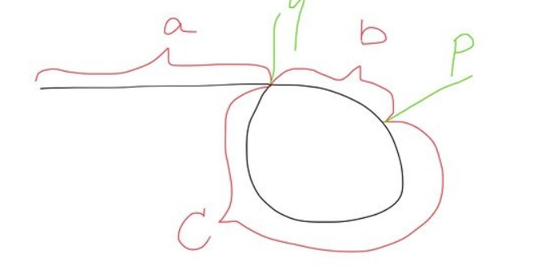

## 数组

### 1. 二维数组中的查找

**题目描述**

一个二维数组中（每个一维数组的长度相同），每一行都按照从左到右递增的顺序排序，每一列都按照从上到下递增的顺序排序。请完成一个函数，输入这样的一个二维数组和一个整数，判断数组中是否含有该整数。

**题解**

1. 可以对每一行进行二分查找
2. 从左下角开始（）向上向右遍历

**心得**

**答案**

```java
boolean fine2(int target, int[][] array){
        int rowCount = array.length;
        int columnCount = array[0].length;

        for(int i=rowCount-1 ,j =0; i < rowCount && j < columnCount;){
            if(target == array[i][j]){
                return true;
            }
            else if(target > array[i][j]){
                j++;
                continue;
            }
            else if(target < array[i][j]){
                i--;
                continue;
            }
        }
        return false;
    }
```


### 2. 数组中重复的数字

**题目描述**

在一个长度为n的数组里的所有数字都在0到n-1的范围内。 数组中某些数字是重复的，但不知道有几个数字是重复的。也不知道每个数字重复几次。请找出数组中任意一个重复的数字。 例如，如果输入长度为7的数组{2,3,1,0,2,5,3}，那么对应的输出是第一个重复的数字2。

**题解**

**心得**

二分查找中对于寻找第一个相同的数字解法：先排序，然后二分查找

**答案**

```java
/**
 * 归位思想
 * 一个萝卜一个坑,如果存在重复,那么自己原来的位置就迟早会被自己占据
 * 边查重边排序
 */
public boolean duplicate3(int numbers[], int length, int[] duplication) {
    if (length <= 0 || numbers == null) {
        return false;
    }

    int index = 0;
    
    while (index < length) {
        if (numbers[index] == index) { // 当前下标index的值刚好为index
            index++;
        } else {
            int tmp = numbers[index];
            if (tmp == numbers[tmp]) { // 要交换位置的两个数相同
                duplication[0] = tmp;
                return true;
            } else { // 交换位置
                numbers[index] = numbers[tmp];
                numbers[tmp] = tmp;
            }
        }
    }
    return false;
}
```


### 3. 构建乘积数组

**题目描述**

给定一个数组A[0,1,...,n-1],请构建一个数组B[0,1,...,n-1],其中B中的元素B[i]=A[0]*A[1]*...*A[i-1]*A[i+1]*...*A[n-1]。不能使用除法。（注意：规定B[0]和B[n-1] = 1）

**心得**

关键在于如何相乘的思想上，要想到可以把B[i]=A[0]A[1]....A[i-1]A[i+1]....A[n-1]。看成A[0]A[1].....A[i-1]和A[i+1].....A[n-2]A[n-1]两部分的乘积。即通过A[i]项将B[i]分为两部分的乘积。效果相当于是个对角矩阵。

**答案**

```java
public int[] multiply2(int[] A) {
    int[] B = new int[A.length];
    int res = 1;
    for(int i=0;i<A.length;i++){
        B[i] = res;
        res *= A[i];
    }
    res= 1;
    for(int i=A.length-1;i>=0;i--){
        B[i] *= res;
        res *= A[i];
    }
    return B;
}
```

### 39、数组中出现次数超过一半的数字

**题目描述**

数组中有一个数字出现的次数超过数组长度的一半，请找出这个数字。例如输入一个长度为9的数组{1,2,3,2,2,2,5,4,2}。由于数字2在数组中出现了5次，超过数组长度的一半，因此输出2。如果不存在则输出0。

**答案**

```java
public int MoreThanHalfNum_Solution(int [] array) {
        int halfLength = array.length/2;
        int[] map = new int[10];
        for(int i =0;i<array.length;i++){
            if(map[array[i]] >= halfLength){
                return array[i];
            }
            map[array[i]]++;
        }
        return 0;
    }
}
```

另解：加快速度：使用快速排序

```java
public int MoreThanHalfNum_Solution(int[] array) {

    int start = 0, end = array.length - 1;
    int mid = array.length / 2;

    int index = partition(array, start, end);
    if (index == mid) {
        return array[index];
    }

    while (index != mid && start <= end) {
        if (index > mid) {
            end = index - 1;
            index = partition(array, start, end);
        } else {
            start = index + 1;
            index = partition(array, start, end);
        }
    }

    if (checkIsHalf(array, index)) return array[index];

    return 0;
}

private boolean checkIsHalf(int[] array, int index) {
    if (index < 0) {
        return false;
    }

    int count = 0;
    for (int i : array) {
        if (array[index] == i) {
            count++;
        }
    }

    return count > array.length / 2;
}

private int partition(int[] array, int start, int end) {
    if (start >= array.length || start < 0
            || end >= array.length || end < 0) {
        return -1;
    }

    int key = array[start];
    int left = start, right = end;

    while (left < right) {
        while (left < right && array[right] >= key) {
            right--;
        }
        if (left < right) {
            array[left] = array[right];
            left++;
        }


        while (left < right && array[left] <= key) {
            left++;
        }
        if (left < right) {
            array[right] = array[left];
            right--;
        }
    }
    array[left] = key;

    return left;
}
```


### 40、最小的K个数

**题目描述**

输入n个整数，找出其中最小的K个数。例如输入4,5,1,6,2,7,3,8这8个数字，则最小的4个数字是1,2,3,4,

**心得**

就是使用排序算法

使用快速排序  patition到k的时候返回list注意list要new一个防止

**答案**

```java
public ArrayList<Integer> GetLeastNumbers_Solution(int [] input, int k) {
        ArrayList<Integer> result = new ArrayList<Integer>();
        
        if(k <=0 || k > input.length){
            return result;
        }
        for(int i =1;i<k;i++){
            int j = i-1;

            int unFindElement = input[i];
            while(j >= 0 && input[j] > unFindElement){
                input[j+1] = input[j];
                j--;
            }
            input[j+1] = unFindElement;
        }
        for(int i =k;i<input.length;i++){
            if(input[i] <input[k-1]){
                int newK = input[i];
                int j = i-1;
                while(j>=0 && input[j] > newK){
                    input[j+1] = input[j];
                    j--;
                }
                input[j+1] = newK;
            }
        }
        for(int i=0;i<k;i++){
            result.add(input[i]);
        }
        return result;
        
    }
```


### 41、连续子数组的最大和

**题目描述**

例如:{6,-3,-2,7,-15,1,2,2},连续子向量的最大和为8(从第0个开始,到第3个为止)。给一个数组，返回它的最大连续子序列的和

**心得**

一开始以为是滑动窗口，但其实是动态规划，注意要及时转变思路

**答案**

常规思想

```java
public int FindGreatestSumOfSubArray(int[] array) {
    int res = Integer.MIN_VALUE;
    int sum = 0;
    for(int i = 0; i < array.length; i++) {
        //如果结果小于0，则从下一个数重新开始计算，代表之前都无效了
        if(sum < 0) {
            sum = array[i];
        } else {
            //只要大于0，一直累加就一直变大
            sum += array[i];
        }
        if(sum > res) {
            res = sum;
        }
    }
    return res;
}
```

**动态规划**(经典）

F（i）：以array[i]为末尾元素的子数组的和的最大值，子数组的元素的相对位置不变  

 F（i）=max（F（i-1）+array[i] ， array[i]）  

   res：所有子数组的和的最大值  

  res=max（res，F（i））

```java
public  int FindGreatestSumOfSubArray(int[] array) {
        int res = array[0]; //记录当前所有子数组的和的最大值
        int max=array[0];   //包含array[i]的连续数组最大值
        for (int i = 1; i < array.length; i++) {
            max=Math.max(max+array[i], array[i]);
            res=Math.max(max, res);
        }
        return res;
}
```

#### **贪心算法了解一下**

**两个序列，A是容忍负数出现的序列，B是不容忍负数出现的序列；**
**①A每轮选择A和B中值最大的，然后加上当前的数字，无论正负；**
**②B每轮的选择是，如果B当前数字 >=0 且当前的数字 >0，则自身加上当前数字，否则等于当前数字（这使得B有些名不副实，不过它可以应对全部都是负数的情况）。**
**③max作为一个统计值，每轮取它自身和A、B3者中最大的一个。**

```java
public int FindGreatestSumOfSubArray(int[] array){
    int allowNegative = 0, notAllowNewgative = 0;
    int max = array[0];
    for(int num : array){
        int tmp = allowNegative > notAllowNegative ? allowNegative : notAllowNegative;
        allowNegative = tmp + num;
        notAllowNegative = num > 0 ? num : 0;
        max = allowNegative > notAllowNegative ?allowNegative : notAllowNegative;
        
    }
    return max;
}
```


### 42、将数组排成最小的数

**题目描述**

输入一个正整数数组，把数组里所有数字拼接起来排成一个数，打印能拼接出的所有数字中最小的一个。例如输入数组{3，32，321}，则打印出这三个数字能排成的最小数字为321323。


**答案**

不算最佳

```java
//优化的话一开始的ArrayList可以是Integer类型的
public String PrintMinNumber(int [] numbers) {
        ArrayList<String> list = new ArrayList<String>();
        for(int i =0;i<numbers.length;i++){
            list.add(numbers[i]+"");
        }
    Collections.sort(list,new Comparator<String>(){
       public int compare(String str1,String str2){
           String c1 = str1+str2;
           String c2 = str2+str1;
           return c1.compareTo(c2);
       }
    });
    
    StringBuilder result = new StringBuilder();
    for(int i =0;i<list.size();i++){
        result.append(list.get(i));
    }
    return result.toString();  
    }
```

学习一下lamda表达式

```java
public class Solution {
    public String PrintMinNumber(int [] numbers) {
        String[] strs = new String[numbers.length];
        for(int i = 0; i < numbers.length; i++)
            strs[i] = String.valueOf(numbers[i]);
        return Arrays.stream(strs)
                    .sorted((x, y) -> (x + y).compareTo(y + x))
                    .reduce("", (x, y) -> x + y);
    }
}
```


### 55、数组中只出现一次的数字

一个整型数组里除了两个数字之外，其他的数字都出现了两次。请写程序找出这两个只出现一次的数字


**答案**

基本做法

```java
public void FindNumsAppearOnce(int [] array,int num1[] , int num2[]) {
        //哈希算法
        HashMap<Integer, Integer> map = new HashMap<Integer, Integer>();
        for(int i=0; i < array.length; i++){
            if(map.containsKey(array[i]))
                map.put(array[i],2);
            else
                map.put(array[i],1);
        }
        int count = 0;
        for(int i=0; i < array.length; i++){
            if(map.get(array[i]) == 1){
                if(count == 0){
                    num1[0] =  array[i];
                    count++;
                }else
                    num2[0] =  array[i];
            }
        }
 
    }
```

这题首先因为他明确写了，只有我们需要找到的两个数字，出现了一次，**所以我们其实可以首先将收到的数组进行排序，这样，只出现一次的数字，他的前一位和后一位都和他不相等**，而出现两次的数字，总能在前面或者后面找到和他相同的数字。但是需要注意的是，数组的第一位和最后一位数字我们需要单独拿出来考虑，因为他们分别不存在前一位和后一位。

```python
class Solution:
    def FindNumsAppearInce(self,array):
        result = []
        if not array or len(array) == 0:
            return result
        array = sorted(array)
        if(array[0] != array[1]):
           result.append(array[0])
        for i in range(1,len(array)-1):
            if array[i] != array[i-1] and array[i] != array[i+1]:
                result.append(array[i])
        if(array[-2] != array[-1]):
            result.append(array[-1])
        return result
```

**位运算加快速度**

1. 两个相等的数字进行异或的结果为0
2. 在这个特殊的数组中，重复出现的数字只能为2次，那么如果将所有数字异或 就等价与将两个不同的数字进行异或
3. 异或的结果肯定有一位为1，那么这两个不同的数字，在这一位上不同。
4. 找到第一个为1的位，并将第一位为1的位是否为1作为分组条件，相同的数字一定在同一个分组里，整个数组分组异或
5. 得到两个结果，即为两个不同的数

```java
public void FindNumsAppearOnce(int[] array, int num1[], int num2[]) {
    if (array == null || array.length < 3) {
        return;
    }

    int result = array[0];

    //全部异或，重复的数字全部为0，所以剩下的就是两个不同的数的异或值
    for (int i = 1; i < array.length; i++) {
        result ^= array[i];
    }

    //找到第一个为1的位，就是简单的移位运算
    int indexOfFirstBit1 = 0;
    int temp = result;
    while (temp != 0) {
        indexOfFirstBit1++;
        temp >>>= 1;
    }
//掩码
    int mask = 1;
    for (int i = 1; i < indexOfFirstBit1; i++) {
        mask <<= 1;
    }

    //将第一位为1的位是否为1作为分组条件，分组异或
    int n1 = -1, n2 = -1;
    for (int i : array) {
        if ((i & mask) == mask) {
            if (n1 == -1) n1 = i;
            else n1 ^= i;
        } else {
            if (n2 == -1) n2 = i;
            else n2 ^= i;
        }
    }

    num1[0] = n1;
    num2[0] = n2;
}
```

## 字符串

### 4. 替换空格

**题目描述**

请实现一个函数，将一个字符串中的每个空格替换成“%20”。例如，当字符串为We Are Happy.则经过替换之后的字符串为We%20Are%20Happy。

**心得**

暴力方法底层的实现是会执行多次resize操作。因此在数据量大的情况下，性能会降低。

将StringBuilder改成用数组构建字符串也是一种办法

此外考虑正则表达式也可


**答案**

```java
//实际上也可称之为双指针法,新旧数组利用指针一起移动
public String replaceSpace2(StringBuffer str){
    String specifiedChars = "%20";
    int isr = 0;
    //执行一次N的遍历
    for (int i = 0; i < str.length(); i++) {
        if (str.charAt(i) == ' ') {
            isr++;
        }
    }
    //最后的新数组的大小
    int newCapacity = str.length() + (isr * specifiedChars.length());
    char[] newChars = new char[newCapacity];
    for (int i = 0, j = 0; i < newCapacity && j < str.length(); i++) {
        if (str.charAt(j) == ' ') {
            for (int t = 0; t < specifiedChars.length(); t++) {
                newChars[i++] = specifiedChars.charAt(t);
            }
            j++;
            continue;
        }
        //正常迁移
        newChars[i] = str.charAt(j++);
    }
    return new String(newChars);
}
```


### 5. 正则表达式匹配

**题目描述**

请实现一个函数用来匹配包括'.'和'*'的正则表达式。模式中的字符'.'表示任意一个字符，而'\*'表示它前面的字符可以出现任意次（包含0次）。 在本题中，匹配是指字符串的所有字符匹配整个模式。例如，字符串"aaa"与模式"a.a"和"ab*ac*a"匹配，但是与"aa.a"和"ab*a"均不匹配

**心得**

考虑到之前学习的回溯算法学习，但是这里存在一点区别，

常规解法就是考虑到每一种情况,注意边界问题和多个通配符联合的作用

还有就是匹配多个和1个的处理逻辑是一样的,最终都会遍历到匹配1个的问题上来

**答案**

```java
	 boolean flag2 = false;
    public boolean match2(char[] str, char[] pattern){
        if(pattern.length == 0){
            if(str.length == 0){
                return true;
            }
            return false;
        }
        match_r2(str,pattern,0,0);
        return flag2;

    }

    public void match_r2(char[] str,char[] pattern,int i,int j){
        if(flag2 == true){
            return;
        }
        if(str.length == i && j == pattern.length){
            flag2 = true;
            return;
        }
        if(j+1 > pattern.length){
            return;
        }

        if(j+1 < pattern.length && pattern[j+1] == '*' ){
            
            if (i < str.length && (pattern[j] == '.' || pattern[j] == str[i])) {
                match_r2(str,pattern,i,j+2);
                match_r2(str,pattern,i+1,j);
                //如果不匹配，则*的作用只能是前面的匹配0次，这样的话，需要跳过两个字符
            }else{
                match_r2(str,pattern,i,j+2);
            }
        }else {
            if (i < str.length &&( pattern[j] == '.' || pattern[j] == str[i] )) {
                match_r2(str, pattern, i + 1, j + 1);
            }
        }
```

**另解:用了动态规划,比较有趣:**

如果 p.charAt ( j )  == s.charAt ( i ) : ` dp[i][j] = dp[i-1][j-1]` 

如果 p.charAt ( j ) == '.' :  `dp[i][j] = dp[i-1][j-1] `

如果 p.charAt ( j ) == '*'：

1. 如果 p.charAt ( j - 1 ) != s.charAt ( i ) : `dp[i][j] = dp[i][j-2]`  //in this case, a* only counts as empty，**e.g.  b&ba\*** 
2. 如果 p.charAt ( j - 1 ) == s.charAt ( i ) or p.charAt (j-1)  == '.'： 
   1. dp [i] [j] = dp [i-1] [j] //in this case, a* counts as multiple a , **e.g.  baaa&ba\*** 
   2. or dp [i] [j] = dp [i] [j-1] // in this case, a* counts as single a, **e.g.  ba&ba\***(注意这个条件可以忽略，它等价于dp [i-1] [j] = dp [i-1] [j-2] 的情形，即b&ba*) 
   3. or dp [i] [j] = dp [i] [j-2] // in this case, a* counts as empty, **e.g.  ba&baa\***

```python
class Solution:
    # s, pattern都是字符串
    def match(self, s, pattern):
        # write code here
        ls, lp = len(s), len(pattern)
        dp = [[False for _ in range(lp + 1)] for _ in range(ls + 1)]
        dp[0][0] = True
        for i in range(1, lp + 1):
            if i - 2 >= 0 and pattern[i - 1] == '*':
                dp[0][i] = dp[0][i - 2]
        for i in range(1, ls + 1):
            for j in range(1, lp + 1):
                m, n = i - 1, j - 1
                if pattern[n] == '*':
                    if s[m] == pattern[n - 1] or pattern[n - 1] == '.':
                        dp[i][j] = dp[i][j - 2] or dp[i - 1][j]
                    else: dp[i][j] = dp[i][j - 2]
                elif s[m] == pattern[n] or pattern[n] == '.':
                    dp[i][j] = dp[i - 1][j - 1]
        return dp[-1][-1]
```


### 6. 标识数值的字符串

**题目描述**

请实现一个函数用来判断字符串是否表示数值（包括整数和小数）。例如，字符串"+100","5e2","-123","3.1416"和"-1E-16"都表示数值。 但是"12e","1a3.14","1.2.3","+-5"和"12e+4.3"都不是。

**心得**

考虑到每一种情况就好


**答案**

另解: 正则表达式熟悉一下

```java
   public static boolean isNumeric(char[] str) {
            String pattern = "^[-+]?\\d*(?:\\.\\d*)?(?:[eE][+\\-]?\\d+)?$";
            String s = new String(str);
            return Pattern.matches(pattern,s);
    }
```


```java
    boolean hasDot = false;
    public boolean  isNumbeeric(char[] str){
        if(str[0] == '+' || str[0] == '-'){
            return Numberic_r(str,1,0);
        }
        return Numberic_r(str,0,0);

    }

    public boolean Numberic_r(char[] str,int index,int state){

        if(index == str.length){
            return true;
        }
        if(state == 1){
            if(numberCheck(str[index])){
                return Numberic_r(str,index+1,state);
            }
        }else{
            if(numberCheck(str[index])){
                return Numberic_r(str,index+1,state);
            }else if(str[index] == '.' && !hasDot){
                hasDot = true;
                return Numberic_r(str,index+1,state);
            }else if((str[index] == 'E' || str[index] == 'e') && !hasDot){
                if(str[index+1] == '+' || str[index+1] =='-'){
                    return Numberic_r(str,index+2,1);
                }else{
                    return Numberic_r(str,index+1,1);
                }
            }
        }
        return false;
    }

    public boolean numberCheck(char s){
        int num = s - '0';
        if(num >= 0 && num <= 9){
            return true;
        }else{
            return false;
        }
    }
```


### 7. 字符流中第一个不重复的字符

**题目描述**

请实现一个函数用来找出字符流中第一个只出现一次的字符。例如，当从字符流中只读出前两个字符"go"时，第一个只出现一次的字符是"g"。当从该字符流中读出前六个字符“google"时，第一个只出现一次的字符是"l"。

**输出描述:**

```
如果当前字符流没有存在出现一次的字符，返回#字符。
```


**心得**

常规思路存储所有字符然后遍历判断不优雅

每次插入的时候维护一个计数器,然后利用队列先入先出,查看是否只出现了1次

**同时用到了字符存储在int数组的方法,有点类似散列表映射的思想**

**顺序有关的问题既可以用队列解决也可以用数组映射表尝试**

**答案**

```java
public class Solution {
    int[] charCnt = new int[128];
    Queue<Character> queue = new LinkedList<Character>();
 
    public void Insert(char ch) {
        if (charCnt[ch]++ == 0) //新来的单身字符，入队;先判断后递增
            queue.add(ch);
    }
    //return the first appearence once char in current stringstream
    public char FirstAppearingOnce() {
        Character CHAR = null;
        char c = 0;
        while ((CHAR = queue.peek()) != null) {
            c = CHAR.charValue();
            if (charCnt[c] == 1) //判断是否脱单了，没脱单则输出
                return c;
            else queue.remove(); //脱单了就移出队列，它不会再回来了
        }
        return '#'; //队空，返回#
    }
}
```

另解

```java
int[] count = new int[256]; // 字符出现的次数
int[] index = new int[256]; // 字符出现的顺序
int number = 0;

public void Insert(char ch) {
    count[ch]++;
    index[ch] = number++;
}

public char FirstAppearingOnce() {
    int minIndex = number;
    char ch = '#';
    for (int i = 0; i < 256; i++) {  // !!!
        //如果该字符只出现了1次且确实出现了(指的是出现的index<minIndex)
        if (count[i] == 1 && index[i] < minIndex) {
            ch = (char) i;
            minIndex = index[i];
        }
    }
    return ch;
}
```


### 38、字符串的排序

**题目描述**

输入一个字符串,按字典序打印出该字符串中字符的所有排列。例如输入字符串abc,则打印出由字符a,b,c所能排列出来的所有字符串abc,acb,bac,bca,cab和cba。

**输入描述:**

> 输入一个字符串,长度不超过9(可能有字符重复),字符只包括大小写字母。


**心得**

[几种全排列算数组法](https://blog.nowcoder.net/n/dfd91d416f064002b8b05e89953d5b92?f=comment)

**答案**

最佳方法：

1、从右向左找到第一个正序对（array[i] < array[i+1]，因为没有等号，所以可以完美去掉重复的排列）
2、从i开始向右搜索，找到比array[i]大的字符中最小的那个，记为array[j]
3、交换array[i]和array[j]
4、将i后面的字符反转
这就得到了字典序的下一个排列。
连续使用这个方法则可从字典序最小的排列推出全部排列。

```java
public class Solution {
    public ArrayList<String> Permutation(String str) {
        ArrayList<String> res = new ArrayList<String>();
        if(str.length() == 0) return res;
        char [] array = str.toCharArray();
        Arrays.sort(array);
        String s = new String(array);
        res.add(str);
        while(true){
            s = nextString(s);
            if(!s.equals("finish")){
                res.add(s);
            }
            else{
                break;
            }
        }
        return res;
    }
 
    public String nextString(String str){
        char [] array = str.toCharArray();
        int length = str.length();
        int i = length-2;
        for(; i>=0 && array[i] >= array[i+1]; i--);
        if(i == -1) return "finish";
        int j = length-1;
        for(; j>=0 && array[j] <= array[i]; j--);
        //swap i,j
        char tmp = array[i];
        array[i] = array[j];
        array[j] = tmp;
        //swap i,j
        for(int a=i+1, b=length-1; a<b;a++,b--){
            tmp = array[a];
            array[a] = array[b];
            array[b] = tmp;
        }
        return new String(array);
    }
}
```


```java
//没有按序排列的算法
public static void printPermutations(int[] data, int n, int k) {
        if (k == n) {
            for (int i = 0; i < n; ++i) {
                System.out.print(data[i] + " ");
            }
            System.out.println();
        }

        for (int i = k; i <n; ++i) {
            int tmp = data[i];
            data[i] = data[k];
            data[k] = tmp;

            printPermutations(data, n, k + 1);
            //必须反转回来，因为之后的递归还要反转，会出现重复
            tmp = data[i];
            data[i] = data[k];
            data[k] = tmp;
        }
    }
```


```java
//  和上面算法一样,添加去重处理
public ArrayList<String> Permutation(String str) {
        //注意这里进行了去重处理
        Set<String> res = new HashSet<>();

        if (str == null || str.length() == 0) {
            return new ArrayList<>();
        }

        Permutation(res, str.toCharArray(), 0);

        ArrayList<String> list = new ArrayList<>(res);

        list.sort(String::compareTo);
        return list;
    }

    private void Permutation(Set<String> res, char[] chars, int start) {
        if (start == chars.length) {
            res.add(new String(chars));
            return;
        }

        for (int i = start; i < chars.length; i++) {
            swap(chars, start, i);

            Permutation(res, chars, start + 1);

            swap(chars, start, i);
        }
    }

    private void swap(char[] chars, int i, int j) {
        char temp = chars[i];
        chars[i] = chars[j];
        chars[j] = temp;
    }
```


## 链表

### 8. 从尾到头打印链表

**题目描述**

输入一个链表，按链表从尾到头的顺序返回一个ArrayList。

**心得**

两种思路，一种是反转链表，一种是逆序输出

注意保存前节点和后继节点

**答案**

```java
//递归打印，容易出现栈溢出
    ArrayList<Integer> list = new ArrayList<Integer>();
    public ArrayList<Integer> printListFromTailToHead2(ListNode listNode) {
        if(listNode!=null){
            printListFromTailToHead(listNode.next);
            list.add(listNode.val);
        }
        return list;
    }
//非递归
public ArrayList<Integer> printListFromTailToHead(ListNode listNode) {
        ArrayList<Integer> list = new ArrayList<Integer>();
        ListNode tmp = listNode;
        while(tmp!=null){
            //关键在于这个add方法
            //add方法当插入的index已经有值的时候会将原来的元素向后搬移
            list.add(0,tmp.val);
            tmp = tmp.next;
        }
        return list;
    }

//使用栈做
public ArrayList<Integer> printListFromTailToHead2(ListNode listNode) {
LinkedList<Integer> stack = new LinkedList<>();

while (listNode != null) {
    stack.addLast(listNode.val);
    listNode = listNode.next;
}

ArrayList<Integer> res = new ArrayList<>();

while (!stack.isEmpty()) {
    res.add(stack.pollLast());
}

return res;
}
```

```java
/**
     * 链表反转  ——递归法（精髓）
     * @param head
     * @return
     */
    public Node reverseList(Node head) {
        if (head == null || head.next == null) return head;
        Node p = reverseList(head.next);
        head.next.next = head;
        head.next = null;
        return p;
    }
 /**
     * 单链表反转
     * @param list
     * @return
     */
    public static  Node reserve(Node list){
        Node cur = list;
        //存储链表的上一个节点，遍历完之后变成头节点
        Node pre = null;
        while(cur != null){
            //暂存指向下一个节点的引用
            Node next = cur.next;
            //反转，将存储的下一个节点指向上一个节点
            cur.next = pre;
            //下面两部将链表向下移动
            pre = cur;
            cur = next;
        }
        //遍历完之后pre变成头节点
        return pre;
    }
```

### 9. 链表中环的入口节点

**题目描述**

给一个链表，若其中包含环，请找出该链表的环的入口结点，否则，输出null。

**心得**

使用快慢指针

注意入口不是相遇的地点

[链表中环的入口结点](https://cyc2018.github.io/CS-Notes/#/notes/23. 链表中环的入口结点?id=_23-链表中环的入口结点)

**答案**

结论：2(A+B) = A+N*B+(N-1)C => A=C



```java
//使用快慢指针法。追及问题，只要慢指针追上快指针，说明存在环路
public ListNode EntryNodeOfLoop(ListNode pHead) {
    if (pHead == null || pHead.next == null)
        return null;
    ListNode slow = pHead, fast = pHead;
    do {
        fast = fast.next.next;
        slow = slow.next;
    } while (slow != fast);
    fast = pHead;
    while (slow != fast) {
        slow = slow.next;
        fast = fast.next;
    }
    return slow;
}
```

简单思路

```java
public ListNode EntryNodeOfLoop(ListNode pHead)
    {
        if(pHead == null){
            return null;
        }
        // 1.判断链表中有环
        ListNode l=pHead,r=pHead;
        boolean flag = false;
        while(r != null && r.next!=null){
            l=l.next;
            r=r.next.next;
            if(l==r){
                flag=true;
                break;
            }
        }
        if(!flag){
            return null;
        }else{
            // 2.得到环中节点的数目
            int n=1;
            r=r.next;
            while(l!=r){
                r=r.next;
                n++;
            }
            // 3.找到环中的入口节点
            l=r=pHead;
            for(int i=0;i<n;i++){
                r=r.next;
            }
            while(l!=r){
                l=l.next;
                r=r.next;
            }
            return l;
        } 
    }
```


另解

```java
public ListNode EntryNodeOfLoop(ListNode pHead)
    {
        Map<Integer,Integer> map = new HashMap<Integer,Integer>();
        ListNode head = pHead;
        while(pHead != null){
            if(map.containsKey(pHead.val)){
                break;
            }
            map.put(pHead.val,1);
            pHead = pHead.next;
        }
        if(pHead == null){
            return null;
        }else{
            return pHead;
        }
    }
```


### 10. 删除链表中重复节点

**题目描述**

在一个排序的链表中，存在重复的结点，请删除该链表中重复的结点，重复的结点不保留，返回链表头指针。 例如，链表1->2->3->3->4->4->5 处理后为 1->2->5

**心得**

构建辅助头节点防止头部重复

注意链表是排序的

​	

**答案**

缺点：只能删除偶数个

```java
public class Solution {
    public ListNode deleteDuplication(ListNode pHead){
        if(pHead == null || pHead.next == null){
            return pHead;
        }
        // 自己构建辅助头结点
        ListNode head = new ListNode(Integer.MIN_VALUE);
        head.next = pHead;
        ListNode pre = head;
        ListNode cur = head.next;
        while(cur!=null){
            if(cur.next != null && cur.next.val == cur.val){
                // 相同结点一直前进
                while(cur.next != null && cur.next.val == cur.val){
                    cur = cur.next;
                }
                // 退出循环时，cur 指向重复值，也需要删除，而 cur.next 指向第一个不重复的值
                // cur 继续前进
                cur = cur.next;
                // pre 连接新结点
                pre.next = cur;
            }else{
                pre = cur;
                cur = cur.next;
            }cur
        }
        return head.next;
    }
}
```


### 49、两个链表的公共节点

**题目描述**

输入两个链表，找出它们的第一个公共结点。（注意因为传入数据是链表，所以错误测试数据的提示是用其他方式显示的，保证传入数据是正确的）

**答案**

看下面的链表例子：
0-1-2-3-4-5-null
a-b-4-5-null
代码的ifelse语句，对于某个指针p1来说，其实就是让它跑了连接好的的链表，长度就变成一样了。
如果有公共结点，那么指针一起走到末尾的部分，也就一定会重叠。看看下面指针的路径吧。
p1： 0-1-2-3-4-5-null(此时遇到ifelse)-a-b-4-5-null
p2: a-b-4-5-null(此时遇到ifelse)0-1-2-3-4-5-null

**但是存在环路问题！**

```java
public ListNode FindFirstCommonNode(ListNode pHead1, ListNode pHead2) {
        if(pHead1 == null || pHead2 == null)return null;
        ListNode p1 = pHead1;
        ListNode p2 = pHead2;
        while(p1!=p2){
            p1 = p1.next;
            p2 = p2.next;
            if(p1 != p2){
                if(p1 == null)p1 = pHead2;
                if(p2 == null)p2 = pHead1;
            }
        }
        return p1;
 
    }
```


