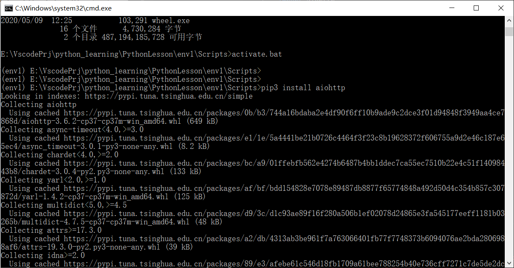

# python环境部署


## pip换源

### Windows

在`C:\Users\11566\pip`，在`pip `目录下新建文件`pip.ini`,内容如下

```ini
[global]
timeout = 6000
index-url = https://pypi.tuna.tsinghua.edu.cn/simple
trusted-host = pypi.tuna.tsinghua.edu.cn
```

### Linux

修改 `~/.pip/pip.conf` (没有就创建一个)

```ini
[global]
index-url = https://pypi.tuna.tsinghua.edu.cn/simple
```


## pip更新

python3

> pip3 install --upgrade pip (--user)


## virtualenv





