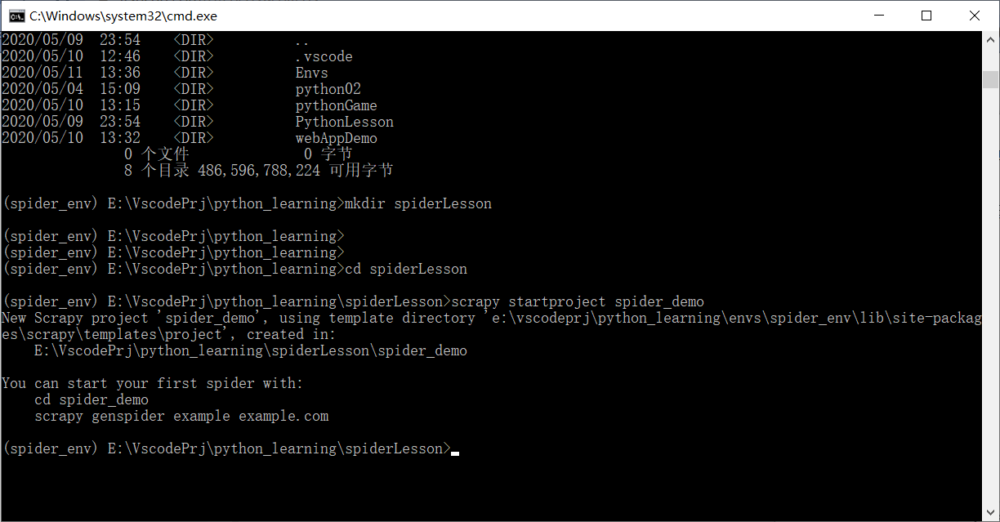

爬虫项目



```shell
New Scrapy project 'spider_demo', using template directory 'e:\vscodeprj\python_learning\envs\spider_env\lib\site-packages\scrapy\templates\project', created in:
    E:\VscodePrj\python_learning\spiderLesson\spider_demo

You can start your first spider with:
    cd spider_demo
    scrapy genspider example example.com

```

