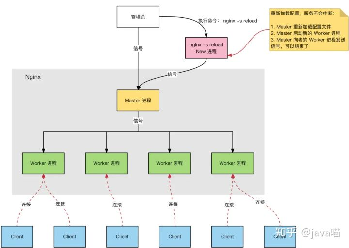
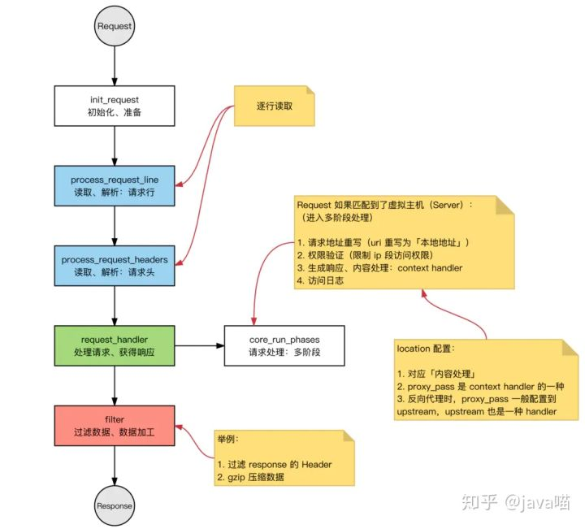
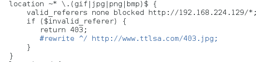

# nginx笔记


## 基本结构

进程模型



1. **多进程**：一个 Master 进程、多个 Worker 进程

2. **Master 进程**：管理 Worker 进程

3. 1. 对外接口：接收`外部的操作`（信号）
   2. 对内转发：根据`外部的操作`的不同，通过`信号`管理 Worker
   3. 监控：监控 worker 进程的运行状态，worker 进程异常终止后，自动重启 worker 进程

4. **Worker 进程**：所有 Worker 进程都是平等的

5. 1. 实际处理：网络请求，由 Worker 进程处理；
   2. Worker 进程数量：在 nginx.conf 中配置，一般设置为`核心数`，充分利用 CPU 资源，同时，避免进程数量过多，避免进程竞争 CPU 资源，增加上下文切换的损耗。


**HTTP 连接建立和请求处理过程：**

1. Nginx 启动时，Master 进程，加载配置文件
2. Master 进程，初始化监听的 socket
3. Master 进程，fork 出多个 Worker 进程
4. Worker 进程，竞争新的连接，获胜方通过三次握手，建立 Socket 连接，并处理请求


**Nginx 高性能、高并发：**

1. Nginx 采用：`多进程` + `异步非阻塞`方式（`IO 多路复用` epoll）

2. 请求的完整过程：

3. 1. 建立连接
   2. 读取请求：解析请求
   3. 处理请求
   4. 响应请求

4. 请求的完整过程，对应到底层，就是：读写 socket 事件

### 事件处理模型

1. **接收请求**：逐行读取`请求行`和`请求头`，判断段有请求体后，读取`请求体`
2. **处理请求**
3. **返回响应**：根据处理结果，生成相应的 HTTP 请求（`响应行`、`响应头`、`响应体`）




### 模块化体系

四大模块

+ core核心
+ event事件
+ http HTTP 模块
+ mail 邮件模块


nginx的模块根据其功能基本上可以分为以下几种类型：

- **event module**: 搭建了独立于操作系统的事件处理机制的框架，及提供了各具体事件的处理。包括`ngx_events_module`， `ngx_event_core_module`和`ngx_epoll_module`等。nginx具体使用何种事件处理模块，这依赖于具体的操作系统和编译选项。
- **phase handler**: 此类型的模块也被直接称为`handler`模块。主要负责处理客户端请求并产生待响应内容，比如`ngx_http_static_module`模块，负责客户端的静态页面请求处理并将对应的磁盘文件准备为响应内容输出。
- **output filter**: 也称为`filter`模块，主要是负责对输出的内容进行处理，可以对输出进行修改。例如，可以实现对输出的所有html页面增加预定义的footbar一类的工作，或者对输出的图片的URL进行替换之类的工作。
- **upstream**: `upstream`模块实现反向代理的功能，将真正的请求转发到后端服务器上，并从后端服务器上读取响应，发回客户端。upstream模块是一种特殊的handler，只不过响应内容不是真正由自己产生的，而是从后端服务器上读取的。
- **load-balancer**: 负载均衡模块，实现特定的算法，在众多的后端服务器中，选择一个服务器出来作为某个请求的转发服务器。

### Nginx vs. Apache

网络 IO 模型：

1. nginx：IO 多路复用，epoll(freebsd 上是 kqueue )

2. 1. 高性能
   2. 高并发
   3. 占用系统资源少

3. **IO 多路服用**：`一个线程`，跟踪多个 socket 状态，哪个`就绪`，就读写哪个；

4. apache：阻塞 + 多进程/多线程

5. 1. 更稳定，bug 少
   2. 模块更丰富
      场景：
      处理多个请求时，可以采用：`IO 多路复用` 或者 `阻塞 IO` +`多线程`
   3. **阻塞 IO** + **多线程**：每一个请求，新建一个服务线程

**思考**：`IO 多路复用` 和 `多线程` 的适用场景？

- `IO 多路复用`：单个连接的请求处理速度没有优势，适合 **IO 密集型** 场景，事件驱动

- - **大并发量**：只使用一个线程，处理大量的并发请求，降低**上下文环境**切换损耗，也不需要考虑并发问题，相对可以处理更多的请求；
  - 消耗更少的系统资源（不需要`线程调度开销`）
  - 适用于`长连接`的情况（多线程模式`长连接`容易造成`线程过多`，造成`频繁调度`）

- `阻塞IO` + `多线程`：实现简单，可以不依赖系统调用，适合 **CPU 密集型** 场景

- - 每个线程，都需要时间和空间；
  - 线程数量增长时，线程调度开销指数增长

### Nginx 最大连接数

基础背景：

1. Nginx 是多进程模型，Worker 进程用于处理请求；
2. 单个进程的连接数（**文件描述符 fd**），有上限（`nofile`）：`ulimit -n`
3. Nginx 上配置单个 worker 进程的最大连接数：`worker_connections` 上限为 `nofile`
4. Nginx 上配置 worker 进程的数量：`worker_processes`

因此，Nginx 的最大连接数：

1. Nginx 的最大连接数：`Worker 进程数量` x `单个 Worker 进程的最大连接数`
2. 上面是 Nginx 作为通用服务器时，最大的连接数
3. Nginx 作为`反向代理`服务器时，能够服务的最大连接数：（`Worker 进程数量` x `单个 Worker 进程的最大连接数`）/ 2。
4. **Nginx 反向代理时，会建立 `Client 的连接`和`后端 Web Server 的连接`，占用 2 个连接**


### 多路复用机制

> **I/O多路复用，I/O就是指的我们网络I/O,多路指多个TCP连接(或多个Channel)，复用指复用一个或少量线程。串起来理解就是很多个网络I/O复用一个或少量的线程来处理这些连接。**
>
> 

[select/poll 和 epoll 比较](https://www.jianshu.com/p/397449cadc9a)

[深入分析select&poll&epoll原理](https://cloud.tencent.com/developer/article/1596962)

[inux IO模式及 select、poll、epoll详解](https://segmentfault.com/a/1190000003063859)


#### 基础知识

文件描述符

形式上只是一个非负整数，实际是一个索引值

缓存IO

IO数据缓存在文件系统的页缓存上。

#### **select**

> 无差别轮询所有流，找出能读出数据，或者写入数据的流，对他们进行操作.
>
> 使用select以后最大的优势是用户可以在一个线程内同时处理多个socket的IO请求。用户可以注册多个socket，然后不断地调用select读取被激活的socket，即可达到在同一个线程内同时处理多个IO请求的目的。

- 查询 `fd_set` 中，是否有**就绪**的 `fd`，可以设定一个**超时时间**，当有 `fd (File descripter)` 就绪或超时返回；

- 问题

  + 每次调用select，都需要把`fd_set`集合从用户态拷贝到内核态，如果`fd_set`集合很大时，那这个开销也很大

  + 同时每次调用select都需要在内核遍历传递进来的所有`fd_set`，如果`fd_set`集合很大时，那这个开销也很大

  + 为了减少数据拷贝带来的性能损坏，内核对被监控的`fd_set`集合大小做了限制，并且这个是通过宏控制的，大小不可改变(限制为`1024`)

#### **poll**

> 本质上和select没有区别，它将用户传入的数组拷贝到内核空间，然后查询每个`fd`对应的设备状态,**基于结构体链表存储**
>
> poll改变了文件描述符集合的描述方式，使用了`pollfd`结构而不是select的`fd_set`结构，使得poll支持的文件描述符集合限制远大于select的`1024`

- 解决了**连接数限制**：

- - poll 中将 select 中的 `fd_set` 替换成了一个 `pollfd` 数组
  - 解决 `fd 数量过小`的问题

- 问题

  + 没有解决数组复制的性能开销问题


#### **epoll**

> 基于事件驱动的I/O方式
>
> epoll没有描述符个数限制，使用一个文件描述符管理多个描述符，将用户关心的文件描述符的事件存放到内核的一个事件表中，这样在用户空间和内核空间的copy只需一次。
>
> 获取事件的时候，它无须遍历整个被侦听的描述符集，只要遍历那些被内核IO事件异步唤醒而加入Ready队列的描述符集合就行了。

- **事件机制**：避免**线性扫描**

- - 为每个 fd，`注册`一个<mark>监听事件</mark>
  - fd 变更为**就绪**时，将 fd 添加到**就绪链表**

- **fd 数量**：无限制（OS 级别的限制，单个进程能打开多少个 fd）


select，poll，epoll：

1. `I/O多路复用`的机制；

2. `I/O多路复用`就通过一种机制，可以监视多个描述符，一旦某个描述符就绪（一般是读就绪或者写就绪），能够通知程序进行相应的读写操作。

3. 1. 监视`多个文件描述符`

4. 但select，poll，epoll本质上都是`同步I/O`：

5. 1. `用户进程`负责`读写`（从`内核空间`拷贝到`用户空间`），读写过程中，用户进程是阻塞的；
   2. `异步 IO`，无需用户进程负责读写，异步IO，会负责从`内核空间`拷贝到`用户空间`


|            |                       select                       |                       poll                       |                            epoll                             |
| :--------- | :------------------------------------------------: | :----------------------------------------------: | :----------------------------------------------------------: |
| 操作方式   |                        遍历                        |                       遍历                       |                             回调                             |
| 底层实现   |                        数组                        |                       链表                       |                            哈希表                            |
| IO效率     |      每次调用都进行线性遍历，时间复杂度为O(n)      |     每次调用都进行线性遍历，时间复杂度为O(n)     | 事件通知方式，每当fd就绪，系统注册的回调函数就会被调用，将就绪fd放到readyList里面，时间复杂度O(1) |
| 最大连接数 |              1024（x86）或2048（x64）              |                      无上限                      |                            无上限                            |
| fd拷贝     | 每次调用select，都需要把fd集合从用户态拷贝到内核态 | 每次调用poll，都需要把fd集合从用户态拷贝到内核态 |  调用epoll_ctl时拷贝进内核并保存，之后每次epoll_wait不拷贝   |


### 负载均衡策略

**轮询策略（轮询加权/round-robin）**

```nginx
upstream backserver {
    server 192.168.0.14;
    server 192.168.0.15;
}
```

**weight**

```nginx
upstream backserver {
    server 192.168.0.14 weight=3;
    server 192.168.0.15 weight=7;
}
```

**ip hash** 

上述方式存在一个问题就是说，在负载均衡系统中，假如用户在某台服务器上登录了，那么该用户第二次请求的时候，因为我们是负载均衡系统，每次请求都会重新定位到服务器集群中的某一个，那么***已经登录某一个服务器的用户再重新定位到另一个服务器，其登录信息将会丢失，这样显然是不妥的\***。
我们可以采用***ip_hash\***指令解决这个问题，如果客户已经访问了某个服务器，当用户再次访问时，会将该请求通过***哈希算法，自动定位到该服务器\***。
每个请求按访问ip的hash结果分配，这样每个访客固定访问一个后端服务器，可以解决***session的问题\***。

```nginx
upstream backserver {
    ip_hash;
    server 192.168.0.14:88;
    server 192.168.0.15:80;
}
```

**fair（第三方）**

根据响应时间

```nginx
upstream backserver {
    server server1;
    server server2;
    fair;
}
```

**url hash（第三方）** 

```nginx
upstream backserver {
    server squid1:3128;
    server squid2:3128;
    hash $request_uri;
    hash_method crc32;
}
```

在需要使用负载均衡的server中增加

```nginx
proxy_pass http://backserver/; 
upstream backserver{ 
    ip_hash; 
    server 127.0.0.1:9090 down; (down 表示单前的server暂时不参与负载) 
    server 127.0.0.1:8080 weight=2; (weight 默认为1.weight越大，负载的权重就越大) 
    server 127.0.0.1:6060; 
    server 127.0.0.1:7070 backup; (其它所有的非backup机器down或者忙的时候，请求backup机器) 
} 
```

## 常见问题

（nginx中多个斜杠其实等价于一个斜杠）

（习惯前面都保留根路径“/”） 

> a**lias** （别名）

语法: alias file-path|directory-path; 

作用域: `location `

+ 后面不会增加配置路径
+ “/”要和location后面保持一致


```nginx
location /abc/ {

alias /home/html/abc/;

}
#查找的是/home/html/abc/11.html
```


> **root** 

可以指定多个，如果locaiton没有指定，会往其外层的server或http中寻找继承。 

作用域：`http`, `server`, `location`

+ 后面会增加location的配置路径
+ root后面的“/”可有可无，。


```nginx
location /abc/ {

root /home/html/;

}
#查找的是/home/html/abc/11.html
```


HTTP模块的其他基本组件将结合案例介绍。

> proxy_pass

+ 配置路径后面加“/”，则不会添加location路径

```nginx

```


> error_page

不加"="只是跳转，加“=”号改变error_code


### 正则表达式

```nginx
#1、正则表达式

 = 完全相等；

 ~为区分大小写匹配；

 ~*为不区分大小写匹配；

 !~和!~*分别为区分大小写不匹配及不区分大小写不匹配。

#2、文件及目录匹配，其中：

-f和!-f用来判断是否存在文件；

-d和!-d用来判断是否存在目录；

-e和!-e用来判断是否存在文件或目录；

-x和!-x用来判断文件是否可执行。
	
if (-d $request_filename){ ... }

$1|$2|$3 用于捕获一个正则表达式括号中匹配的字符串（从左到右依次存储在$1|$2|$3 ...中），新值覆盖旧值
```

常见正则

```nginx
^$  空行

```


### event模块

`max_client = work_processes*worker_connection`


### rewrite语法


结合源码阅读


http_header


### 防盗链



 


参考链接

[大佬的博客 ](https://zhang.ge/5116.html )

[官方手册](http://nginx.org/en/#architecture_and_scalability)

[Nginx （五）——Rewrite 语法介绍](https://blog.51cto.com/5001660/2130506)

[Nginx的默认配置语法](https://www.jianshu.com/p/06e95028943e )

[Understanding Nginx Server and Location Block Selection Algorithms](https://www.digitalocean.com/community/tutorials/understanding-nginx-server-and-location-block-selection-algorithms#matching-location-blocks )

 [nginx完整配置文件例子](https://blog.csdn.net/jackliu16/article/details/79444327)

[nginx 配置详解（软连接）](https://www.cnblogs.com/jenkin1991/p/8301983.html)

## 错误记录

+ 如果location包含了正则表达式,则 "proxy_pass"不能包含URI part 


## 开坑

nginx  location的匹配规则

​	


问题：为什么html访问不到：每次记得删进程

问题：为什么静态文件的正则匹配不到：`^~`会比`~`优先匹配

问题：图片插入如何使用相对路径

