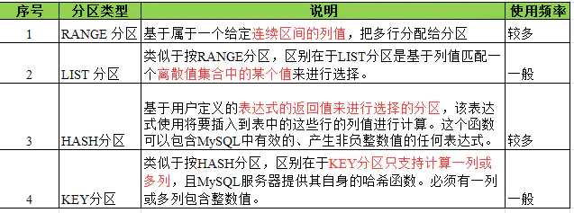

#  InnoDB技术内幕

**mysql的架构**


由图可见：mysql由以下组成
**Connection Pool**：连接池组件，管理缓冲用户连接，线程处理等需要缓存的需求

**Management Serveices &Utilities**：管理服务和工具组件

**SQL Interface:**  SQL接口组件，接受用户的SQL命令，并且返回用户需要查询的结果。比如select from就是调用SQL Interface。

**Parser:**  查询分析器组件SQL命令传递到解析器的时候会被解析器验证和解析。解析器是由Lex和YACC实现的，是一个很长的脚本。

主要功能：
 a . 将SQL语句分解成数据结构，并将这个结构传递到后续步骤，以后SQL语句的传递和处理就是基于这个结构的 。
 b.  如果在分解构成中遇到错误，那么就说明这个sql语句是不合理的

**Optimizer：**优化器组件，QL语句在查询之前会使用查询优化器对查询进行优化。他使用的是“选取-投影-联接”策略进行查询。用一个例子就可以理解： select uid,name fromuser where gender = 1;这个select 查询先根据where 语句进行选取，而不是先将表全部查询出来以后再进行gender过滤。这个select查询先根据uid和name进行属性投影，而不是将属性全部取出以后再进行过滤，将这两个查询条件联接起来生成最终查询结果

 **Cache和Buffer：**缓冲组件，如果查询缓存有命中的查询结果，查询语句就可以直接去查询缓存中取数据。这个缓存机制是由一系列小缓存组成的。比如表缓存，记录缓存，key缓存，权限缓存等

 **Engine：**插件式存储引擎，存储引擎是MySql中具体的与文件打交道的子系统。也是Mysql最具有特色的一个地方。Mysql的存储引擎是插件式的。它根据MySql AB公司提供的文件访问层的一个抽象接口来定制一种文件访问机制（这种访问机制就叫存储引擎）。MySQL插件式的存储引擎架构提供了一系列标准的管理和服务支持，这些标准和存储引擎本书无关。**注意：存储引擎是基于表的，而不是基于数据库**

 **物理文件：**不展开。


## innoDB简单体系图


**从图中可以看到，InnoDB的体系简单分为三块，分别是后台线程，内存池，文件。**

## **后台线程**

后台线程主要作用

1. 刷新内存池中的数据，保证缓冲池中数据都是最新的数据。
2. 将缓冲池中的数据刷刷新到磁盘文件中.
3. 保证发生异常时候，发生缓冲池和磁盘数据不一致时能正常恢复。

后台线程分为

1. Master Thread - 核心线程，负责缓冲池数据刷回磁盘，脏页刷新，合并插入缓冲，UNDO页回收等。
2. IO Thread - 负责AIO的回调处理
3. Purge Thread - 回收已经没有用的UNDO页(从Master Thread抽离)
4. Page Cleaner Thread - 脏页刷新回磁盘(从Master Thread抽离)

**Master Thread**

这是最核心的一个线程,主要负责将**缓冲池中的数据异步刷新到磁盘**,保证数据的一致性,包括**赃页的刷新**、**合并插入缓冲**、**UNDO 页的回收**等.

**IO Thread**

在 InnoDB 存储引擎中大量使用了异步 IO 来处理写 IO 请求, IO Thread 的工作主要是负责这些 **IO 请求的回调.** 

可以通过命令来观察 InnoDB 中的 IO Thread:` SHOW ENGINE INNODB STATUS\G` 

可以看到, InnoDB 共有**10**个 IO Thread, 分别是 **4个 write、4个 read、1个 insert buffer和1个 log thread.**

关于**第二点IO Thread，会使用AIO呢**？有两个好处

1. 第一是因为一个SQL的查询，可能需要读取磁盘中的多个索引页，AIO可以并**行读取数据，提高读取的效率。**
2. 第二是可以**进行IO合并操作**，当读取的多个页是相邻的，可以合并为一个IO请求，提高IOPS。


**Purge Thread**

事物被提交之后,` undo log` 可能不再需要,因此需要 `Purge Thread` 来回收已经使用比分配的 `undo`页. `InnoDB `支持多个 `Purge Thread`, 这样做可以加快 `undo `页的回收

 InnoDB 引擎默认设置为4个 Purge Thread:
 `SHOW VARIABLES LIKE "innodb_purge_threads"\G`

**Page Cleaner Thread**

Page Cleaner Thread 是新引入的,其作用是将之前版本中脏页的刷新操作都放入单独的线程中来完成,这样减轻了 Master Thread 的工作及对于用户查询线程的阻塞


## 内存

### 缓冲池

缓冲池简单来说就是一块内存区域.

**页的读取**

数据库读取页的时候，会先判断缓冲池中是否已经存在该页，如果存在，就直接使用缓冲池中的页，如果不存在，就从磁盘中进行读取。

**页的修改**

对于页的修改，也是先修改缓冲池中的页，然后再以一定的频率刷新到磁盘进行持久化。

如果数据在刷回磁盘前数据库异常了怎么办？答案是根据Redo日志进行恢复。InnoDB会保证，在页修改时，Redo日志必须已经持久化到磁盘。

**页的管理**

InnoDB使用LRU来管理缓冲中的页，朴素的LRU会把最新的数据插入到头部，淘汰掉尾部的数据。InnoDB使用的LRU有一点不同的是，最新的数据会插入到中间的位置，这是为了避免一些冷门的大SQL需要扫描很多页，导致热点数据被刷掉。

 缓冲池的大小直接影响数据库的整体性能,对于 InnoDB 存储引擎而言,缓冲池配置通过参数 `innodb_buffer_pool_size`来设置. 下面显示本机虚拟机上一台 MySQL 数据库配置:

```mysql
 SHOW VARIABLES LIKE 'innodb_buffer_pool_size'\G
```

缓冲池中缓存的数据页类型有:**索引页、数据页、 undo 页、插入缓冲、自适应哈希索引、 InnoDB 的锁信息、数据字典信息等.索引页和数据页占缓冲池的很大一部分.**


### 重做日志缓冲

InnoDB 存储引擎先将重做日志信息放入这个缓冲区,然后以一定频率将其刷新到重做日志文件.重做日志文件一般不需要设置得很大,因为在下列三种情况下重做日志缓冲中的内容会刷新到磁盘的重做日志文件中.

1. Master Thread 每一秒将重做日志缓冲刷新到重做日志文件
2. 每个事物提交时会将重做日志缓冲刷新到重做日志文件
3. 当重做日志缓冲剩余空间小于1/2时,重做日志缓冲刷新到重做日志文件


> InnoDB 有一个后台线程，每隔 1 秒，就会把 redo log buffer 中的日志，调用 write 写到 文件系统的 page cache，然后调用 fsync 持久化到磁盘。
>
> MySQL 的“双 1”配置，指的就是 sync_binlog 和 innodb_flush_log_at_trx_commit 都设置成 1，都是事务提交后立刻刷盘持久化， 这样能保障最高的可靠性，但是在并发高的时候，性能会受到较大影响。
> 

### 额外的内存池

在 InnoDB 存储引擎中, 对**一些数据结构本身的内存进行分配时,需要从额外的内存池中进行申请**.例如,分配了缓冲池,但是每个缓冲池中的帧缓冲还有对应的缓冲控制对象,这些对象记录以一些诸如 LRU, 锁,等待等信息,而这个对象的内存需要从额外的内存池中申请.


### Checkpoint技术

CheckPoint可以理解为检查点，每到检查点，缓冲池中的脏页数据会马上刷回到磁盘。

1. Master Thread Checkpoint - 每秒或十秒一次
2. FLUSH_LRU_LIST 02

## InnoDB关键特性

### 插入缓冲

**[InnoDB关键特性之insert buffer](https://www.cnblogs.com/yuyue2014/p/3802779.html)**

当插入数据需要更新非聚集索引时，如果每次都更新则需要进行多次随机IO，因此将这些值写入缓冲**对相同页的进行合并**提高IO性能。

插入缓冲需要满足两个条件

1. 非唯一，因为唯一在插入时需要判断约束，无法缓冲
2. 索引是非聚簇索引

**Insert Buffer内部是一颗B+树**

刷新缓冲的三种情况

+ 对应的索引页被读入缓冲池。
+ 对应的索引页的可用空间小于1/32，则强制进行合并。
+ Master Thread中的合并插入缓冲。


### 两次写

在对脏页刷新到磁盘时，如果某一页还没写完就宕机，此时该页数据已经混乱无法通过redo实现恢复。innodb提供了doublewrite机制，其刷新脏页步骤如下：

1. 先将脏页数据复制到doublewrite buffer中（2MB内存）
2. 将doublewrite buffer分两次，每次1MB写入到doublewrite磁盘（2MB）中。
3. 马上同步脏页数据到磁盘。对于数据混乱的页则可以从doublewrite中读取到，该页写到共享表空间。

> redo log中记录的是对页的物理修改，如偏移量800，写’aaaa’记录。**如果这个页本身已经发生了损坏，再对其进行重做是没有意义的**。MySQL在恢复的过程中检查page的checksum，checksum就是检查page的最后事务号，发生partial page write问题时，page已经损坏，找不到该page中的事务号。在InnoDB看来，这样的数据页是无法通过checksum验证的，就无法恢复。即时我们强制让其通过验证，也无法从崩溃中恢复，因为当前InnoDB存在的一些日志类型，有些是逻辑操作，并不能做到幂等。


### 自适应哈希索引

InnoDB存储引擎会监控对表上索引的查找，如果观察到建立哈希索引可以带来速度的提升，则建立哈希索引，所以称之为自适应（adaptive） 的。**自适应哈希索引通过缓冲池的B+树构造而来**，因此建立的速度很快。而且不需要将整个表都建哈希索引，InnoDB存储引擎会自动根据访问的频率和模式 来为某些页建立哈希索引。

### 异步IO

linux和windows中提供异步IO，其可以对连续的页做合并连续页的IO操作使随机IO变顺序IO。

### 刷新邻近页

刷新页时判断相邻页是否也是脏页。。


## 文件

当MySQL实例启动时，MySQL会先去读一个配置参数文件，用来寻找数据库的各种文件所在位置以及指定某些初始化参数，这些参数通常定义了某种内存结构有多大等设置。默认情况下，MySQL实例会按照一定的次序去取，你只需通过命令mysql --help|grep my.cnf来寻找即可。

从MySQL 5.1版本开始，可以通过`information_schema`架构下的`GLOBAL_VARIABLES`视图来进行查找，如下所示：

```mysql
 select * from GLOBAL_VARIABLES where VARIABLE_NAME like 'innodb_buffer%'\G;
 show variables like 'innodb_buffer%'\G
```

### 日志文件


MySQL有几个不同的日志文件，可以帮助你找出mysqld内部发生的事情：

+ 日志文件： 记入文件中的信息类型
+  错误日志：记录启动、运行或停止mysqld时出现的问题。
+  查询日志：记录建立的客户端连接和执行的语句。
+  更新日志：记录更改数据的语句。不赞成使用该日志。
+  二进制日志：记录所有更改数据的语句。还用于复制。
+  慢查询日志：记录所有执行时间超过`long_query_time`秒的所有查询或不使用索引的查询。

mysql 日志包括：错误日志，二进制日志，通用查询日志，慢日志等

**慢查询日志**：
 记录所有执行时间超过long_query_time秒的所有查询或者不适用索引的查询
 默认情况下，MySQL不开启慢查询日志，long_query_time的默认值为10，即运行时间超过10s的语句是慢查询语句。

查看当前慢查询日志的开启情况：

```mysql
 show variables like '%query%';
```

 查询当前慢查询的语句个数：

```mysql
 show global status like '%slow%';
```

 可以通过查询语句查看慢查询的语句：

```mysql
 select * from mysql.slow_log;
```

**.socket文件**

> 一般在/tmp目录下，名为mysql.sock.

 mysql有两种连接方式，常用的一般是tcp

```shell
mysql -h(ip) -uroot -pxxx #常用的
mysql -S /tmp/mysqld.sock
```

 mysql 采用unix socket连接方式，比用tcp的方式更快，但只适用于mysql和应用同在一台PC上。如果不在同一台pc上，就没有办法连接了。

**pid文件:**

> 实例的进程文件
>
>  mysql启动时，会将自己的进程ID写入一个文件中，该文件为pid文件。由参数`pid_file`控制，默认位于数据库目录下，文件名为主机名.pid

 **mysql表结构文件**
 每个表或视图，都有一个以`frm`为后缀名的文本文件，记录该表的表结构定义。

 **InnoDB存储引擎文件**
 MySql中每个表存储引擎都有自己独有的文件，InnoDB存储引擎相关的文件主要包括：**重做日志文件，表空间文件。**

在默认配置下会有一个初始大小为10MB，名为`ibdata1`的文件。该文件就是默认的表空间文件（tablespace file）(内含**undolog**)

重做日志文件对于InnoDB存储引擎很重要，它们记录了对于InnoDB存储引擎的事务日志。


## 表的存储结构

InnoDB的数据结构都是用B+Tree来组织的。

### 逻辑存储结构

**逻辑存储结构**按照粒度从左到右逐渐变细，需要注意的是页是InnoDB管理磁盘的最小单位，InnoDB从磁盘中读数据都是按页读的。

tablespace(表空间) -> segment(段) -> extend(区) -> page(页) -> row(行)

**表空间**

表空间可以看做是InnoDB存储引擎逻辑结构的最高层，所有的数据都存放在表空间中。默认情况下InnoDB存储引擎有一个共享表空间`ibdata1`,即所有数据都存放在这个表空间内。如果用户启动了`innodb_file_per_table`，则每个表内的数据可以单独放到一个表空间内，但要注意的是每张表的表空间内存放的只是**数据、索引和插入缓存Bitmap页**，而其他类的数据，如**回滚(undo)信息，插入缓存索引页、系统事务信息、二次写缓存（Double write buffer）**等还是存放在原来的**共享表空间**内。
 即使设置了`innodb_file_per_table`为ON了，共享表空间还是会不断地增加其大小。

**段**

表空间由各个段组成，比如数据段，索引段，回滚段等。

**区**

区由连续的页组成，在任何情况下区的大小都是1M。InnoDB存储引擎一次从磁盘申请大概4-5个区。在默认情况下，页的大小为16KB，即一个区中有大概64个连续的页。

**页**

InnoDB磁盘管理的最小单位。

- **B树节点= 一个物理Page（16K）**
- 数据按16KB切片为Page 并编号
- 编号可映射到物理文件偏移(16K * N）
- B+树叶子节点前后形成双向链表	

**行**

数据是按行进行存放的。

### 行记录格式		

Compact行设计目标是能**高效存放数据**。简单来说，如果一个页中存放的行数据越多，其性能就越高。

| 变长字段长度列表 | NULL标志位 | 记录头信息 | 列1数据 | 列2数据 | ……   |
| ---------------- | ---------- | ---------- | ------- | ------- | ---- |
|                  |            |            |         |         |      |

InnoDB 1.0.x之前：

- Compact
- Redundant 为了兼容之前的版本

InnoDB 1.0.x之后

- Compressed
- Dynamic

查看行格式的方法，注意row_format字段。

```mysql
 show table status like 'table_name'\G
```


#### Compressed和Dynamic行记录格式

新的两种格式对于存放BLOB的数据采用了完全的行溢出的方式，在数据页中只存放20个字节的指针，实际的数据都存放在BLOB Page中，而之前的Compact和Redundant两种格式会存放768个前缀字节。

#### char的行结构存储

在InnoDB引擎内部对于char类型在**多字节字符集类型**（如utf8）的存储，char很明确的被视为了变长类型，对于未能占满长度的字符还是填充长度。可以说，在**多字节字符集**的情况下，char和varchar的行存储基本是没有区别的
										

### **索引组织表**

> 这或许就是聚簇索引？

在InnoDB存储引擎中，因为表都是按照主键的顺序进行存放的，这种存放方式，我们成为**索引组织表(IOT)**

那么，在整个创建表的过程中,InnoDB是怎么去创建主键的

1. 显式的创建主键Praimary key

2. 判断表中是否有非空唯一索引，如果有，则为主键

3. 如果都不符合上述1/2的条件，则会生成UUID的一个隐式主键(6字节大)

   在创建的的过程中，如果表中，有多个**非空唯一索引**的时候，则按照创建索引的顺序，以第一个非空唯一索引为准来创建。


### InnoDB数据页结构

页是InnoDB存储引擎管理数据库的最小磁盘单位。页类型为B-tree node的页，存放的即是表中行的实际数据了。

| File Header | Page Header | Infimum+Supremum Records | User Records | Free Space | Page Directory | File Trailer |
| ----------- | ----------- | ------------------------ | ------------ | ---------- | -------------- | ------------ |
|             |             |                          |              |            |                |              |

#### File Header

File Header用来记录页的一些头信息。

#### Page Header

接着File Header部分的是Page Header，用来记录数据页的状态信息

#### **Infimum和Supremum记录**

在InnoDB存储引擎中，每个数据页中有两个虚拟的行记录，用来限定记录的边界。Supremum和Infimum分别是主键值得上界和下界，这两个值在页创建时被建立，并且在任何情况下不会被删除。

#### User Records与FreeSpace

User Records即实际存储行记录的内容。再次强调，InnoDB存储引擎表总是B+树索引组织的。
 Free Space指的就是空闲空间，同样也是个链表数据结构。当一条记录被删除后，该空间会被加入空闲链表中。

#### Page Directory

Page Directory（页目录）中存放了记录的相对位置。需要记住，**B+树索引本身并不能找到具体的一条记录，B+树索引能找到的只是该记录所在的页。**数据库把页载入内存，然后通过Page Directory再进行二分查找。

#### File Trailer

用来保证页能够完整的写入磁盘，来作比较以此来保证页的完整性。

#### Named File Formats机制

InnoDB存储引擎通过Named File Formats机制来解决不同版本下页结构兼容性的问题。

## 数据完整性

完整性是指数据的准确性和一致性，而完整性检查就是指检查数据的准确性和一致性。[mysql](http://www.2cto.com/database/MySQL/)[数据库](http://www.2cto.com/database/)管理[系统](http://www.2cto.com/os/)提供了一直机制来检查数据库中的数据是否满足规定的条件。以保证数据库中数据的准确性和一致性，这种机制就是约束。

mysql所支持的完整性约束

+ `NOT NULL(NK)·`
+ `DEFAULT`
+  `UNIQUE  KEY(UK)`约束字段的值是唯一的
+ ` PRIMATYKEY(PK)`
+ ` AUTO_INCREMENT`
+ ` FOREIGN KEY(FK)`


### 约束和索引的区别

mysql 约束和索引
相同点: 保证数据的完整性
区别: 索引是从数据结构的角度来保证数据完整性, 而 约束是一个逻辑概念,用来保证数据完整性

### 保证数据完整性的方法:

**一. 对错误数据的约束**
 设置sql_mode 为 严格模式, 来提示报错而不是警告
 服务器配置: my.cnf sql_mode ='STRICT_TRANS_TABLES' ;
 客户端 使用 : set   sql_mode = 'STRICT_TRANS_TABLES' ;
 比如在非严格模式下, 对字段已设置为not null  , 插入了 非法日期的值: 比如 2009-02-30.

**二. ENUM 和 SET 约束(针对数据类型).**
 比如假设 性别 只允许两种, male, female.  enum('male', 'female'), 也可以 enum(0, 1). 如果设置为 tinyint(1), 值就可以存在 0-9.

**三. 触发器约束**
 通过创建触发器来过滤错误的数据.一般用在字读间的计算.

**四.外键**
 InnoDB支持外键, 可以通过外键来保证数据的完整性. 比如 一个用户表, 对应有张子表来存储一些额外的信息,
 子表通过外键就可以达到只要主表有 delete 和 update 的操作,对应的数据也会 delete 和 update.
 **MyISAM 表不支持外键,可以只用 触发器来控制数据完整性.**

## 分区

[分区的具体操作示例](https://blog.csdn.net/laoyang360/article/details/52886987)

### 1）传统不分区数据库痛点

mysql数据库中的数据是以文件的形势存在磁盘上的，默认放在`/mysql/data`下面（可以通过`my.cnf`中的`datadir`来查看），
 一张表主要对应着三个文件，一个是`frm`存放表结构的，一个是`myd`存放表数据的，一个是`myi`存表索引的。

### 2）数据库分区处理·

如果一张表的数据量太大的话，那么myd,myi就会变的很大，查找数据就会变的很慢，这个时候我们可以利用mysql的分区功能，在物理上将这一张表对应的三个文件，分割成许多个小块，这样呢，我们查找一条数据时，就不用全部查找了，只要知道这条数据在哪一块，然后在那一块找就行了。如果表的数据太大，可能一个磁盘放不下，这个时候，我们可以把数据分配到不同的磁盘里面去。

### 表分区优点

1. 与单个磁盘或文件系统分区相比，可以**存储更多的数据**。

2. 对于那些已经失去保存意义的数据，通常可以通过删除与那些数据有关的分区，**很容易地删除那些数据**。
    相反地，在某些情况下，添加新数据的过程又可以通过为那些新数据专门增加一个新的分区，来很方便地实现。

   同样的，你可以**很快的通过删除分区来移除旧数据**。你还可以优化、检查、修复个别分区。

3. **一些查询可以得到极大的优化**。 可以把一些归类的数据放在一个分区中，可以减少服务器检查数据的数量加快查询。这主要是借助于满足一个给定WHERE语句的数据可以只保存在一个或多个分区内，这样在查找时就不用查找其他剩余的分区。
    PS：因为分区可以在创建了分区表后进行修改，所以在第一次配置分区方案时还不曾这么做时，可以重新组织数据，来提高那些常用查询的效率。

4. **涉及到例如SUM()和COUNT()这样聚合函数的查询，可以很容易地进行并行处理**。
    这种查询的一个简单例子如
    `“SELECT salesperson_id, COUNT (orders) as order_total FROM sales GROUP BY salesperson_id；”。`
    通过“并行”，这意味着该查询可以在每个分区上同时进行，最终结果只需通过总计所有分区得到的结果。

5. **通过跨多个磁盘来分散数据查询，来获得更大的查询吞吐量。**


### mysql分区类型



**子分区**
分区其实是对每个分区表的每个分区进行再次分隔，目前只有`RANGE`和`LIST`分区的表可以再进行子分区，子分区只能是HASH或者KEY分区。子分区可以将原本的数据进行再次的分区划分。

#### **常见分区操作**

·

#### 获取分区表信息的方法

**5.1 show create table 表名**

可以查看创建分区表的create语句
 举例：

```mysql
mysql> show create table foo_list;
```

**5. 2 show table status**

可以查看表是不是分区表
 举例：

```mysql
 SHOW TABLE STATUS LIKE ‘foo_range’;
```

**5.3 查看information_schema.partitions表**

如下命令可以查看表具有哪几个分区、分区的方法、分区中数据的记录数等信息

```mysql
 mysql> select
 -> partition_name part,
 -> partition_expression expr,
 -> partition_description descr,
 -> table_rows
 -> from information_schema.partitions where
 -> table_schema = schema()
 -> and table_name='foo_range';
```

### 常见使用场景

1）当数据量很大(过T)时，肯定不能把数据再如到内存中，这样查询一个或一定范围的`item`是很耗时。另外一般这情况下，历史数据或不常访问的数据占很大部分，最新或热点数据占的比例不是很大。这时可以根据有些条件进行表分区。
 2）分区表的更易管理，比如删除过去某一时间的历史数据，直接执行`truncate`，或者狠点`drop`整个分区，这比`detele`删除效率更高
 3）当数据量很大，或者将来很大的，但单块磁盘的容量不够，或者想提升IO效率的时候，可以把没分区中的子分区挂载到不同的磁盘上。
 4）使用分区表可避免某些特殊的瓶颈，例如`Innodb`的**单个索引的互斥访问**..
 5）单个分区表的备份很恢复会更有效率，在某些场景下
 总结：**可伸缩性，可管理性，提高数据库查询效率**。

#### 业务场景举例

项目中需要动态新建、删除分区。如新闻表，按照时间维度中的月份对其分区，为了防止新闻表过大，只保留最近6个月的分区，同时预建后面3个月的分区，这个删除、预建分区的过程就是分区表的动态管理。


### 缺点

+ 无法使用索引
+ 仍然占用存储空间，意义不是很大


## 分库分表

### 水平拆分

目前绝大多数应用采取的两种分库分表规则

- `离散映射`：如 mod 或 dayofweek ， 这种类型的映射能够很好的解决热点问题，但带来了数据迁移和历史数据问题。
- `连续映射`；如按 id 或 gmt_create_time 的连续范围做映射。这种类型的映射可以避免数据迁移，但又带来热点问题。

随着数据量的增大，每个表或库的数据量都是各自增长。当一个表或库的数据量增长到了一个极限，要加库或加表的时候，介于这种分库分表算法的离散性，必需要做 **数据迁移** 才能完成。

考虑到数据增长的特点，如果我们以代表时间增长的字段，按递增的范围分库，则可以避免数据迁移。这样的方式下，在数据量再增加达到前几个库/表的上限时，则继续水平增加库表，原先的数据就不需要迁移了。但是这样的方式会带来一个 **热点问题**：当前的数据量达到某个库表的范围时，所有的插入操作，都集中在这个库/表了。

结合离散分库/分表和连续分库/分表的优点，可使要热点和新数据均匀分配在每个库，同时又保证易于水平扩展。分库分表的主要经历以下三个阶段：

#### 阶段一

一个数据库，两个表，`rule0 = id % 2`

```java
分库规则dbRule: “DB0″
分表规则tbRule: “t” + (id % 2)
```

#### 阶段二

当单库的数据量接近 1千万，单表的数据量接近 500 万时，进行扩容（数据量只是举例，具体扩容量要根据数据库和实际压力状况决定）：增加一个数据库 `DB1`，将 `DB0.t0` 整表迁移到新库 `DB1.t1`。每个库各增加1个表，未来10M-20M的数据mod2分别写入这2个表：`t0_1，t1_1`：

分库规则dbRule:

```java
“DB” + (id % 2)
```

分表规则tbRule:

```java
    if(id < 1千万){
        return "t"+ (id % 2);   //1千万之前的数据，仍然放在t0和t1表。t1表从DB0搬迁到DB1库
    }else if(id < 2千万){
        return "t"+ (id % 2) +"_1"; //1千万之后的数据，各放到两个库的两个表中: t0_1,t1_1
    }else{
        throw new IllegalArgumentException("id outof range[20000000]:" + id);
    }
```

这样 `10M` 以后的新生数据会均匀分布在 `DB0` 和 `DB1`; 插入更新和查询热点仍然能够在每个库中均匀分布。每个库中同时有老数据和不断增长的新数据。每表的数据仍然控制在 `500万` 以下。

#### 阶段三

当两个库的容量接近上限继续水平扩展时，进行如下操作：

- 新增加两个库：`DB2`和`DB3`，以`id % 4`分库。余数`0、1、2、3`分别对应`DB`的下标. `t0`和`t1`不变，
- 将`DB0.t0_1`整表迁移到`DB2`; 将`DB1.t1_1`整表迁移到`DB3`

`20M-40M`的数据 mod4 分为 4 个表：`t0_2，t1_2，t2_2，t3_2`，分别放到4个库中：

新的分库分表规则如下：

分库规则dbRule:  

```java
  if(id < 2千万){
      //2千万之前的数据，4个表分别放到4个库
      if(id < 1千万){
          return "db"+  (id % 2);     //原t0表仍在db0, t1表仍在db1
      }else{
          return "db"+ ((id % 2) +2); //原t0_1表从db0搬迁到db2; t1_1表从db1搬迁到db3
      }
  }else if(id < 4千万){
      return "db"+ (id % 4);          //超过2千万的数据，平均分到4个库
  }else{
      throw new IllegalArgumentException("id out of range. id:"+id);
  }
```

分表规则tbRule:

```java
  if(id < 2千万){        //2千万之前的数据，表规则和原先完全一样，参见阶段二
      if(id < 1千万){
          return "t"+ (id % 2);       //1千万之前的数据，仍然放在t0和t1表
      }else{
          return "t"+ (id % 2) +"_1"; //1千万之后的数据，仍然放在t0_1和t1_1表
      }
  }else if(id < 4千万){
      return "t"+ (id % 4)+"_2";      //超过2千万的数据分为4个表t0_2，t1_2，t2_2，t3_2
  }else{
      throw new IllegalArgumentException("id out of range. id:"+id);
  }
```

随着时间的推移，当第一阶段的`t0/t1`，第二阶段的`t0_1/t1_1`逐渐成为历史数据，不再使用时，可以直接`truncate`掉整个表。省去了历史数据迁移的麻烦。

分库分表规则的设计和配置，长远说来必须满足以下要求

- 可以动态推送修改
- **规则可以分层级叠加**，旧规则可以在新规则下继续使用，新规则是旧规则在更宽尺度上的拓展，以此支持新旧规则的兼容，避免数据迁移
- 用 `mod` 方式时，最好选 2 的指数级倍分库分表，这样方便以后切割。


### 数据迁移

在上述的水平扩容方案中，如何进行数据迁移，是在扩容中需要考虑的问题。一般情况下，数据迁移分为：停机迁移、双写迁移。

**停机迁移** 是最简单、最安全、最快速的迁移方案，但一般线上业务系统很少允许停机迁移。在停机迁移中，首先停掉数据库 A 的写入请求，复制 A 数据到 B，待复制完成后，切换线上数据源。

**双写迁移** 方案就是同时写两个库，一个是老库，一个是新库。也就是在线上系统里面，除了对所有老库的增删改地方，同时对新库同样执行增删改。主要经历以下三个阶段：

1. 导入历史数据，数据库双写（事务成功以老数据源为准），查询走老数据源，通过定时任务补全新老差异数据
2. 新老数据无差异，依旧双写（事务成功以新数据源为准），查询走新数据源
3. 稳定运行无误后，下线老数据源


## 主从复制

MySQL 主从复制涉及到三个线程，一个运行在主节点（log dump thread），其余两个(I/O thread, SQL thread)运行在从节点。

- **Log Dump Thread**：当从节点连接主节点时，主节点会创建一个 log dump 线程，用于发送 bin-log 的内容。在读取 bin-log 中的操作时，此线程会对主节点上的 bin-log 加锁，当读取完成，甚至在发动给从节点之前，锁会被释放。
- **I/O Thread**：当从节点上执行 `start slave` 命令之后，从节点会创建一个 I/O 线程用来连接主节点，请求主库中更新的 bin-log。I/O线程接收到主节点 binlog dump 进程发来的更新之后，保存在本地 relay-log 中。
- **SQL Thread**：负责读取 relay log 中的内容，解析成具体的操作并执行，最终保证主从数据的一致性。

一个 slave 节点可同时从多个 master 进行数据复制，在这种情况下，不同 master 的 bin-log 存储在不同的 relay log中。

### 同步模式

**异步模式（mysql async-mode）**：MySQL增删改操作会全部记录在 binary log 中，当 slave 节点连接 master 时，会主动从 master 处获取最新的 bin log 文件。

**半同步模式(mysql semi-sync)**：这种模式下主节点只需要接收到其中一台从节点的返回信息，就会 `commit` ；否则需要等待直到超时时间然后切换成异步模式再提交；这样做的目的可以使主从数据库的数据延迟缩小，可以提高数据安全性，确保了事务提交后，binlog 至少传输到了一个从节点上，不能保证从节点将此事务更新到 db 中。性能上会有一定的降低，响应时间会变长。

**全同步模式** 是指主节点和从节点全部执行了commit并确认才会向客户端返回成功。

### 主从复制的延迟问题

进行主从同步的过程中，如果使用异步或半异步模式，均会有主从节点数据不一致的窗口时间。同时，从节点上的 `SQL Thread` 只能串行执行 `relay-log` 中的记录，当某条 DDL/DML 耗时较长时，会加剧这个窗口时间；再者在某些场景下会使用 slave 节点进行数据读取，这也可能导致数据加锁等待。基于以上原因在处理主从复制延迟问题上有以下几种方向：


### [DB主从一致性架构优化4种方法](https://mp.weixin.qq.com/s?__biz=MjM5ODYxMDA5OQ==&mid=2651959442&idx=1&sn=feb8ff75385d8031386e120ef3535329&scene=21#wechat_redirect)

## 全局ID

- 数据库自增 id
- 设置数据库 sequence 或者表自增字段步长
- UUID
- Snowflake 算法

### Snowflake

twitter 开源的分布式 id 生成算法，采用 `Scala` 语言实现，是把一个 `64` 位的 `long` 型的 `id` ，`1` 个 `bit` 是不用的，用其中的 `41` `bit` 作为毫秒数，用 `10` `bit` 作为工作机器 `id` ，`12` `bit` 作为序列号。

```
|–1位符号位–|--41位时间戳–|--10位机器ID–|--12位序列号–|
```

- **1 bit**：不用，为啥呢？因为二进制里第一个 `bit` 为如果是 1，那么都是负数，但是我们生成的 id 都是正数，所以第一个 bit 统一都是 0。
- **41 bit**：表示的是时间戳，单位是毫秒。`41 bit` 可以表示的数字多达 `2^41 - 1`，也就是可以标识 `2^41 - 1` 个毫秒值，换算成年就是表示`69`年的时间。
- **10 bit**：记录工作机器 `id`，代表的是这个服务最多可以部署在 `2^10`台机器上哪，也就是`1024`台机器。但是 10 bit 里 5 个 bit 代表机房 id，5 个 bit 代表机器 id。意思就是最多代表 `2^5`个机房（32个机房），每个机房里可以代表 `2^5` 个机器（32台机器）。
- **12 bit**：这个是用来记录同一个毫秒内产生的不同 id，`12 bit` 可以代表的最大正整数是 `2^12 - 1 = 4096`，也就是说可以用这个 `12 bit` 代表的数字来区分同一个毫秒内的 `4096` 个不同的 id。

#### Snowflake 的问题

Snowflake 这样依赖时间的 ID 生成算法注定存在一个问题：**时间的准确度问题**。这一算法有一个默认前提：分布式环境下时间获取总是准确的，即时间总是递增的。而现实环境中，这样的条件很难满足。总会因为硬件、软件、人的原因造成时间变化。如果你的硬件时间本身就比正常时间快，而你接入了一个 NTP 服务，每当进行 NTP 时间校准时，你的机器时间总会向后 **回拨** 一段时间，这时悲剧就来了：有极大可能性生成重复ID。

针对上面提到的两个问题，可如下改进：

1. 时间戳由毫秒变为秒
2. 使用环形列表对时间戳对应的序列进行缓存
3. 使用 CAS 操作避免大粒度悲观锁

为了 **缓解** 时钟回拨问题，对之前的序列进行缓存，而原生算法很显然是不利于缓存的，最坏的情况下每秒需要缓存 1000 个值，这显然对内存很不友好。于是我将时间戳改为秒为单位，同时可以把省出来的位交给序列。此时缓存一个小时的数据（即可以容忍一个小时的时钟回拨）也就只需要缓存 3600 个序列，完全可以接受。改进后的 Snowflake 生成的ID是这样组成的：

```
|–1位符号位–|--32位时间戳–|--10位机器ID–|--21位序列号–|
```

> 环形列表：即整个列表的容量是一定的，当列表满了以后再加入的元素会按照入列的先后顺序覆盖之前的元素。

## 锁和算法

> InnoDB与MyISAM的最大不同有两点：一是支持事务（TRANSACTION）；二是采用了行级锁

MySQL大致可归纳为以下3种锁：

- 表级锁：开销小，加锁快；不会出现死锁；锁定粒度大，发生锁冲突的概率最高，并发度最低。
- 行级锁：开销大，加锁慢；会出现死锁；锁定粒度最小，发生锁冲突的概率最低，并发度也最高。
- 页面锁：开销和加锁时间界于表锁和行锁之间；会出现死锁；锁定粒度界于表锁和行锁之间，并发度一般

### lock与latch区别

 这里要区分锁中容易令人混淆的概念`lock`与`latch`。在数据库中，`lock`与`latch`都可以成为锁，但两者有截然不同的含义

- `latch `一般称为闩锁(轻量级的锁) 因为其要求锁定的时间非常短，若迟延时间长，则应用性能非常差，在InnoDB存储引擎中，latch有可以分为`mutex`(**互斥锁**)和`rwlock`(**读写锁**)**其目的用来保证并发线程操作临界资源的正确性，并且没有死锁检测的机制**
- `lock`的对象是**事务**，用来锁定的是数据库中的UI想，如表、页、行。并且一般lock对象仅在事务`commit`或`rollback`后进行释放(不同事务隔离级别释放的时间可能不同)，**此外lock正如大多数数据库中一样，是有死锁机制的**。表显示了lock与latch的不同


### 实现事务隔离的方式

>2021.3.19更新
>
>[讨论不同隔离情况下具体的加锁方式](https://blog.csdn.net/weixin_39710462/article/details/111277215)


- 一种是在读取数据前，**对其加锁**，阻止其他事务对数据进行修改。
- 另一种是不用加任何锁，通过一定机制生成一个数据请求时间点的一致性数据**快照**（Snapshot)，并用这个快照来提供一定级别（语句级或事务级）的一致性读取。从用户的角度来看，好像是数据库可以提供同一数据的多个版本，因此，这种技术叫做数据多版本并发控制（MultiVersion Concurrency Control，简称**MVCC**或MCC），也经常称为多版本数据库。
- ==实现隔离级别的是一致性视图==

#### 一致性非锁定读（consistent nonlocking read）

一致性非锁定读是InnoDB存储引擎通过多版本控制（multi versioning）的方式来读取当前执行时间数据库中的数据。如、

据版本，该实现通过undo段来完成。非锁定读的方式极大提高了数据库的并发性。在InnoDB存储引擎中，这是默认的读取方式。


#### 一致性锁定读

==**mysql InnoDb引擎中update,delete,insert语句自动加排他锁**==

==**InnoDB的行锁是针对索引加的锁，不是针对记录加的锁。并且该索引不能失效，否则都会从行锁升级为表锁**==。

在默认情况下，InnoDB存储引擎对数据采用的是一致性非锁定读。但是有些情况下为了保证数据逻辑的一致性，需要对SELECT的操作加锁。InnoDB存储引擎对于SELECT语句支持两种一致性的锁定读（locking read）操作。

```mysql
 1、  SELECT …… FOR UPDATE
 2、  SELECT …… LOCK IN SHARE MODE
```

其中，SELECT …… FOR UPDATE对读取的记录加一个X锁（**排它锁**），其他事务不能对已锁定的行加任何锁。而SELECT …… LOCK IN SHARE MODE是对读取的记录加一个S锁（**共享锁**），其他事物可以向被锁定的行加S锁，但是如果加X锁，则会被阻塞。

==S锁与S锁是兼容的，意思是当一条记录被S锁锁住的时候，可以继续往上面加S锁，但是S锁和X锁是互斥的，两者同时只能存在一个锁锁住记录。==


#### [表锁和行锁](https://blog.csdn.net/xts5701046/article/details/81395958)

##### 行锁优化

1 尽可能让所有数据检索都通过索引来完成，避免无索引行或索引失效导致行锁升级为表锁。

2 尽可能避免间隙锁带来的性能下降，减少或使用合理的检索范围。

3 尽可能减少事务的粒度，比如控制事务大小，而从减少锁定资源量和时间长度，从而减少锁的竞争等，提供性能。

4 尽可能低级别事务隔离，隔离级别越高，并发的处理能力越低。

##### 表锁

加锁的方式：自动加锁。查询操作（SELECT），会自动给涉及的所有表加读锁，更新操作（UPDATE、DELETE、INSERT），会自动给涉及的表加写锁。也可以显示加锁：

共享读锁：lock table tableName read;

独占写锁：lock table tableName write;

批量解锁：unlock tables;

**使用场景**

第一种情况：**全表更新**。事务需要更新大部分或全部数据，且表又比较大。若使用行锁，会导致事务执行效率低，从而可能造成其他事务长时间锁等待和更多的锁冲突。

第二种情况：**多表查询**。事务涉及多个表，比较复杂的关联查询，很可能引起死锁，造成大量事务回滚。这种情况若能一次性锁定事务涉及的表，从而可以避免死锁、减少数据库因事务回滚带来的开销。

#### 自增长与锁

自增长在数据库中是一种非常常见的一种属性，也是很多DBA或开发人员或者DBA人员首选的主键方式。在InnoDB存储引擎的内存结构中，对每个含有自增长值的表都有一**个自增长计数器**(auto_increment counter)。当对含有自增长的计数器的表进行插入操作时，这个计数器会被初始化，执行如下的语句来得到计数器的值：
` select max(auto_inc_col) from test for update;`
 插入操作会根据这个自增长的计数器值加1赋予自增长列。这个实现方式称作为`AUTO-INC Locking`。这种锁采用一种特殊的**表锁机制**，为了提高插入的性能，**锁不是在一个事务完成后才释放，而是在完成对自增长值插入的SQL语句后立即释放**。


#### 外键与锁

简单说一下外键，外键主要用于引用完整性的约束检查。在InnoDB存储引擎中，**对于一个外键列，如果没有显示地对这个列加索引，InnoDB存储引擎会自动对其加一个索引，因为这样可以避免表锁**。这比Oracle数据库做得好，Oracle数据库不会自动添加索引，用户必须自己手动添加，这也导致了Oracle数据库中可能产生死锁。


#### 间隙锁和next-key锁

解决幻读
InnoDB只好引入新的锁，也就是间隙锁(Gap Lock)，（间隙锁，锁的就是两个值之间的空隙，）。

**对于键值在条件范围内但并不存在的记录，叫做”间隙(GAP)”**

执行 `select * from t for update` 后，就会产生 n 条记录加上了行锁 和 n+1 个间隙锁。这样就确保了无法再插入新的记录。·

**注意点：**

1. 跟间隙锁存在冲突关系的，是“往这个间隙中插入一个记录”这个操作，间隙锁之间都不存在冲突关系。
2. **间隙锁和行锁合称 next-key lock**。(手动加)
3. **间隙锁是在可重复读隔离级别下才会生效。**
   间隙锁的引入，可能会导致同样的语句锁住更大的范围，这其实是影响了并发度的。
4. 查询的索引含有**唯一属性（唯一索引，主键索引）**时，Innodb存储引擎会对`next-key lock`进行优化，将其降为`record lock`,即仅锁住索引本身，而不是范围！若是普通辅助索引，则会使用传统的`next-key lock`进行范围锁定！

解决并发时间隙锁导致的死锁

事务隔离级别设置为读提交，同时，要解决可能出现的数据和日志不一致问题，需要把` binlog_format=row。`
[关于next-key的测试](https://www.cnblogs.com/zhoujinyi/p/3435982.html)

### 锁的算法

#### 死锁

解决死锁的问题最简单的一种方法是**超时**，当两个事务互相等待时，当一个等待时间超过设置的某一阈值时，其中一个事务回滚，另一个等待的事务就能继续运行了，在InnoDB存储引擎中，参数`innodb_lock_wait_timeout`用来设置超时时间·

```mysql
show  variables like 'innodb_lock_wait_timeout';    
show  variables like 'innodb_lock_wait_timeout';    
```


超时机制虽然简单，但是其仅通过超时后对事务进行回滚的方式处理，或者说其是根据FIFO的顺序选择回滚对象，但若超时的事务所占权重比较大，如事务操作更新了很多航，占用了较多的undo log,这是采用FIFO方式，就显得不合适了，因为回滚这个事务的时间相对另一个事务所占用的时间可能会更多

除了超时机制，当前的数据库还采用`wait-for graph`(**等待图**)的方式来进行**死锁检测**，较之超时的解决方案，这是一种更为主动的死锁检测方式。InnoDB存储引擎也是采用这种方式。wait-for graph要求数据库保存以下两种信息

- 锁的信息链表
- 事务等待链表

正常情况下选择**死锁检测**，但是它也是有额外负担的，如果瞬间有大量线程请求会消耗消耗大量的CPU资源，但是每秒却执行不了几个事务，因为每次都要检测。

**怎么解决由这种热点行更新导致的性能问题?**

- 问题的症结在于，死锁检测要耗费大量的CPU资源
- 如果你能确保这个业务一定不会出现死锁，可以临时把死锁检测关掉。 一般不建议采用
- 控制并发度，对应相同行的更新，在进入引擎之前排队。这样在InnoDB内部就不会有大量的死锁检测工作了。
- 将热更新的行数据拆分成逻辑上的多行来减少锁冲突，但是业务复杂度可能会大大提高。
- `innodb行级锁是通过锁索引记录实现的，如果更新的列没建索引是会锁住整个表的。`


[参考文章](https://www.jianshu.com/p/b7e0066684cf)


#### 手动排查死锁

1. 查询进程`show processlist`->` kill id`

2. 检查是否锁表 `show OPEN TABLES where In_use > 0;`

3. 在5.5中，`information_schema `库中增加了三个关于锁的表（innoDB引擎）：

   ```mysql
   innodb_trx     ## 当前运行的所有事务
   innodb_locks    ## 当前出现的锁
   innodb_lock_waits ## 锁等待的对应关系
   ```

   检查

   ```mysql
   #查看正在锁的事务
   SELECT * FROM INFORMATION_SCHEMA.INNODB_LOCKS; 
   #查看等待锁的事务
   SELECT * FROM INFORMATION_SCHEMA.INNODB_LOCK_WAITS; 
   ```

4. 查看表锁 `show status like 'table%'`

5. 查看`InnoDB_row_lock`状态变量来分析系统上的行锁的争夺情况：`show status like 'InnoDB_row_lock%'`


#### 死锁原理与分析

　　本文前面的部分，基本上已经涵盖了MySQL/InnoDB所有的加锁规则。深入理解MySQL如何加锁，有两个比较重要的作用：


- 可以根据MySQL的加锁规则，写出不会发生死锁的SQL；

  

- 可以根据MySQL的加锁规则，定位出线上产生死锁的原因；

　　下面，来看看两个死锁的例子 (一个是两个Session的两条SQL产生死锁；另一个是两个Session的一条SQL，产生死锁)：
　　　　 

　　　　 
　　上面的两个死锁用例。第一个非常好理解，也是最常见的死锁，每个事务执行两条SQL，分别持有了一把锁，然后加另一把锁，产生死锁。

　　第二个用例，虽然每个Session都只有一条语句，仍旧会产生死锁。要分析这个死锁，首先必须用到本文前面提到的MySQL加锁的规则。针对Session 1，从name索引出发，读到的[hdc, 1]，[hdc, 6]均满足条件，不仅会加name索引上的记录X锁，而且会加聚簇索引上的记录X锁，加锁顺序为先[1,hdc,100]，后[6,hdc,10]。而Session 2，从pubtime索引出发，[10,6],[100,1]均满足过滤条件，同样也会加聚簇索引上的记录X锁，加锁顺序为[6,hdc,10]，后[1,hdc,100]。发现没有，跟Session 1的加锁顺序正好相反，如果两个Session恰好都持有了第一把锁，请求加第二把锁，死锁就发生了。　　

结论：死锁的发生与否，并不在于事务中有多少条SQL语句，死锁的关键在于：**两个(或以上)的Session加锁的顺序不一致**。而使用本文上面提到的，分析MySQL每条SQL语句的加锁规则，分析出每条语句的加锁顺序，然后检查多个并发SQL间是否存在以相反的顺序加锁的情况，就可以分析出各种潜在的死锁情况，也可以分析出线上死锁发生的原因。

### 加锁过程分析

#### 1）一条简单SQL的加锁实现分析

　　在介绍完一些背景知识之后，本文接下来将选择几个有代表性的例子，来详细分析MySQL的加锁处理。当然，还是从最简单的例子说起。经常有朋友发给我一个SQL，然后问我，这个SQL加什么锁？就如同下面两条简单的SQL，他们加什么锁？

- SQL1：select * from t1 where id = 10;
- SQL2：delete from t1 where id =10;

　　针对这个问题，该怎么回答？我能想象到的一个答案是：

- SQL1：不加锁。因为MySQL是使用多版本并发控制的，读不加锁。
- SQL2：对id = 10的记录加写锁 (走主键索引)。


　　这个答案对吗？说不上来。即可能是正确的，也有可能是错误的，已知条件不足，这个问题没有答案。如果让我来回答这个问题，我必须还要知道以下的一些前提，前提不同，我能给出的答案也就不同。要回答这个问题，还缺少哪些前提条件？


- 前提一：id列是不是主键？

- 前提二：当前系统的隔离级别是什么？

- 前提三：id列如果不是主键，那么id列上有索引吗？

- 前提四：id列上如果有二级索引，那么这个索引是唯一索引吗？

- 前提五：两个SQL的执行计划是什么？索引扫描？全表扫描？


没有这些前提，直接就给定一条SQL，然后问这个SQL会加什么锁，都是很业余的表现。而当这些问题有了明确的答案之后，给定的SQL会加什么锁，也就一目了然。下面，我将这些问题的答案进行组合，然后按照从易到难的顺序，逐个分析每种组合下，对应的SQL会加哪些锁？

注：下面的这些组合，我做了一个前提假设，也就是有索引时，执行计划一定会选择使用索引进行过滤 (索引扫描)。但实际情况会复杂很多，真正的执行计划，还是需要根据MySQL输出的为准。


- 组合一：id列是主键，RC隔离级别

- 组合二：id列是二级唯一索引，RC隔离级别
- 组合三：id列是二级非唯一索引，RC隔离级别
- 组合四：id列上没有索引，RC隔离级别
- 组合五：id列是主键，RR隔离级别
- 组合六：id列是二级唯一索引，RR隔离级别
- 组合七：id列是二级非唯一索引，RR隔离级别
- 组合八：id列上没有索引，RR隔离级别
- 组合九：Serializable隔离级别


排列组合还没有列举完全，但是看起来，已经很多了。真的有必要这么复杂吗？事实上，要分析加锁，就是需要这么复杂。但是从另一个角度来说，只要你选定了一种组合，SQL需要加哪些锁，其实也就确定了。接下来，就让我们来逐个分析这9种组合下的SQL加锁策略。

注：在前面八种组合下，也就是RC，RR隔离级别下，SQL1：select操作均不加锁，采用的是快照读，因此在下面的讨论中就忽略了，主要讨论SQL2：delete操作的加锁。


##### 组合一：id主键+RC

　　这个组合，是最简单，最容易分析的组合。id是主键，Read Committed隔离级别，给定SQL：delete from t1 where id = 10; 只需要将主键上，id = 10的记录加上X锁即可。如下图所示：
　　　　　　　　　　　　　　　　　　 　　　　　　
　　　　　　结论：id是主键时，此SQL只需要在id=10这条记录上加X锁即可。

##### 组合二：id唯一索引+RC 

　　这个组合，id不是主键，而是一个Unique的二级索引键值。那么在RC隔离级别下，delete from t1 where id = 10; 需要加什么锁呢？见下图：
　　　　　  
　　此组合中，id是unique索引，而主键是name列。此时，加锁的情况由于组合一有所不同。由于id是unique索引，因此delete语句会选择走id列的索引进行where条件的过滤，在找到id=10的记录后，首先会将**unique索引上的id=10索引记录加上X锁**，同时，会根据读取到的name列，回主键索引(聚簇索引)，然后将**聚簇索引上的name = ‘d’ 对应的主键索引项加X锁**。为什么聚簇索引上的记录也要加锁？试想一下，如果并发的一个SQL，是通过主键索引来更新：update t1 set id = 100 where name = ‘d’; 此时，如果delete语句没有将主键索引上的记录加锁，那么并发的update就会感知不到delete语句的存在，违背了同一记录上的更新/删除需要串行执行的约束。

结论：若id列是unique列，其上有unique索引。那么SQL需要加两个X锁，一个对应于id unique索引上的id = 10的记录，另一把锁对应于聚簇索引上的[name='d',id=10]的记录。


##### 组合三：id非唯一索引+RC 　

相对于组合一、二，组合三又发生了变化，隔离级别仍旧是RC不变，但是id列上的约束又降低了，id列不再唯一，只有一个普通的索引。假设delete from t1 where id = 10; 语句，仍旧选择id列上的索引进行过滤where条件，那么此时会持有哪些锁？同样见下图：
　　　　 
　　根据此图，可以看到，首先，id列索引上，满足id = 10查询条件的记录，均已加锁。同时，这些记录对应的主键索引上的记录也都加上了锁。与组合二唯一的区别在于，组合二最多只有一个满足等值查询的记录，而组合三会将所有满足查询条件的记录都加锁。

结论：**若id列上有非唯一索引，那么对应的所有满足SQL查询条件的记录，都会被加锁。同时，这些记录在主键索引上的记录，也会被加锁。**


##### 组合四：id无索引+RC

　　相对于前面三个组合，这是一个比较特殊的情况。id列上没有索引，where id = 10;这个过滤条件，没法通过索引进行过滤，那么只能走全表扫描做过滤。对应于这个组合，SQL会加什么锁？或者是换句话说，全表扫描时，会加什么锁？这个答案也有很多：有人说会在表上加X锁；有人说会将聚簇索引上，选择出来的id = 10;的记录加上X锁。那么实际情况呢？请看下图：

　　**由于id列上没有索引，因此只能走聚簇索引，进行全部扫描。从图中可以看到，满足删除条件的记录有两条，但是，聚簇索引上所有的记录，都被加上了X锁。无论记录是否满足条件，全部被加上X锁**。既不是加表锁，也不是在满足条件的记录上加行锁。

　　有人可能会问？为什么不是只在满足条件的记录上加锁呢？这是由于MySQL的实现决定的。如果一个条件无法通过索引快速过滤，那么存储引擎层面就会将所有记录加锁后返回，然后由MySQL Server层进行过滤。因此也就把所有的记录，都锁上了。

注：在实际的实现中，MySQL有一些改进，在MySQL Server过滤条件，发现不满足后，会调用unlock_row方法，把不满足条件的记录放锁 (违背了2PL的约束)。这样做，保证了最后只会持有满足条件记录上的锁，但是每条记录的加锁操作还是不能省略的。

结论：若id列上没有索引，SQL会走聚簇索引的全扫描进行过滤，由于过滤是由MySQL Server层面进行的。因此每条记录，无论是否满足条件，都会被加上X锁。但是，为了效率考量，MySQL做了优化，对于不满足条件的记录，会在判断后放锁，最终持有的，是满足条件的记录上的锁，但是不满足条件的记录上的加锁/放锁动作不会省略。同时，优化也违背了2PL的约束。


##### 组合五：id主键+RR

　　上面的四个组合，都是在Read Committed隔离级别下的加锁行为，接下来的四个组合，是在Repeatable Read隔离级别下的加锁行为。

　　组合五，id列是主键列，Repeatable Read隔离级别，针对delete from t1 where id = 10; 这条SQL，加锁与组合一：[[id主键，Read Committed](http://hedengcheng.com/?p=771#_组合一：id主键+RC)]一致。


##### 组合六：id唯一索引+RR

　　与组合五类似，组合六的加锁，与组合二：[[id唯一索引，Read Committed](http://hedengcheng.com/?p=771#_组合二：id唯一索引+RC)]一致。两个X锁，id唯一索引满足条件的记录上一个，对应的聚簇索引上的记录一个。


##### 组合七：id非唯一索引+RR

　　还记得前面提到的MySQL的四种隔离级别的区别吗？RC隔离级别允许幻读，而RR隔离级别，不允许存在幻读。但是在组合五、组合六中，加锁行为又是与RC下的加锁行为完全一致。那么RR隔离级别下，如何防止幻读呢？问题的答案，就在组合七中揭晓。

　　组合七，Repeatable Read隔离级别，id上有一个非唯一索引，执行delete from t1 where id = 10; 假设选择id列上的索引进行条件过滤，最后的加锁行为，是怎么样的呢？同样看下面这幅图：
　　　　　　 
　　此图，相对于组合三：[[id列上非唯一锁，Read Committed](http://hedengcheng.com/?p=771#_组合三：id非唯一索引+RC)]看似相同，其实却有很大的区别。最大的区别在于，这幅图中多了一个GAP锁，而且GAP锁看起来也不是加在记录上的，倒像是加载两条记录之间的位置，GAP锁有何用？

　　其实这个多出来的GAP锁，就是RR隔离级别，相对于RC隔离级别，不会出现幻读的关键。确实，**GAP锁锁住的位置，也不是记录本身，而是两条记录之间的GAP**。所谓幻读，就是同一个事务，连续做两次当前读 (例如：select * from t1 where id = 10 for update;)，那么这两次当前读返回的是完全相同的记录 (记录数量一致，记录本身也一致)，第二次的当前读，不会比第一次返回更多的记录 (幻象)。

　　如何保证两次当前读返回一致的记录，那就需要在第一次当前读与第二次当前读之间，其他的事务不会插入新的满足条件的记录并提交。为了实现这个功能，GAP锁应运而生。

　　如图中所示，有哪些位置可以插入新的满足条件的项 (id = 10)，考虑到B+树索引的有序性，满足条件的项一定是连续存放的。记录[6,c]之前，不会插入id=10的记录；[6,c]与[10,b]间可以插入[10, aa]；[10,b]与[10,d]间，可以插入新的[10,bb],[10,c]等；[10,d]与[11,f]间可以插入满足条件的[10,e],[10,z]等；而[11,f]之后也不会插入满足条件的记录。因此，为了保证[6,c]与[10,b]间，[10,b]与[10,d]间，[10,d]与[11,f]不会插入新的满足条件的记录，MySQL选择了用GAP锁，将这三个GAP给锁起来。

　　Insert操作，如insert [10,aa]，首先会定位到[6,c]与[10,b]间，然后在插入前，会检查这个GAP是否已经被锁上，如果被锁上，则Insert不能插入记录。因此，通过第一遍的当前读，不仅将满足条件的记录锁上 (X锁)，与组合三类似。同时还是增加3把GAP锁，将可能插入满足条件记录的3个GAP给锁上，保证后续的Insert不能插入新的id=10的记录，也就杜绝了同一事务的第二次当前读，出现幻象的情况。

　　有心的朋友看到这儿，可以会问：既然防止幻读，需要靠GAP锁的保护，为什么组合五、组合六，也是RR隔离级别，却不需要加GAP锁呢？

　　首先，这是一个好问题。其次，回答这个问题，也很简单。GAP锁的目的，是为了防止同一事务的两次当前读，出现幻读的情况。而组合五，id是主键；组合六，id是unique键，都能够保证唯一性。一个等值查询，最多只能返回一条记录，而且新的相同取值的记录，一定不会在新插入进来，因此也就避免了GAP锁的使用。其实，针对此问题，还有一个更深入的问题：如果组合五、组合六下，针对SQL：select * from t1 where id = 10 for update; 第一次查询，没有找到满足查询条件的记录，那么GAP锁是否还能够省略？此问题留给大家思考。

结论：Repeatable Read隔离级别下，id列上有一个非唯一索引，对应SQL：delete from t1 where id = 10; 首先，通过id索引定位到第一条满足查询条件的记录，加记录上的X锁，加GAP上的GAP锁，然后加主键聚簇索引上的记录X锁，然后返回；然后读取下一条，重复进行。直至进行到第一条不满足条件的记录[11,f]，此时，不需要加记录X锁，但是仍旧需要加GAP锁，最后返回结束。


##### 组合八：id无索引+RR

　　组合八，Repeatable Read隔离级别下的最后一种情况，id列上没有索引。此时SQL：delete from t1 where id = 10; 没有其他的路径可以选择，只能进行全表扫描。最终的加锁情况，如下图所示：
　　　　 
　　如图，这是一个很恐怖的现象。**首先，聚簇索引上的所有记录，都被加上了X锁。其次，聚簇索引每条记录间的间隙(GAP)，也同时被加上了GAP锁**。这个示例表，只有6条记录，一共需要6个记录锁，7个GAP锁。试想，如果表上有1000万条记录呢？

　　在这种情况下，这个表上，除了不加锁的快照度，其他任何加锁的并发SQL，均不能执行，不能更新，不能删除，不能插入，全表被锁死。

　　当然，跟组合四：[[id无索引, Read Committed](http://hedengcheng.com/?p=771#_组合四：id无索引+RC)]类似，这个情况下，MySQL也做了一些优化，就是所谓的semi-consistent read。semi-consistent read开启的情况下，对于不满足查询条件的记录，MySQL会提前放锁。针对上面的这个用例，就是除了记录[d,10]，[g,10]之外，所有的记录锁都会被释放，同时不加GAP锁。semi-consistent read如何触发：要么是read committed隔离级别；要么是Repeatable Read隔离级别，同时设置了[innodb_locks_unsafe_for_binlog](http://dev.mysql.com/doc/refman/5.5/en/innodb-parameters.html) 参数。更详细的关于semi-consistent read的介绍，可参考我之前的一篇博客：[MySQL+InnoDB semi-consitent read原理及实现分析](http://hedengcheng.com/?p=220) 。

结论：在Repeatable Read隔离级别下，如果进行全表扫描的当前读，那么会锁上表中的所有记录，同时会锁上聚簇索引内的所有GAP，杜绝所有的并发 更新/删除/插入 操作。当然，也可以通过触发semi-consistent read，来缓解加锁开销与并发影响，但是semi-consistent read本身也会带来其他问题，不建议使用。


##### 组合九：Serializable

　　针对前面提到的简单的SQL，最后一个情况：Serializable隔离级别。对于SQL2：delete from t1 where id = 10; 来说，Serializable隔离级别与Repeatable Read隔离级别完全一致，因此不做介绍。

　　Serializable隔离级别，影响的是SQL1：select * from t1 where id = 10; 这条SQL，在RC，RR隔离级别下，都是快照读，不加锁。但是在Serializable隔离级别，SQL1会加读锁，也就是说快照读不复存在，MVCC并发控制降级为Lock-Based CC。

结论：在MySQL/InnoDB中，所谓的读不加锁，并不适用于所有的情况，而是隔离级别相关的。Serializable隔离级别，读不加锁就不再成立，所有的读操作，都是当前读。


#### 2）一条复杂的sql语句

　　写到这里，其实MySQL的加锁实现也已经介绍的八八九九。只要将本文上面的分析思路，大部分的SQL，都能分析出其会加哪些锁。而这里，再来看一个稍微复杂点的SQL，用于说明MySQL加锁的另外一个逻辑。SQL用例如下：
　　　　　　 
　　　　如图中的SQL，会加什么锁？假定在Repeatable Read隔离级别下 (Read Committed隔离级别下的加锁情况，留给读者分析。)，同时，假设SQL走的是idx_t1_pu索引。

　　　　在详细分析这条SQL的加锁情况前，还需要有一个知识储备，那就是一个SQL中的where条件如何拆分？具体的介绍，建议阅读我之前的一篇文章：[SQL中的where条件，在数据库中提取与应用浅析](http://hedengcheng.com/?p=577) 。在这里，我直接给出分析后的结果：


- - 　　Index key：pubtime > 1 and puptime < 20。此条件，用于确定SQL在idx_t1_pu索引上的查询范围。

    

  - 　　Index Filter：userid = ‘hdc’ 。此条件，可以在idx_t1_pu索引上进行过滤，但不属于Index Key。

- - 　　Table Filter：comment is not NULL。此条件，在idx_t1_pu索引上无法过滤，只能在聚簇索引上过滤。


　　在分析出SQL where条件的构成之后，再来看看这条SQL的加锁情况 (RR隔离级别)，如下图所示：
　　　　 
　　从图中可以看出，在Repeatable Read隔离级别下，由Index Key所确定的范围，被加上了GAP锁；Index Filter锁给定的条件 (userid = ‘hdc’)何时过滤，视MySQL的版本而定，在MySQL 5.6版本之前，不支持[Index Condition Pushdown](http://dev.mysql.com/doc/refman/5.6/en/index-condition-pushdown-optimization.html)(ICP)，因此Index Filter在MySQL Server层过滤，在5.6后支持了Index Condition Pushdown，则在index上过滤。若不支持ICP，不满足Index Filter的记录，也需要加上记录X锁，若支持ICP，则不满足Index Filter的记录，无需加记录X锁 (图中，用红色箭头标出的X锁，是否要加，视是否支持ICP而定)；而Table Filter对应的过滤条件，则在聚簇索引中读取后，在MySQL Server层面过滤，因此聚簇索引上也需要X锁。最后，选取出了一条满足条件的记录[8,hdc,d,5,good]，但是加锁的数量，要远远大于满足条件的记录数量。

结论：在Repeatable Read隔离级别下，针对一个复杂的SQL，首先需要提取其where条件。Index Key确定的范围，需要加上GAP锁；Index Filter过滤条件，视MySQL版本是否支持ICP，若支持ICP，则不满足Index Filter的记录，不加X锁，否则需要X锁；Table Filter过滤条件，无论是否满足，都需要加X锁。

## 索引和算法

> InnoDB支持三种索引，分别是B+树索引，全文索引，Hash索引

### B+树


为什么会使用B+树来组织索引数据呢？

1. 非叶子节点也是由页组成，每个页的大小是有限的，而B+树非叶子节点不存储真实数据，**使得非叶子节点可以放入非常多的索引数据，降低树的层数。而树的层数越低，扫描索引数据需要的次数也就越低。**
2. **数据都放在叶子节点中，每次索引扫描，需要进行IO磁盘次数都是一致的，所以每次扫描的时间都十分稳定。**
3. 叶子节点使用**双向链表**链接，可以很方便地进行范围查询。
4. 避免临时表和排序

**所以，为什么DBA老是跟我们说不要用大VARCHAR建立索引呢？用长的VARCHAR建立索引，页能存储的数据数目就变少了，效率自然就降低了。**


**推荐使用自增主键，因为这样减少页分裂的几率，提高效率。**

### 聚簇索引

聚簇索引就是按照表主键构建的B+Tree，叶子节点存储的就是**表的行记录数据**。

### 非聚簇索引

叶子节点不包含行的记录数据，而是存储聚簇索引的**聚簇索引键**，一般就是主键。

当通过非聚簇索引查找数据时，需要先在非聚簇索引树中找到对应的聚簇索引键，然后再根据键到聚簇索引树中查找数据。

所以也不要认为建一个非聚簇索引就万事大吉了，如果在非聚簇索引键上进行大范围的数据查询，还是得离散地访问聚簇索引树，效率不一定比全表扫描快。

### 联合索引

+ 出现在 SELECT、UPDATE、DELETE 语句的 WHERE 从句中的列
+ 包含在 ORDER BY、GROUP BY、DISTINCT 中的字段
+ 并不要将符合 1 和 2 中的字段的列都建立一个索引， 通常将 1、2 中的字段建立**联合索引**效果更好

### 覆盖索引

覆盖索引：就是包含了所有查询字段 (where,select,ordery by,group by 包含的字段) 的索引

 **覆盖索引的好处：**

• **避免 Innodb 表进行索引的二次查询:** 

Innodb 是以聚集索引的顺序来存储的，对于 Innodb 来说，二级索引在叶子节点中所保存的是行的主键信息，如果是用二级索引查询数据的话，在查找到相应的键值后，还要通过主键进行二次查询才能获取我们真实所需要的数据。而在覆盖索引中，二级索引的键值中可以获取所有的数据，避免了对主键的二次查询 ，减少了 IO 操作，提升了查询效率。

• **可以把随机 IO 变成顺序 IO 加快查询效率:** 

由于覆盖索引是按键值的顺序存储的，对于 IO 密集型的范围查找来说，对比随机从磁盘读取每一行的数据 IO 要少的多，因此利用覆盖索引在访问时也可以把磁盘的随机读取的 IO 转变成索引查找的顺序 IO。

### MRR技术(Multi-Range Read)

Mysql5.5.6后支持的，目的是减少磁盘的随机访问，将随机访问转换为较为顺序的数据访问。

工作方式为

1. 将查询得到的非聚簇索引键值存储到一个缓存中
2. 缓存中的键值进行排序，再根据排序的顺序进行数据访问

如果多个键值在同一个页里面，就能一次磁盘访问就把数据捞出来了。


### 哈希索引

　哈希索引的查询效率虽然比较高，但是哈希结构做索引是有缺点。

1. 缺点一，如仅仅能满足"="，"IN"，**不能使用范围查询**。由于哈希索引比较的是进行哈希运算之后的哈希值，所以只能等值的过滤，不能用于基于范围的查询，因为经过相应的哈希算法处理之后的哈希值的大小，并不能保证和哈希运算前的完全一样。
2. 缺点二**，无法被用来避免数据的排序操**作。因为哈希结构存放的应该哈希运算之后的值，而且哈希值的大小关系并不一定和哈希运算前的键值完全一样，所以数据库无法使用索引的数据来避免任何排序运算。
3. 缺点三，**不能利用部分索引键查询**。对于组合索引，哈希索引在计算哈希值的时候是组合键，就是将组合索引键合并之后，在一起进行运算的哈希的值，而不是单独计算哈希值的，通过组合索引的前面一个或者几个索引键来查询的时候，哈希索引也无法被利用，而B+树是支持利用组合索引里面的部分索引的。
4. 缺点四，**不能避免表扫描。**哈希索引是将索引键通过哈希运算之后将运算结果的哈希值和所对应的行指针信息存储到一个桶中，由于不同索引键存在相同的哈希值，所以即使取出满足某个哈希键值的那些数据来，也无法从哈希索引中直接完成查询，还是要通过访问这个桶中的实际数据进行相应的比较，这是无法避免表扫描的原因的。
5. 缺点五，**遇到大量Hash值相等的情况后性能并不一定就会比B+树索引高**。对于选择性比较低的索引键，如果创建哈希索引，那么将会存在大量记录指针及其存放同一个桶的情况，从而造成整体性能非常低下，就类比之前的二叉树，很可能变成线性存储结构，也有可能在一个极端的情况下，所有的键计算出来的哈希值都是相同的，也就是都放到同一个桶中，那我们查询最后一条数据，就会变成线性的了，所以呢，这也是哈希索引不能成为主流索引的原因，因为不稳定，也不支持范围的查询。

### 密集索引和稀疏索引的区别？

**(索引演化趋势，最终成为了B+树)**

**密集索引**文件中的每个搜索码值都对应一个索引值。密集索引，叶子节点保存的不仅仅是键值，还保存了位于同一行记录里面的其他列的信息，由于密集索引决定了表的物理排列顺序，一个表只能有一个物理排列顺序，所以一个表只能创建一个密集索引。

**稀疏索引**文件只为索引码的某些值建立索引项。叶子节点仅保存了键位类信息，以及该行数据的地址，有的稀疏索引是仅保存了键位信息及其主键，那么定位到叶子节点之后，仍然需要通过地址和主键信息进一步定位到数据。


Innodb密集索引的选取规则。

1. 若一个主键被定义，该主键则作为密集索引而存在的。
2. 若没有主键被定义，该表的第一个**唯一非空索引**则作为密集索引。
3. 若不满足以上条件，Innodb内部会生成一个**隐藏主键**（密集索引）是一个6字节的列，该列的值会随着数据
4. 非主键索引存储相关键位和其对应的主键值，包含两次查找，这就是为什么一定要主键索引。非主键索引，也就是稀疏索引的叶子节点并不存储行数据的物理地址，而是存储的是该行的主键值，所以非主键索引包含了两次查找，一次是查找次级索引自身，再查找主键。

### 最左匹配原则

1. 假设有两列A、B，此时对A、B设置一个联合索引，就是将A、B都设置成索引，设置顺序是A、B，在where语句中调用A = ？ and B =? ，此时会走A、B的联合索引，如果使用where A = ? 也会走联合索引，但是当我们调用where B = ?的时候，此时不会走A、B的组合索引了。
2. 最左前缀匹配原则，非常重要的原则，mysql会一直向右匹配直到遇到查询（>、<、between、like）就停止匹配，比如a= 3 and b = 4 and c > 5 and d = 6，如果建立（a、b、c、d）顺序的索引，d是用不到索引的，如果建立（a、b、d、c）的索引则都可以用到，a、b、d的顺序可以任意调整。
3. =和in可以乱序，比如a = 1 and b = 2 and c =3 建立（a、b、c）索引可以任意顺序，mysql的查询优化器会帮你优化成索引可以识别的形式。
4. 联合索引的最左匹配原则的成因，mysql创建复合索引的规则是首先会对复合索引的最左边的，也就是第一个索引字段的数据进行排序，在第一个字段的排序的基础上呢，在对后面第二个索引字段进行排序，其实就相当于实现了类似Order By字段1，Order By 字段2，这样的一种排序规则.所以呢，第一个字段是绝对有序的，而第二个字段就是无序的了，因此通常情况下，直接使用第二个字段进行条件判断是用不到索引的，这就是所谓的Mysql为什么要强调联合索引的最左匹配原则的原因。

## 性能调优

### 1、CPU

  数据库一般是IO密集型的，其性能瓶颈在于IO。数据库服务器的选购偏内存，CPU可以适当降低其要求。

  InnoDB存储引擎相关后台线程：

```mysql
  show engine innodb status\G;
```

 根据CPU适当调节`innodb_read_io_threads`与`innodb_write_io_threads`

### 2、内存

内存的大小最能直接反应数据库的性能。InnoDB存储引擎既缓存数据，又缓存索引（存放在数据文件中，表空间），并放入一个很大的缓冲池中(`InnoDB Buffer Pool`)。    **【innodb_buffer_pool的大小如果能等于数据文件的大小，则能缓存所有的数据文件，性能会得到极高的提升】**（innodb_buffer_pool_size）

如何判断当前数据库的内存是否达到了瓶颈了呢?

mysql提供 ` show global status `命令查看系统运行状况监控，（``INFORMATION_SCHEMA  GLOBAL_STATUS``临时表）。

```mysql
关注如下参数：
    innodb_buffer_pool_reads: 从物理磁盘读取页的次数
    innodb_buffer_pool_read_ahead:预读的次数
    innodb_buffer_pool_read_ahead_evicted:预读的页，但没有被读取就从缓冲区被替换的也的数量，一般用来判断预读的效率。
    innodb_buffer_pool_read_requests:从缓冲池中读取页的次数（可以理解为缓冲命中次数）
    innodb_data_read:总共读入的字节数
    innodb_data_reads:发起读请求的次数
    预读的效率：(1 -  (innodb_buffer_pool_read_ahead / innodb_buffer_pool_read)) * 100 %
    InnoDB缓存命中率： innodb_buffer_pool_read_requests /  ( innodb_buffer_pool_read_requests + innodb_buffer_pool_reads  + innodb_buffer_pool_read_ahead )  * 100 %,
    InnoDB缓存命中率通常要保持在99%以上，才表明内存无压力，这样性能杠杠的。
    平均每次读取的字节数= innodb_data_read/innodb_data_reads
    内存大于数据文件，并不意味着没有IO操作，Innodb会定时刷脏（将被修改的页刷写到数据文件），并且每次
    事务提交，会写redo日志。
```


### 3、磁盘

   数据库是IO密集型应用，推荐使用raid10(磁盘冗余阵列)

### 4、SQL语句优化

​    SQL语句的优化点基本上会落到是否能利用索引这个问题上来。
​     1）养成好的SQL使用习惯
​           a、禁止使用 `select *`，应写需要的数据字段。
​           b、尽量使用`exists`代替`in`
​     2）尽量利用索引来加速SQL数据的查询效率
​          **以下情况将无法利用索引：**
​          a、不支持` != `表达式，如果使用不等于，无法利用到索引。索引的存储结构是B+树，**支持等值查询与范围查询。**
​          b、`like '%a%'`无法利用索引，但'`a%`'可以使用索引。
​                原因分析，索引的存储结构是B+树，叶子节点存放数据，数据本身是排序的，输入值必须是一个明确的值，方便对比，a%开头的查询，是可以用a当查询关键字首先定位记录的，但%a%无法定位。
​          c、复合索引，查询条件必须包含第一列（**最左列**）
​               道理是一样的，索引的优势就是天生是排序的，查询类似于二分查询（每比较一次，就会缩短查询范围）。
​              例如有两列的复合索引类似(  1, 1  ) (  1, 3  ) (  2, 1  )  (  2, 5  )   (  3, 1  ) 只有包含第一列，整个二元序列就是有序的，但如果剔除第一列，那序列为  1,3,1,5,1，无序序列的查找，复杂度为o(n)。
​         d、**对字段使用表达式或函数允许，将无法使用索引**
​     3）索引建立原则
​          a、列高选择性（重复率低）
​          b、频繁查询的列
​          c、`order by` 或 `group by`字段（利用索引的有序性）

### 5、MySQL执行计划解读

**使用案例**

```mysql
EXPLAIN SELECT
    t.id,
    t.order_no,
    t.total_price,
    t.seller_id,
    t.creator,
    t.create_time
FROM
    (
        SELECT
            a.id,
            a.order_no,
            a.total_price,
            a.seller_id,
            a.creator,
            a.create_time
        FROM
            es_order a
        WHERE
            a.seller_id = 24
        LIMIT 20,
        10
    ) t
INNER JOIN es_order_item b ON b.order_id = t.id
```


**相关字段**

 **id** :

 执行顺序，数字越大，先执行。
**select_type**: 

(只是标记为查询类型)·

+ `simple` : 查询中不包含子查询或union
+ `primary`: 若查询中包含任何复杂的子查询，最外层查询标记为：PRIMARY
+ `subquery`: 子查询
+ `derived`:  驱动表，不是真实的物理表，但不同于临时表
+ `union`:  union result

**table**:

指的就是当前执行的表

**type**:

==访问类型，重点关注==

```mysql
从好到差依次是：
system > const > eq_ref > ref > range > index > all
```

+ `all `: 全表扫描

+  `index`: Full Index Scan, index与all的区别为index只遍历索引树。

```mysql
   例如：(select a.id from es_order a)
```

+ `range`: 索引范围扫描，只检索给定范围的行，使用一个索引来选择行，常见于索引字段上的  between > <  like( like 'a%')

+ `ref `: **非唯一索引的等值匹配**，例如a.seller_id=24 (seller_id上建有索引)

+ `eq_ref`:**唯一性索引等值匹配**，对于每个索引键，表中只有一条记录与之匹配。常见于主键或唯一索引扫描

+ `const` ：表示通过索引一次就找到了，const用于比较primary key 或者unique索引。因为只匹配一行数据，所以很快

+ `system`：表只有一行记录（等于系统表），这是const类型的特列

  ```mysql
  explain select a.id,a.name from es_order a where a.id=8078
  ```

+ `null `: 不需要访问表，索引等。

**possible_keys**
        指出mysql能使用哪个索引能在表中找到行，查询涉及到的字段若存在索引，则会列出，但不一定使用

**key （重点关注）**
        使用到的索引

**key_len **

(索引用到的长度)，在不损失精确性的情况下，长度越短越好

**ref**

 索引匹配的情况（列）【无需太关注】

**rows**
        本次查询，预计需要扫描的行数
**Extra**  

额外的说明信息

+ `Using index`

     表示相应的select操作中使用了覆盖索引（Covering Index），避免访问了表的数据行，效率不错。如果同时出现using where，表明索引被用来执行索引键值的查找；如果没有同时出现using where，表明索引用来读取数据而非执行查找动作。java

+  `using where`
              表示mysql服务器从存储引擎收到记录后，进行“后过滤”，如果未使用索引，提醒
          
+  `Using temporary`
             表示使用了临时表空间（**排序**、**分组**）
         
+  `Using filesort`
              Mysql中无法利用索引完成的排序操作成为文件排序。


### 6、数据库设计心得

1）数据库的表的设计方法论为理解ER关系
     一对一、一对多、多对对（分拆成两个1对多关系，也就是引入一个关系实体）
2）适当打破数据库第三范式
     适当增加冗余字段，减少表的连接操作。
     举例：订单表中有商品ID，由于订单反映的当时下单时商品的信息，我们完成可以增加一个冗余字段，商品名称goods_name,这样在展示订单信息
     时，无需join商品信息表。（冗余字段的增加可能会带来数据的不一致性，所以要结合实际情况，不能为了冗余而冗余）
3）数据库字段类型选择
     尽量选择满足需求的最小长度。比如订单状态，可以使用tinyint,而无需使用int。这样的直接好处就是减少数据行的长度，每页能存储更多的数据行，IO效率得到提高。（性能是一个积累的过程）
4）表的垂直分割
     将一个表的信息分割成多个表，这样主要是保证频繁使用的主表每行的数据尽量少，每页存放更多数据行，提高IO读效率。
     表分割后，如果每次查询主表，都需要连接查询从表，那就没有必要进行垂直分割。
     举例：
          比如一条资讯信息，咨询的内容使用的类型为(text)，在实际使用时，一般是先出资讯列表，然后点击到每一条资讯时，才去查询资讯内容，此时
          可以将咨询内容单独分割出一张表，在咨询主表中冗余一个字段（摘要），存放咨询内容的部分信息，用于列表展示。
     反例：
          比如一条评论，有评论内容，类型为text,此时就没必要单独将评论内容抽取出来，因为每次显示评论时，基本上都要查看全部的评论内容，如果
     分开，会进行多边连接，性能反而受影响。
5）表设计阶段应该考虑索引的建立
     应根据系统相关需求，在创建表时建立必要的索引。


[mysql技术内幕--innodb存储引擎图解（超级详细）](https://blog.csdn.net/tanliqing2010/article/details/81509539)